# Event Flow Diagrams
## Self-Hosted GitHub Actions AI Agent System - Wave 1

---

## Table of Contents
1. [System Overview](#system-overview)
2. [Event Routing Flow](#event-routing-flow)
3. [PR Review Workflow Flow](#pr-review-workflow-flow)
4. [Issue Auto-Response Flow](#issue-auto-response-flow)
5. [Code Auto-Fix Flow](#code-auto-fix-flow)
6. [Error Handling Flow](#error-handling-flow)
7. [Rate Limit Handling Flow](#rate-limit-handling-flow)
8. [Job Queue Management](#job-queue-management)

---

## System Overview

### High-Level Architecture

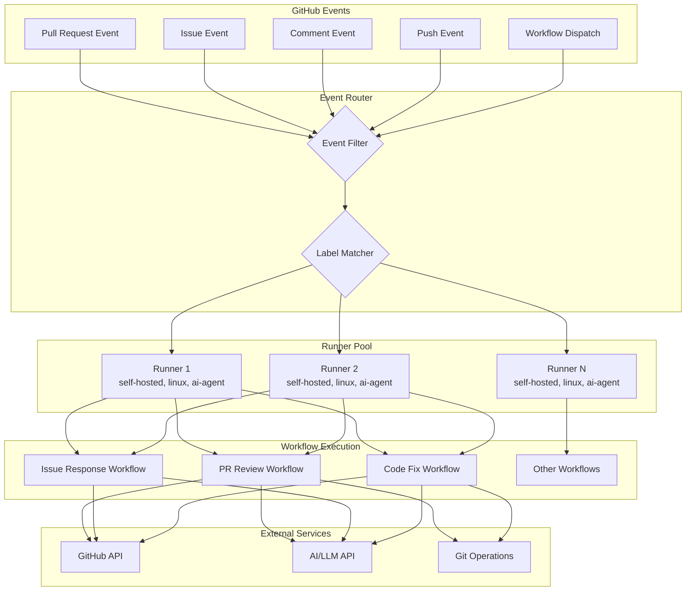

---

## Event Routing Flow

### Event-to-Workflow Routing

```mermaid
flowchart TD
    START([GitHub Event Received]) --> EVENT_TYPE{Event Type?}

    EVENT_TYPE -->|pull_request| PR_TYPE{PR Action Type?}
    EVENT_TYPE -->|issues| ISSUE_TYPE{Issue Action?}
    EVENT_TYPE -->|issue_comment| COMMENT_CHECK{Check Comment}
    EVENT_TYPE -->|push| PUSH_BRANCH{Branch Name?}
    EVENT_TYPE -->|workflow_dispatch| DISPATCH_INPUT{Input Parameters}

    PR_TYPE -->|opened| PR_FILTER
    PR_TYPE -->|synchronize| PR_FILTER
    PR_TYPE -->|reopened| PR_FILTER
    PR_TYPE -->|labeled| CHECK_LABEL{Label Name?}
    PR_TYPE -->|other| SKIP[Skip - No Action]

    CHECK_LABEL -->|auto-fix| CODE_FIX_WF
    CHECK_LABEL -->|needs-review| PR_REVIEW_WF
    CHECK_LABEL -->|other| SKIP

    PR_FILTER[Filter by Paths] --> PATH_CHECK{Source Code<br/>Changed?}
    PATH_CHECK -->|Yes| LABEL_MATCH
    PATH_CHECK -->|No| SKIP

    LABEL_MATCH{Runner Labels<br/>Available?} -->|Yes| PR_REVIEW_WF[PR Review Workflow]
    LABEL_MATCH -->|No| QUEUE[Add to Queue]

    ISSUE_TYPE -->|opened| ISSUE_FILTER
    ISSUE_TYPE -->|labeled| ISSUE_LABEL_CHECK{Has 'ai-assist'<br/>label?}
    ISSUE_TYPE -->|other| SKIP

    ISSUE_LABEL_CHECK -->|Yes| ISSUE_RESPOND_WF
    ISSUE_LABEL_CHECK -->|No| SKIP

    ISSUE_FILTER[Check Issue Labels] --> HAS_AI_LABEL{Has 'ai-assist'?}
    HAS_AI_LABEL -->|Yes| ISSUE_RESPOND_WF[Issue Response Workflow]
    HAS_AI_LABEL -->|No| SKIP

    COMMENT_CHECK --> IS_BOT{Is Bot<br/>Mention?}
    IS_BOT -->|@ai-assistant| COMMENT_CONTEXT{Context Type?}
    IS_BOT -->|/fix command| CODE_FIX_WF[Code Fix Workflow]
    IS_BOT -->|/review command| PR_REVIEW_WF
    IS_BOT -->|other| SKIP

    COMMENT_CONTEXT -->|On PR| PR_REVIEW_WF
    COMMENT_CONTEXT -->|On Issue| ISSUE_RESPOND_WF

    PUSH_BRANCH -->|main/develop| QUALITY_CHECK[Quality Check Workflow]
    PUSH_BRANCH -->|other| SKIP

    DISPATCH_INPUT --> MANUAL_WORKFLOW[Configured Workflow]

    PR_REVIEW_WF --> EXECUTE
    ISSUE_RESPOND_WF --> EXECUTE
    CODE_FIX_WF --> EXECUTE
    QUALITY_CHECK --> EXECUTE
    MANUAL_WORKFLOW --> EXECUTE

    EXECUTE[Execute on Runner] --> END([Complete])
    QUEUE --> RETRY{Retry<br/>Available?}
    RETRY -->|Yes| LABEL_MATCH
    RETRY -->|No| FAIL[Workflow Failed]
    SKIP --> END
    FAIL --> END
```

### Runner Label Matching

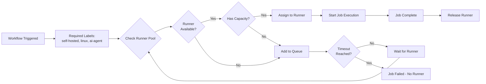

---

## PR Review Workflow Flow

### Complete PR Review Sequence

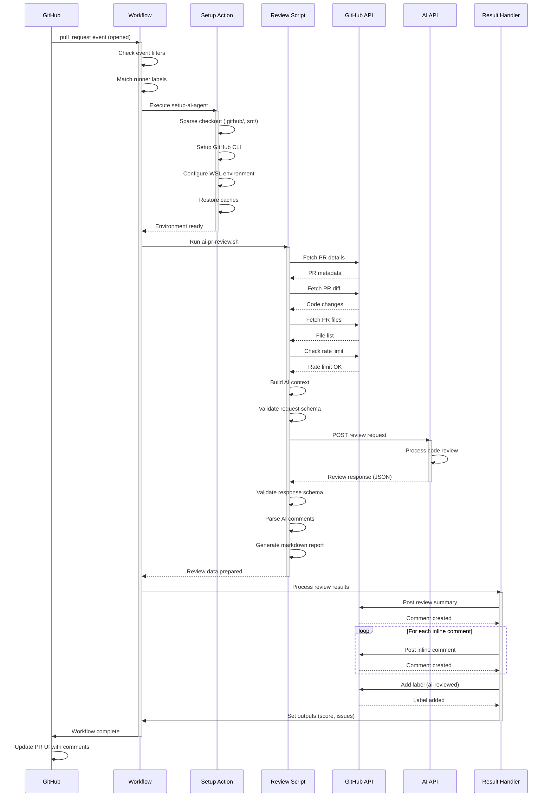

### PR Review State Machine

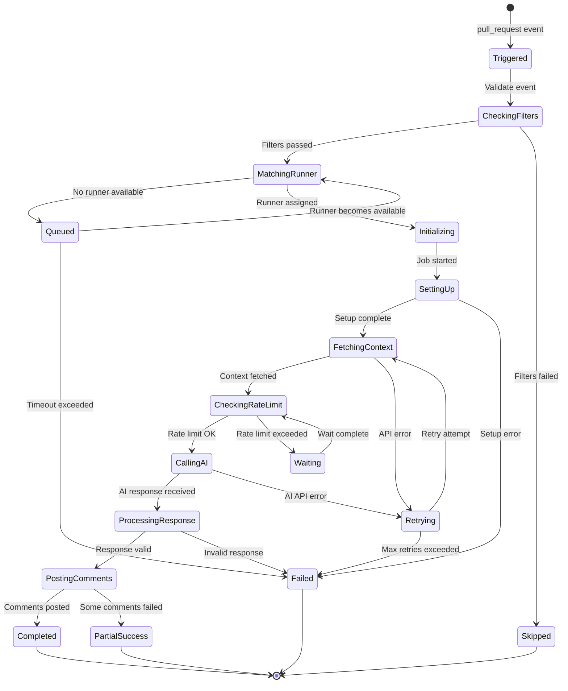

---

## Issue Auto-Response Flow

### Issue Response Sequence

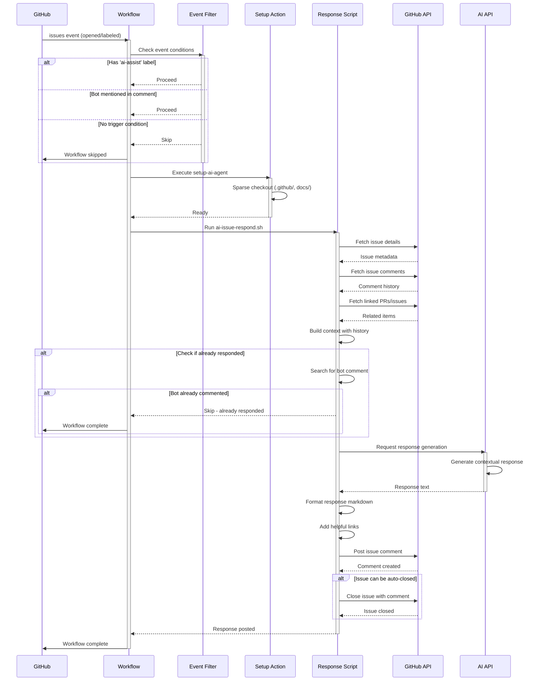

### Issue Response Decision Tree

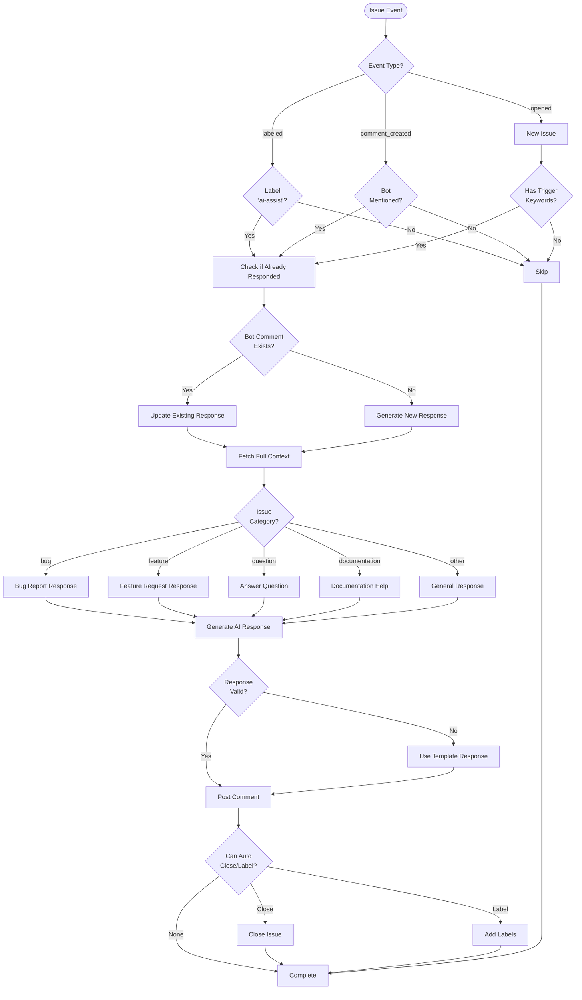

---

## Code Auto-Fix Flow

### Code Fix Workflow Sequence

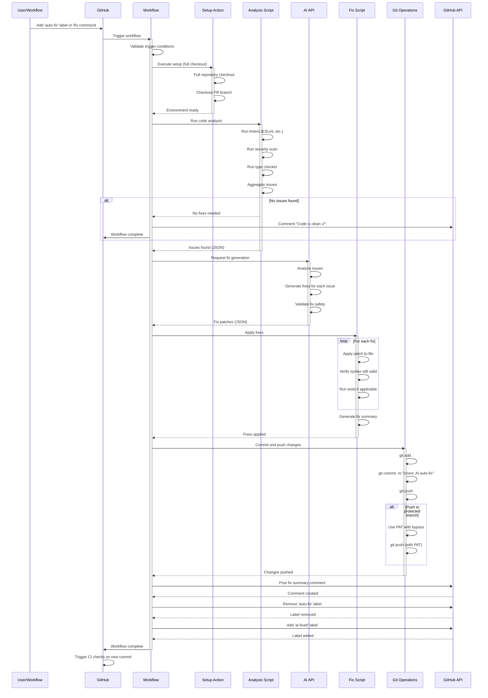

### Code Fix State Machine

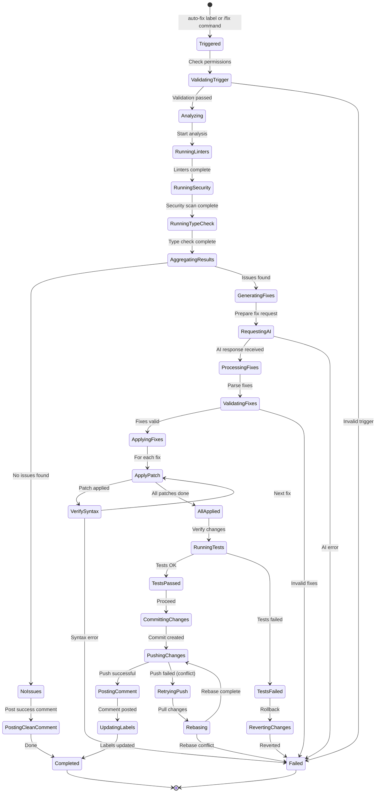

---

## Error Handling Flow

### Error Handling Hierarchy

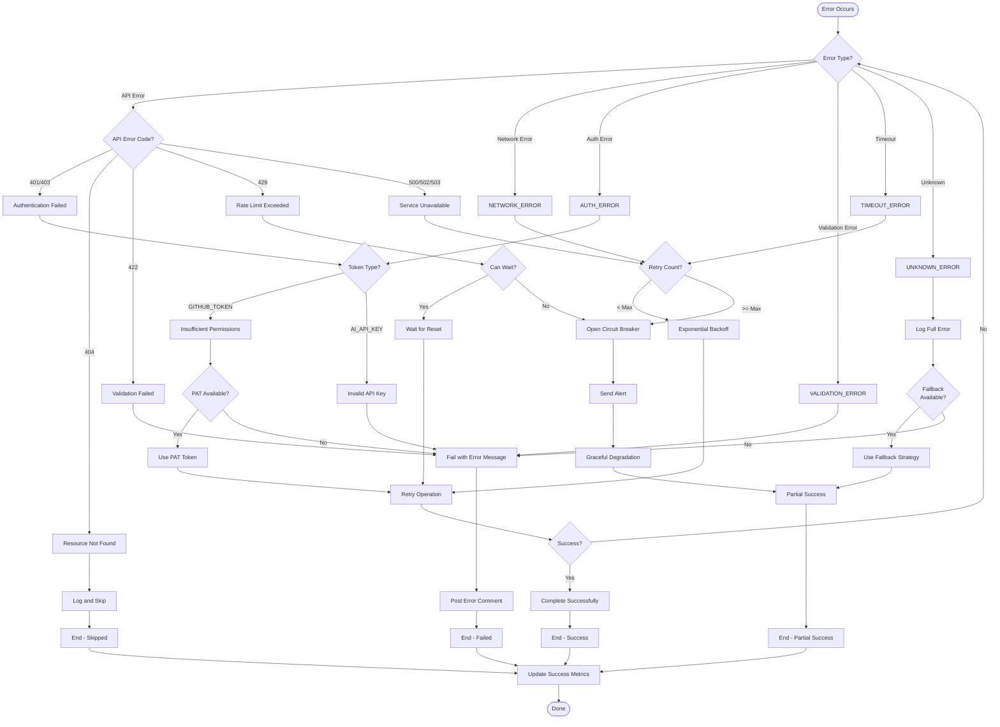

### Retry with Exponential Backoff

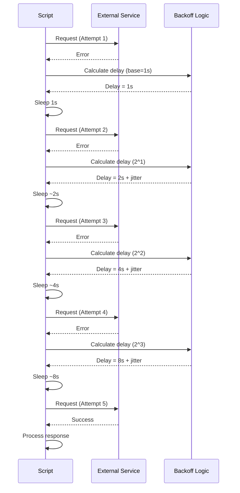

---

## Rate Limit Handling Flow

### GitHub API Rate Limit Management

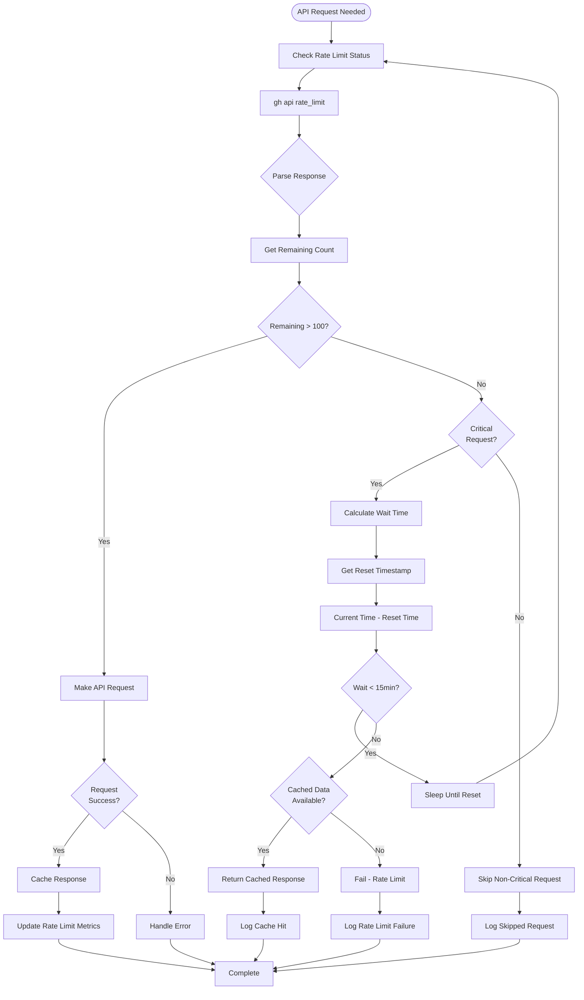

### AI API Rate Limit with Circuit Breaker

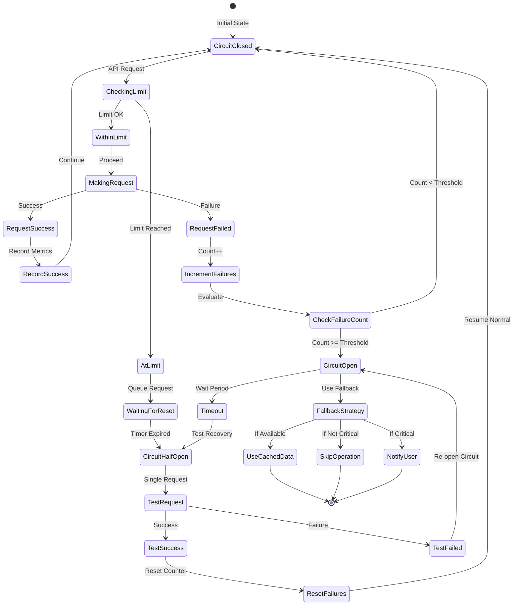

---

## Job Queue Management

### Job Queue and Runner Assignment

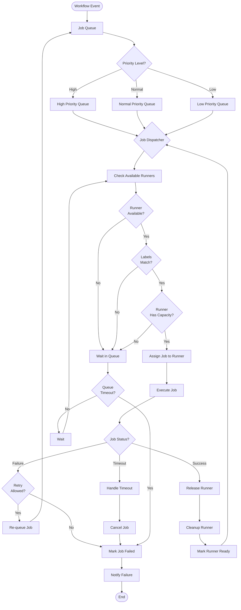

### Parallel Job Execution

```mermaid
gantt
    title Job Execution Timeline with Multiple Runners
    dateFormat HH:mm:ss
    axisFormat %H:%M:%S

    section Runner 1
    PR Review #123    :active, r1j1, 00:00:00, 180s
    Idle              :r1i1, after r1j1, 20s
    PR Review #125    :active, r1j2, after r1i1, 150s
    Idle              :r1i2, after r1j2, 10s

    section Runner 2
    Issue Response #45 :active, r2j1, 00:00:10, 60s
    Idle               :r2i1, after r2j1, 30s
    Code Fix #124      :active, r2j2, after r2i1, 200s

    section Runner 3
    Idle               :r3i1, 00:00:00, 45s
    PR Review #124     :active, r3j1, after r3i1, 170s
    Idle               :r3i2, after r3j1, 15s
    Issue Response #46 :active, r3j2, after r3i2, 55s

    section Queue
    Job Waiting        :crit, q1, 00:00:00, 45s
    Job Waiting        :crit, q2, 00:01:10, 30s
```

---

## Integration Flow Summary

### Complete End-to-End Flow

```mermaid
flowchart TB
    START([GitHub Event]) --> WEBHOOK[Webhook Trigger]

    WEBHOOK --> EVENT_VALIDATION{Validate Event}
    EVENT_VALIDATION -->|Valid| WORKFLOW_SELECTION
    EVENT_VALIDATION -->|Invalid| LOG_INVALID[Log Invalid Event]

    WORKFLOW_SELECTION[Select Workflow] --> RUNNER_MATCH[Match Runner Labels]

    RUNNER_MATCH --> QUEUE_OR_START{Runner<br/>Available?}
    QUEUE_OR_START -->|Yes| START_JOB[Start Job]
    QUEUE_OR_START -->|No| QUEUE_JOB[Queue Job]

    QUEUE_JOB --> WAIT_RUNNER[Wait for Runner]
    WAIT_RUNNER --> QUEUE_OR_START

    START_JOB --> CHECKOUT[Checkout Code]
    CHECKOUT --> SETUP[Setup Environment]
    SETUP --> CACHE_CHECK{Cache<br/>Available?}

    CACHE_CHECK -->|Yes| RESTORE_CACHE[Restore Cache]
    CACHE_CHECK -->|No| FRESH_SETUP[Fresh Setup]

    RESTORE_CACHE --> EXEC_SCRIPT
    FRESH_SETUP --> SAVE_CACHE[Save Cache]
    SAVE_CACHE --> EXEC_SCRIPT[Execute Script]

    EXEC_SCRIPT --> FETCH_CONTEXT[Fetch GitHub Context]
    FETCH_CONTEXT --> RATE_CHECK[Check Rate Limits]

    RATE_CHECK --> RATE_OK{Limit OK?}
    RATE_OK -->|Yes| CALL_AI[Call AI API]
    RATE_OK -->|No| WAIT_RESET[Wait for Reset]

    WAIT_RESET --> CALL_AI

    CALL_AI --> AI_SUCCESS{AI Success?}
    AI_SUCCESS -->|Yes| PROCESS_RESPONSE[Process Response]
    AI_SUCCESS -->|No| AI_RETRY{Retry?}

    AI_RETRY -->|Yes| BACKOFF[Exponential Backoff]
    AI_RETRY -->|No| USE_FALLBACK[Use Fallback]

    BACKOFF --> CALL_AI
    USE_FALLBACK --> PROCESS_RESPONSE

    PROCESS_RESPONSE --> VALIDATE_OUTPUT{Output Valid?}
    VALIDATE_OUTPUT -->|Yes| TAKE_ACTION[Take Action]
    VALIDATE_OUTPUT -->|No| ERROR_HANDLE[Handle Error]

    TAKE_ACTION --> ACTION_TYPE{Action Type?}
    ACTION_TYPE -->|Comment| POST_COMMENT[Post Comment]
    ACTION_TYPE -->|Commit| CREATE_COMMIT[Create Commit]
    ACTION_TYPE -->|Label| UPDATE_LABELS[Update Labels]

    POST_COMMENT --> FINALIZE
    CREATE_COMMIT --> PUSH_CHANGES[Push Changes]
    UPDATE_LABELS --> FINALIZE

    PUSH_CHANGES --> PUSH_SUCCESS{Push OK?}
    PUSH_SUCCESS -->|Yes| FINALIZE[Finalize Job]
    PUSH_SUCCESS -->|No| REBASE[Rebase and Retry]

    REBASE --> PUSH_CHANGES

    ERROR_HANDLE --> NOTIFY_ERROR[Notify Error]
    NOTIFY_ERROR --> FINALIZE

    FINALIZE --> UPDATE_STATUS[Update Job Status]
    UPDATE_STATUS --> METRICS[Record Metrics]
    METRICS --> CLEANUP[Cleanup Environment]
    CLEANUP --> RELEASE_RUNNER[Release Runner]

    RELEASE_RUNNER --> COMPLETE[Complete]
    LOG_INVALID --> COMPLETE

    COMPLETE --> END([End])
```

---

## Summary

This document provides comprehensive event flow diagrams covering:

1. **System Overview** - High-level architecture and component interaction
2. **Event Routing** - How events are filtered and routed to appropriate workflows
3. **PR Review Flow** - Complete sequence and state machine for code reviews
4. **Issue Response Flow** - Issue handling and automated responses
5. **Code Auto-Fix Flow** - Automated code correction workflow
6. **Error Handling** - Comprehensive error handling hierarchy and retry logic
7. **Rate Limit Management** - GitHub and AI API rate limit handling with circuit breakers
8. **Job Queue Management** - Runner assignment and parallel execution

All diagrams use Mermaid syntax for easy rendering in GitHub and documentation tools.
