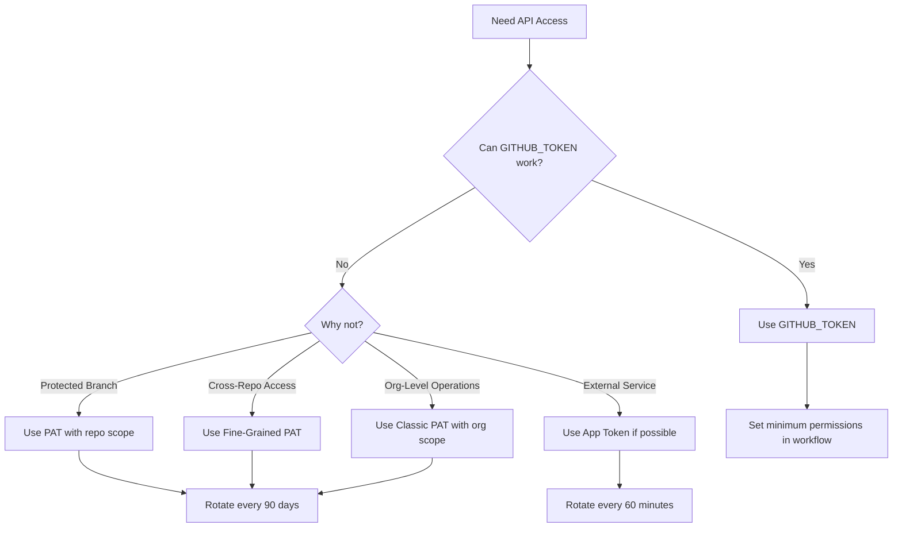
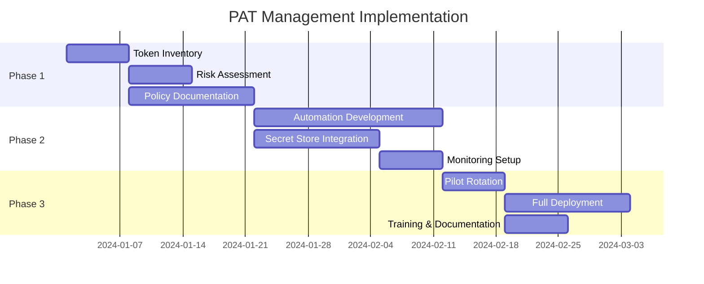

# Personal Access Token (PAT) Management Strategy

## Executive Summary

This document defines the comprehensive strategy for managing Personal Access Tokens (PATs) in the self-hosted GitHub Actions runner environment. It establishes lifecycle management, scope minimization, and automated rotation procedures to maintain security while enabling necessary automation capabilities.

## Table of Contents

- [PAT Strategy Overview](#pat-strategy-overview)
- [Token Types and Use Cases](#token-types-and-use-cases)
- [Lifecycle Management](#lifecycle-management)
- [Scope Minimization Guidelines](#scope-minimization-guidelines)
- [Automated Rotation](#automated-rotation)
- [Monitoring and Auditing](#monitoring-and-auditing)
- [Emergency Procedures](#emergency-procedures)
- [Best Practices](#best-practices)

## PAT Strategy Overview

### Core Principles

1. **GITHUB_TOKEN First**: Always prefer GITHUB_TOKEN over PAT
2. **Minimum Viable Scope**: Only request necessary permissions
3. **Purpose-Specific Tokens**: One token per specific use case
4. **Time-Limited Access**: Maximum 90-day expiration
5. **Automated Management**: Rotation and renewal without manual intervention

### Decision Matrix: GITHUB_TOKEN vs PAT



## Token Types and Use Cases

### 1. Fine-Grained Personal Access Tokens (Preferred)

```yaml
fine_grained_pat_examples:
  pr_automation:
    name: "PR-Automation-Token"
    expiration: 90_days
    repository_access:
      - "org/main-repo"
      - "org/docs-repo"
    permissions:
      contents: read
      pull_requests: write
      issues: write
      metadata: read

  deployment_token:
    name: "Deploy-Production-Token"
    expiration: 30_days
    repository_access:
      - "org/production-app"
    permissions:
      contents: read
      deployments: write
      environments: write
      pages: write

  dependency_updates:
    name: "Dependency-Bot-Token"
    expiration: 90_days
    repository_access:
      - "org/*"  # All repos in org
    permissions:
      contents: write
      pull_requests: write
      vulnerabilities: read
```

### 2. Classic PATs (Limited Use)

Use ONLY when fine-grained tokens insufficient:

```yaml
classic_pat_use_cases:
  org_runner_management:
    scopes:
      - admin:org      # Manage org runners
      - repo           # Full repo access
    justification: "Runner registration requires org admin"
    expiration: 30_days

  legacy_api_access:
    scopes:
      - repo
      - workflow
    justification: "Legacy API endpoints not supporting fine-grained"
    expiration: 90_days
```

### 3. GitHub App Tokens (Recommended Alternative)

```yaml
github_app_alternative:
  benefits:
    - Higher rate limits (5000/hour vs 1000/hour)
    - Automatic 1-hour expiration
    - Installation-level permissions
    - Better audit trail

  use_cases:
    - Continuous integration
    - Automated PR reviews
    - Issue management
    - Status checks
```

## Lifecycle Management

### Token Creation Process

```yaml
creation_workflow:
  1_request:
    actor: Developer/DevOps
    form: Token Request Form
    fields:
      - purpose
      - repositories
      - required_permissions
      - expiration_date
      - business_justification

  2_review:
    approver: Security Team
    checks:
      - Verify minimum scope
      - Validate business need
      - Check for existing tokens
      - Assess risk level

  3_creation:
    method: Automated via API
    storage: Secret Management System
    notification: Email to requester
    documentation: Update token registry

  4_validation:
    test: Verify token works
    audit: Log creation event
    monitoring: Enable usage tracking
```

### Token Rotation Schedule

| Token Type | Default Expiry | Rotation Window | Grace Period |
|------------|---------------|-----------------|--------------|
| Fine-Grained PAT | 90 days | 7 days before | 3 days |
| Classic PAT | 30 days | 7 days before | 1 day |
| High-Risk PAT | 30 days | 14 days before | 0 days |
| Emergency PAT | 7 days | N/A | 0 days |

### Rotation Automation Script

```bash
#!/bin/bash
# PAT Rotation Automation Script

# Configuration
VAULT_ADDR="https://vault.company.com"
GITHUB_API="https://api.github.com"
NOTIFICATION_WEBHOOK="https://slack.company.com/webhook"

# Function to rotate PAT
rotate_pat() {
    local token_name=$1
    local token_config=$2

    echo "Starting rotation for: $token_name"

    # Step 1: Create new token
    new_token=$(gh api \
        --method POST \
        -H "Accept: application/vnd.github+json" \
        /user/personal-access-tokens \
        --input "$token_config")

    # Step 2: Test new token
    if test_token "$new_token"; then
        # Step 3: Update in vault
        vault kv put "secret/github-pats/$token_name" \
            token="$new_token" \
            rotated_at="$(date -u +%Y-%m-%dT%H:%M:%SZ)"

        # Step 4: Schedule old token deletion (after grace period)
        schedule_deletion "$token_name" "3days"

        # Step 5: Notify team
        send_notification "SUCCESS" "$token_name rotated successfully"
    else
        send_notification "FAILURE" "$token_name rotation failed"
        exit 1
    fi
}

# Function to test token
test_token() {
    local token=$1

    response=$(curl -s -o /dev/null -w "%{http_code}" \
        -H "Authorization: token $token" \
        "$GITHUB_API/user")

    [ "$response" -eq 200 ]
}

# Main rotation logic
main() {
    # Get tokens expiring soon
    expiring_tokens=$(vault kv list -format=json secret/github-pats | \
        jq -r '.[] | select(.expiry_date < now + 7days)')

    for token in $expiring_tokens; do
        config=$(vault kv get -format=json "secret/github-pats/$token/config")
        rotate_pat "$token" "$config"
    done
}

main "$@"
```

## Scope Minimization Guidelines

### Permission Decision Tree

```yaml
permission_guidelines:
  read_operations:
    contents: read         # View code, commits, branches
    metadata: read        # Basic repo information
    pull_requests: read   # View PRs and reviews
    issues: read          # View issues and comments

  write_operations:
    contents: write       # DANGER: Can modify code
    pull_requests: write  # Create/update PRs
    issues: write        # Create/update issues
    packages: write      # Publish packages

  admin_operations:
    administration: write # CRITICAL: Full repo control
    organization: admin   # CRITICAL: Org-wide control
```

### Scope Validation Rules

```yaml
validation_rules:
  - rule: "Never grant admin unless absolutely necessary"
    check: "permissions.administration == null"

  - rule: "Avoid repo scope in classic PATs"
    check: "token_type == 'fine-grained' OR justification.approved"

  - rule: "Write permissions require approval"
    check: "any_write_permission -> approval.security_team"

  - rule: "Organization tokens require CISO approval"
    check: "scope.includes('org') -> approval.ciso"
```

### Example: Minimal Scope for Common Operations

```yaml
common_operations:
  create_pull_request:
    minimum_scopes:
      contents: read
      pull_requests: write
    github_token_capable: true
    pat_required: false

  push_to_protected_branch:
    minimum_scopes:
      repo: write  # Classic PAT
    github_token_capable: false
    pat_required: true
    justification: "Branch protection bypass"

  update_github_pages:
    minimum_scopes:
      contents: read
      pages: write
    github_token_capable: true
    pat_required: false

  manage_repo_secrets:
    minimum_scopes:
      secrets: write
    github_token_capable: false
    pat_required: true
    approval_required: true
```

## Automated Rotation

### Rotation Pipeline

```yaml
name: PAT Rotation Pipeline
on:
  schedule:
    - cron: '0 2 * * *'  # Daily at 2 AM
  workflow_dispatch:

jobs:
  check-expiration:
    runs-on: ubuntu-latest
    steps:
      - name: Get expiring tokens
        run: |
          # Query vault for tokens expiring within 7 days
          EXPIRING=$(vault kv list -format=json secret/pats | \
            jq '.[] | select(.expiry < now + 7*24*60*60)')
          echo "tokens=$EXPIRING" >> $GITHUB_OUTPUT

  rotate-tokens:
    needs: check-expiration
    strategy:
      matrix:
        token: ${{ fromJson(needs.check-expiration.outputs.tokens) }}
    steps:
      - name: Create new token
        run: |
          # Create replacement token with same scopes
          NEW_TOKEN=$(gh api /user/personal-access-tokens \
            --method POST \
            --field name="${{ matrix.token.name }}-rotated" \
            --field expiration="90days" \
            --field scopes="${{ matrix.token.scopes }}")

      - name: Validate new token
        run: |
          # Test token functionality
          curl -H "Authorization: token $NEW_TOKEN" \
            https://api.github.com/user

      - name: Update secret store
        run: |
          # Store in vault with encryption
          vault kv put secret/pats/${{ matrix.token.name }} \
            token="$NEW_TOKEN" \
            rotated_at="$(date -u)"

      - name: Notify teams
        run: |
          # Send notification about rotation
          curl -X POST $SLACK_WEBHOOK \
            -d "{\"text\": \"PAT rotated: ${{ matrix.token.name }}\"}"
```

### Rotation Monitoring Dashboard

```yaml
monitoring_metrics:
  token_expiration:
    query: |
      SELECT token_name, expiry_date,
             DATEDIFF(day, CURRENT_DATE, expiry_date) as days_remaining
      FROM pat_registry
      WHERE active = true
      ORDER BY days_remaining ASC

  rotation_success_rate:
    query: |
      SELECT COUNT(CASE WHEN status = 'success' THEN 1 END) * 100.0 /
             COUNT(*) as success_rate
      FROM rotation_logs
      WHERE timestamp > NOW() - INTERVAL '30 days'

  token_usage:
    query: |
      SELECT token_name,
             COUNT(*) as usage_count,
             MAX(last_used) as last_activity
      FROM github_audit_logs
      WHERE token_type = 'PAT'
      GROUP BY token_name
```

## Monitoring and Auditing

### Usage Tracking

```yaml
usage_monitoring:
  metrics_to_track:
    - api_calls_per_token
    - unique_repositories_accessed
    - permission_usage_frequency
    - rate_limit_utilization
    - geographic_access_patterns

  alerting_rules:
    - name: "Excessive API usage"
      condition: "api_calls > 900/hour"
      action: "notify_security_team"

    - name: "Unusual access pattern"
      condition: "new_ip_location OR off_hours_access"
      action: "require_mfa_confirmation"

    - name: "Scope escalation attempt"
      condition: "request_permission > granted_permission"
      action: "block_and_alert"
```

### Audit Log Requirements

```json
{
  "event": "pat_access",
  "timestamp": "2024-01-15T10:30:00Z",
  "actor": {
    "type": "pat",
    "id": "pat_1234567890",
    "name": "PR-Automation-Token"
  },
  "action": "api_call",
  "resource": {
    "type": "repository",
    "id": "org/repo",
    "path": "/repos/org/repo/pulls"
  },
  "permissions_used": ["pull_requests:write"],
  "ip_address": "192.168.1.100",
  "user_agent": "GitHub-Actions/2.0",
  "result": "success",
  "response_code": 200
}
```

### Compliance Reporting

```yaml
compliance_reports:
  monthly_pat_report:
    sections:
      - total_active_tokens
      - tokens_by_type
      - expiring_tokens
      - rotation_compliance
      - unused_tokens
      - high_risk_permissions

  quarterly_security_review:
    sections:
      - token_proliferation_analysis
      - scope_creep_detection
      - rotation_effectiveness
      - incident_correlation
      - recommendation_summary
```

## Emergency Procedures

### Token Compromise Response

```yaml
compromise_response:
  1_immediate_actions:
    - Revoke compromised token immediately
    - Audit all recent token usage
    - Check for unauthorized changes
    time_limit: 15_minutes

  2_investigation:
    - Identify compromise vector
    - Determine data exposure
    - Timeline reconstruction
    time_limit: 2_hours

  3_remediation:
    - Rotate all related tokens
    - Update affected systems
    - Patch vulnerability
    time_limit: 24_hours

  4_prevention:
    - Update security controls
    - Enhance monitoring
    - Team training
    time_limit: 7_days
```

### Emergency Token Creation

```bash
#!/bin/bash
# Emergency PAT Creation (Break-Glass Procedure)

create_emergency_pat() {
    # Require two-person authorization
    read -p "Authorizer 1 username: " auth1
    read -sp "Authorizer 1 password: " pass1
    echo
    read -p "Authorizer 2 username: " auth2
    read -sp "Authorizer 2 password: " pass2
    echo

    # Validate authorizers
    if validate_authorizers "$auth1" "$pass1" "$auth2" "$pass2"; then
        # Create time-limited emergency token
        emergency_token=$(gh api \
            --method POST \
            /user/personal-access-tokens \
            --field name="EMERGENCY-$(date +%s)" \
            --field expiration="1day" \
            --field scopes="repo,admin:org")

        # Log emergency access
        log_emergency_access "$auth1" "$auth2" "$emergency_token"

        # Set automatic revocation
        schedule_revocation "$emergency_token" "24hours"

        echo "Emergency token created. Expires in 24 hours."
        echo "Token ID: ${emergency_token}"
    else
        echo "Authorization failed"
        exit 1
    fi
}
```

### Bulk Revocation

```yaml
bulk_revocation_scenarios:
  security_breach:
    scope: "all_tokens"
    notification: "immediate"
    replacement: "manual_recreation"

  employee_departure:
    scope: "user_tokens"
    notification: "standard"
    replacement: "transfer_ownership"

  policy_update:
    scope: "non_compliant_tokens"
    notification: "7_day_warning"
    replacement: "automated_rotation"
```

## Best Practices

### DO's and DON'Ts

```yaml
best_practices:
  DO:
    - Use fine-grained PATs whenever possible
    - Implement automated rotation
    - Monitor token usage continuously
    - Document token purpose clearly
    - Test tokens before rotation
    - Use separate tokens per environment
    - Enable SSO requirement for PAT creation

  DONT:
    - Share tokens between teams
    - Hardcode tokens in code
    - Use tokens beyond expiration
    - Grant unnecessary permissions
    - Create tokens without approval
    - Use classic PATs for new integrations
    - Disable audit logging
```

### Token Naming Convention

```yaml
naming_convention:
  format: "{PURPOSE}-{ENVIRONMENT}-{IDENTIFIER}"

  examples:
    - "PR-AUTOMATION-PROD-001"
    - "DEPLOY-STAGING-AWS-002"
    - "DEPENDENCY-UPDATE-ALL-003"

  reserved_prefixes:
    EMERGENCY: "Break-glass tokens"
    TEMP: "Temporary tokens (<7 days)"
    SYSTEM: "System-generated tokens"
```

### Security Checklist

```yaml
pat_security_checklist:
  before_creation:
    - [ ] GITHUB_TOKEN evaluated first
    - [ ] Minimum scopes identified
    - [ ] Business justification documented
    - [ ] Security approval obtained
    - [ ] Rotation schedule defined

  during_usage:
    - [ ] Token stored in secret manager
    - [ ] Usage monitored continuously
    - [ ] Audit logs enabled
    - [ ] Rate limits monitored
    - [ ] Anomalies investigated

  before_rotation:
    - [ ] New token tested
    - [ ] Dependencies identified
    - [ ] Rollback plan prepared
    - [ ] Team notified
    - [ ] Grace period configured

  after_rotation:
    - [ ] Old token revoked
    - [ ] Systems validated
    - [ ] Documentation updated
    - [ ] Metrics reviewed
    - [ ] Lessons learned captured
```

## Implementation Timeline



## References

- [GitHub Fine-grained PATs Documentation](https://docs.github.com/en/authentication/keeping-your-account-and-data-secure/managing-your-personal-access-tokens)
- [GitHub Token Security Best Practices](https://docs.github.com/en/actions/security-guides/security-hardening-for-github-actions)
- [OWASP Key Management Cheat Sheet](https://cheatsheetseries.owasp.org/cheatsheets/Key_Management_Cheat_Sheet.html)

---

*Document Version: 1.0*
*Classification: Confidential*
*Last Updated: 2024*
*Next Review: Monthly*
*Owner: Security Team*