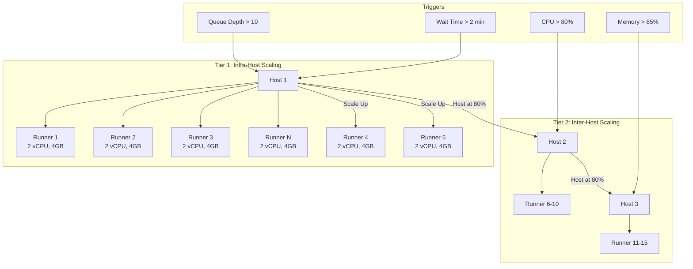
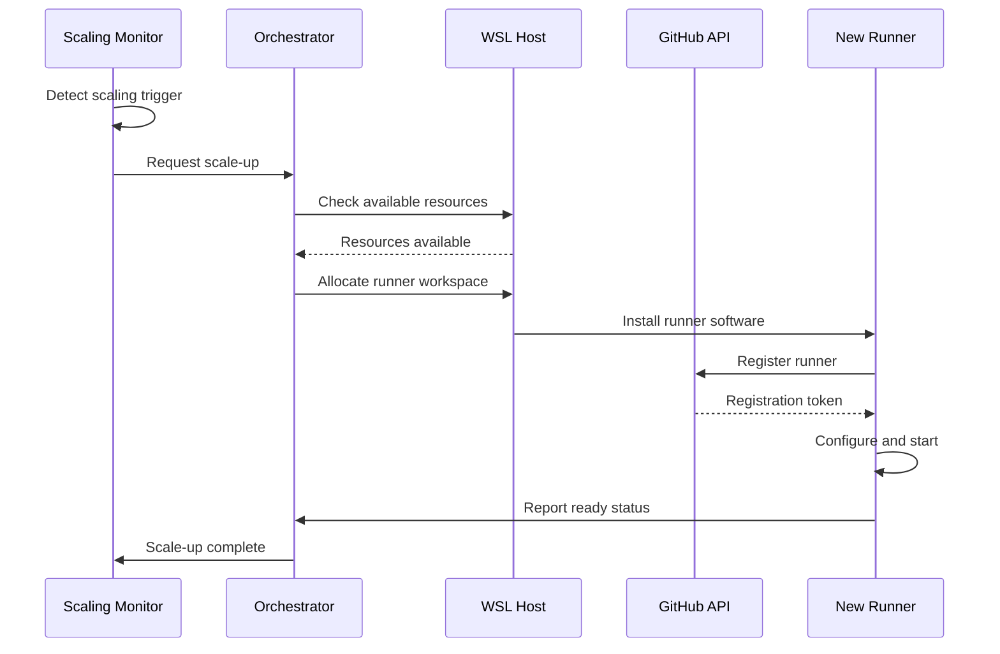
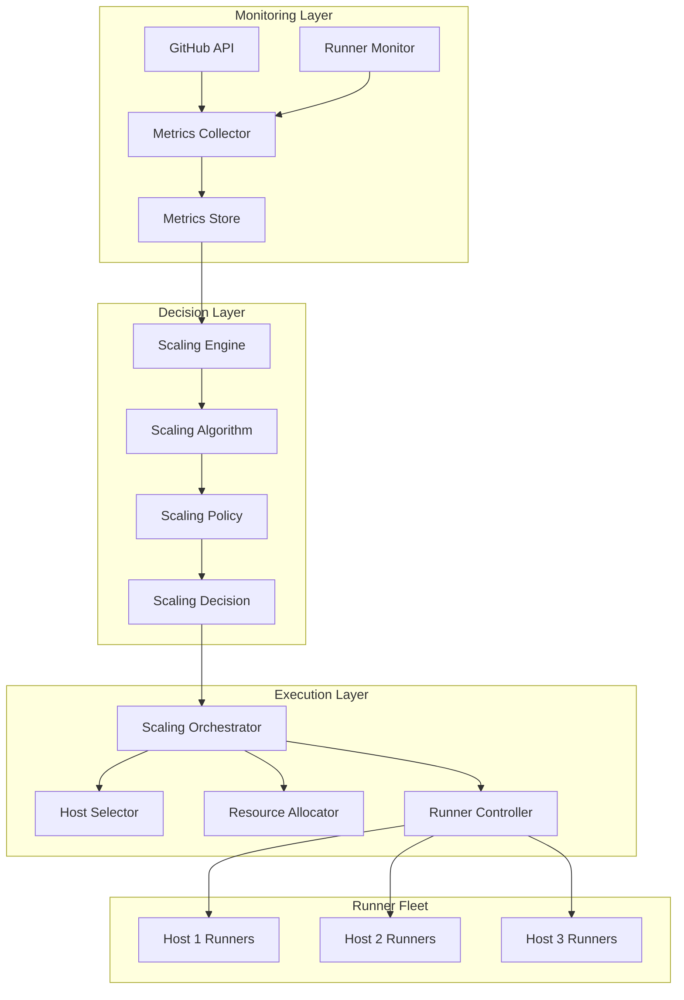

# GitHub Actions Runner Scaling Strategy

## Executive Summary

This document outlines the horizontal and vertical scaling strategy for self-hosted GitHub Actions runners on Windows + WSL 2.0 with native runner processes. The strategy focuses on cost-effective scaling from 3-5 initial runners to 10-20 runners per host, with automatic scaling based on workload demands.

## Scaling Principles

1. **Horizontal First**: Prioritize adding runner instances before adding hosts
2. **Predictive Scaling**: Use historical data to anticipate demand
3. **Cost Optimization**: Right-size resources based on actual usage
4. **Performance Consistency**: Maintain sub-30 second job startup times
5. **Resource Efficiency**: Target 80% utilization during peak hours

## Scaling Architecture

### Two-Tier Scaling Model



## Horizontal Scaling Strategy

### Scaling Triggers

#### Primary Triggers (Immediate Scaling)
```yaml
Queue-Based Triggers:
  - Condition: Job queue depth > 10
  - Action: Add 2 runners
  - Cooldown: 5 minutes

  - Condition: Average wait time > 2 minutes
  - Action: Add 1 runner per minute of wait
  - Cooldown: 3 minutes

Performance-Based Triggers:
  - Condition: All runners busy for > 5 minutes
  - Action: Add 1 runner
  - Cooldown: 5 minutes

  - Condition: Runner utilization > 90% for 10 minutes
  - Action: Add 2 runners
  - Cooldown: 10 minutes
```

#### Secondary Triggers (Gradual Scaling)
```yaml
Predictive Triggers:
  - Condition: Historical peak approaching (ML prediction)
  - Action: Pre-warm runners 15 minutes early
  - Example: Daily builds at 9 AM, nightly tests at midnight

Schedule-Based Triggers:
  - Condition: Known high-activity periods
  - Action: Scale up preemptively
  - Schedule:
    - Weekdays 9-11 AM: +50% runners
    - Weekdays 2-4 PM: +30% runners
    - Release days: +100% runners
```

### Scaling Algorithms

#### Step Scaling Algorithm
```python
def calculate_runners_needed():
    """Calculate optimal runner count based on metrics"""

    base_runners = 3  # Minimum runners always running

    # Queue-based calculation
    queue_depth = get_queue_depth()
    queue_factor = math.ceil(queue_depth / 5)  # 1 runner per 5 jobs

    # Wait time calculation
    avg_wait_time = get_average_wait_time()
    wait_factor = math.ceil(avg_wait_time / 60)  # 1 runner per minute wait

    # Utilization calculation
    current_utilization = get_runner_utilization()
    util_factor = 0
    if current_utilization > 0.9:
        util_factor = 2  # Add 2 runners if >90% busy
    elif current_utilization > 0.8:
        util_factor = 1  # Add 1 runner if >80% busy

    # Calculate total needed
    total_needed = base_runners + max(queue_factor, wait_factor, util_factor)

    # Apply limits
    return min(total_needed, MAX_RUNNERS_PER_HOST)
```

#### Predictive Scaling Algorithm
```python
def predict_runner_demand():
    """Predict runner demand using historical patterns"""

    current_time = datetime.now()
    day_of_week = current_time.weekday()
    hour_of_day = current_time.hour

    # Historical pattern analysis
    historical_demand = query_metrics(
        f"SELECT AVG(runner_count) FROM metrics "
        f"WHERE day_of_week = {day_of_week} "
        f"AND hour = {hour_of_day} "
        f"AND date > NOW() - INTERVAL '30 days'"
    )

    # Trend analysis
    trend_factor = calculate_growth_trend()

    # Special events
    special_events = check_calendar_events()  # Releases, sprints, etc.
    event_multiplier = 1.0
    if special_events:
        event_multiplier = 1.5  # 50% more for special events

    # Calculate prediction
    predicted_demand = historical_demand * trend_factor * event_multiplier

    # Add safety buffer
    return math.ceil(predicted_demand * 1.1)  # 10% buffer
```

### Scale-Up Process

#### Runner Addition Workflow


#### Implementation Steps
```bash
#!/bin/bash
# scale-up.sh - Add new runner to host

add_runner() {
    local RUNNER_NUMBER=$1
    local RUNNER_NAME="runner-${HOSTNAME}-${RUNNER_NUMBER}"
    local RUNNER_PATH="/home/runners/${RUNNER_NAME}"

    # Create runner directory
    mkdir -p ${RUNNER_PATH}

    # Download and extract runner
    cd ${RUNNER_PATH}
    curl -O -L https://github.com/actions/runner/releases/download/v2.311.0/actions-runner-linux-x64-2.311.0.tar.gz
    tar xzf actions-runner-linux-x64-2.311.0.tar.gz

    # Get registration token
    RUNNER_TOKEN=$(get_registration_token)

    # Configure runner
    ./config.sh \
        --url "${GITHUB_URL}" \
        --token "${RUNNER_TOKEN}" \
        --name "${RUNNER_NAME}" \
        --work "workspace" \
        --labels "self-hosted,WSL,Linux,X64,scaled" \
        --unattended \
        --replace

    # Start runner as service
    sudo ./svc.sh install ${RUNNER_NAME}
    sudo ./svc.sh start ${RUNNER_NAME}

    # Update metrics
    report_scaling_event "scale-up" ${RUNNER_NAME}
}

# Main scaling logic
current_runners=$(get_current_runner_count)
target_runners=$(calculate_runners_needed)

if [ ${target_runners} -gt ${current_runners} ]; then
    runners_to_add=$((target_runners - current_runners))
    echo "Scaling up: adding ${runners_to_add} runners"

    for i in $(seq 1 ${runners_to_add}); do
        next_number=$((current_runners + i))
        add_runner ${next_number} &
    done
    wait
fi
```

### Scale-Down Process

#### Scale-Down Triggers
```yaml
Idle Detection:
  - Condition: Runner idle > 30 minutes
  - Action: Mark for removal
  - Grace Period: 10 minutes

Low Utilization:
  - Condition: Overall utilization < 40% for 20 minutes
  - Action: Remove 1 runner
  - Minimum: Keep 3 runners always

Queue Reduction:
  - Condition: Queue depth = 0 for 15 minutes
  - Action: Scale to minimum runners
  - Protection: Keep warm runners for quick scale-up
```

#### Graceful Shutdown
```python
def graceful_runner_shutdown(runner_name):
    """Gracefully shut down a runner"""

    # Step 1: Stop accepting new jobs
    set_runner_offline(runner_name)

    # Step 2: Wait for current job completion
    max_wait = 300  # 5 minutes
    start_time = time.time()
    while is_runner_busy(runner_name):
        if time.time() - start_time > max_wait:
            log_warning(f"Runner {runner_name} still busy after {max_wait}s")
            return False
        time.sleep(10)

    # Step 3: Preserve workspace if needed
    if should_preserve_workspace(runner_name):
        archive_workspace(runner_name)

    # Step 4: Unregister from GitHub
    unregister_runner(runner_name)

    # Step 5: Stop service and clean up
    stop_runner_service(runner_name)
    cleanup_runner_directory(runner_name)

    # Step 6: Update metrics
    report_scaling_event("scale-down", runner_name)

    return True
```

## Vertical Scaling Strategy

### Resource Tier Definitions

#### Runner Tiers
```yaml
Tier 1 - Light Runner:
  CPU: 2 vCPU
  Memory: 4 GB
  Storage: 20 GB
  Use Cases:
    - Simple builds
    - Unit tests
    - Linting
    - Documentation generation
  Max per Host: 10

Tier 2 - Standard Runner:
  CPU: 4 vCPU
  Memory: 8 GB
  Storage: 50 GB
  Use Cases:
    - Integration tests
    - Container builds
    - Medium complexity builds
    - AI/LLM operations
  Max per Host: 5

Tier 3 - Heavy Runner:
  CPU: 8 vCPU
  Memory: 16 GB
  Storage: 100 GB
  Use Cases:
    - Performance tests
    - Large application builds
    - Data processing
    - ML model training
  Max per Host: 2
```

### Dynamic Resource Allocation

#### WSL 2.0 Resource Management
```powershell
# Dynamic WSL memory allocation based on runner tier
function Set-RunnerResources {
    param(
        [string]$RunnerName,
        [string]$Tier
    )

    $config = @{
        "Light" = @{
            Memory = "4GB"
            Processors = 2
            Swap = "2GB"
        }
        "Standard" = @{
            Memory = "8GB"
            Processors = 4
            Swap = "4GB"
        }
        "Heavy" = @{
            Memory = "16GB"
            Processors = 8
            Swap = "8GB"
        }
    }

    $tierConfig = $config[$Tier]

    # Update WSL config for specific runner
    $wslConfig = @"
[wsl2]
memory=$($tierConfig.Memory)
processors=$($tierConfig.Processors)
swap=$($tierConfig.Swap)
"@

    Set-Content -Path "$env:USERPROFILE\.wslconfig-$RunnerName" -Value $wslConfig

    # Apply configuration
    wsl --terminate $RunnerName
    wsl --distribution $RunnerName --exec echo "Resources updated"
}
```

#### Resource Promotion/Demotion
```python
def adjust_runner_tier(runner_name, metrics):
    """Automatically adjust runner tier based on usage"""

    current_tier = get_runner_tier(runner_name)

    # Analyze last 7 days of metrics
    avg_cpu = metrics['avg_cpu_usage']
    avg_memory = metrics['avg_memory_usage']
    peak_cpu = metrics['peak_cpu_usage']
    peak_memory = metrics['peak_memory_usage']

    # Promotion criteria
    if current_tier == "Light":
        if avg_cpu > 80 or avg_memory > 3.5:  # GB
            promote_runner_to_tier(runner_name, "Standard")
            return "promoted"
    elif current_tier == "Standard":
        if avg_cpu > 80 or avg_memory > 7:  # GB
            promote_runner_to_tier(runner_name, "Heavy")
            return "promoted"

    # Demotion criteria
    if current_tier == "Heavy":
        if peak_cpu < 50 and peak_memory < 8:  # GB
            demote_runner_to_tier(runner_name, "Standard")
            return "demoted"
    elif current_tier == "Standard":
        if peak_cpu < 30 and peak_memory < 4:  # GB
            demote_runner_to_tier(runner_name, "Light")
            return "demoted"

    return "unchanged"
```

## Auto-Scaling Implementation

### Scaling Service Architecture



### Configuration Management

#### Scaling Configuration File
```yaml
# scaling-config.yaml
scaling:
  enabled: true
  mode: automatic  # automatic, manual, scheduled

  limits:
    min_runners: 3
    max_runners_per_host: 20
    max_total_runners: 100
    max_scale_up_rate: 5  # runners per scaling event
    max_scale_down_rate: 2  # runners per scaling event

  triggers:
    queue_depth:
      enabled: true
      threshold: 10
      action: scale_up
      runners_to_add: 2
      cooldown_minutes: 5

    wait_time:
      enabled: true
      threshold_seconds: 120
      action: scale_up
      runners_to_add: 1
      cooldown_minutes: 3

    utilization:
      enabled: true
      high_threshold: 90
      low_threshold: 40
      evaluation_minutes: 10
      cooldown_minutes: 10

    schedule:
      enabled: true
      schedules:
        - name: "Morning Peak"
          cron: "0 9 * * 1-5"  # Weekdays 9 AM
          scale_to: 10
        - name: "Afternoon Peak"
          cron: "0 14 * * 1-5"  # Weekdays 2 PM
          scale_to: 8
        - name: "Night Minimum"
          cron: "0 22 * * *"  # Every day 10 PM
          scale_to: 3

  resource_tiers:
    light:
      cpu: 2
      memory_gb: 4
      storage_gb: 20
      max_jobs: 2
    standard:
      cpu: 4
      memory_gb: 8
      storage_gb: 50
      max_jobs: 3
    heavy:
      cpu: 8
      memory_gb: 16
      storage_gb: 100
      max_jobs: 1

  cost_optimization:
    prefer_spot_instances: false
    consolidate_runners: true
    idle_timeout_minutes: 30
    preserve_warm_runners: 2
```

### Monitoring and Metrics

#### Key Performance Indicators
```yaml
Scaling KPIs:
  - Metric: Average job wait time
    Target: < 30 seconds
    Alert: > 2 minutes

  - Metric: Runner utilization
    Target: 70-85%
    Alert: < 40% or > 95%

  - Metric: Scaling response time
    Target: < 2 minutes
    Alert: > 5 minutes

  - Metric: Failed scaling events
    Target: < 1%
    Alert: > 5%

  - Metric: Cost per job
    Target: < $0.10
    Alert: > $0.25

Operational Metrics:
  - Runner startup time
  - Job completion rate
  - Queue depth over time
  - Resource usage trends
  - Scaling event frequency
  - Cost tracking
```

#### Metrics Collection Script
```python
#!/usr/bin/env python3
# collect-scaling-metrics.py

import psutil
import requests
from datetime import datetime
import json

class ScalingMetricsCollector:
    def __init__(self):
        self.github_api = "https://api.github.com"
        self.metrics_endpoint = "http://localhost:9090/metrics"

    def collect_system_metrics(self):
        """Collect system-level metrics"""
        return {
            "cpu_percent": psutil.cpu_percent(interval=1),
            "memory_percent": psutil.virtual_memory().percent,
            "disk_usage": psutil.disk_usage('/').percent,
            "network_io": psutil.net_io_counters()._asdict()
        }

    def collect_runner_metrics(self):
        """Collect runner-specific metrics"""
        runners = self.get_active_runners()
        metrics = []

        for runner in runners:
            runner_metrics = {
                "name": runner["name"],
                "status": runner["status"],
                "busy": runner["busy"],
                "labels": runner["labels"],
                "cpu_usage": self.get_runner_cpu(runner["name"]),
                "memory_usage": self.get_runner_memory(runner["name"]),
                "jobs_completed": self.get_job_count(runner["name"])
            }
            metrics.append(runner_metrics)

        return metrics

    def collect_queue_metrics(self):
        """Collect job queue metrics"""
        queue_data = self.get_queue_status()
        return {
            "queue_depth": queue_data["total_count"],
            "pending_jobs": queue_data["pending"],
            "running_jobs": queue_data["in_progress"],
            "avg_wait_time": self.calculate_avg_wait_time(queue_data),
            "oldest_job_age": self.get_oldest_job_age(queue_data)
        }

    def calculate_scaling_recommendations(self, metrics):
        """Calculate scaling recommendations based on metrics"""
        recommendations = []

        # Queue-based recommendations
        if metrics["queue"]["queue_depth"] > 10:
            recommendations.append({
                "action": "scale_up",
                "reason": "high_queue_depth",
                "runners_needed": min(5, metrics["queue"]["queue_depth"] // 5)
            })

        # Utilization-based recommendations
        avg_utilization = self.calculate_avg_utilization(metrics["runners"])
        if avg_utilization > 90:
            recommendations.append({
                "action": "scale_up",
                "reason": "high_utilization",
                "runners_needed": 2
            })
        elif avg_utilization < 30:
            recommendations.append({
                "action": "scale_down",
                "reason": "low_utilization",
                "runners_to_remove": 1
            })

        return recommendations

    def push_metrics(self, metrics):
        """Push metrics to monitoring system"""
        payload = {
            "timestamp": datetime.utcnow().isoformat(),
            "metrics": metrics
        }

        response = requests.post(
            self.metrics_endpoint,
            json=payload,
            headers={"Content-Type": "application/json"}
        )

        return response.status_code == 200

if __name__ == "__main__":
    collector = ScalingMetricsCollector()

    # Collect all metrics
    metrics = {
        "system": collector.collect_system_metrics(),
        "runners": collector.collect_runner_metrics(),
        "queue": collector.collect_queue_metrics()
    }

    # Calculate recommendations
    recommendations = collector.calculate_scaling_recommendations(metrics)
    metrics["recommendations"] = recommendations

    # Push to monitoring
    if collector.push_metrics(metrics):
        print(f"Metrics pushed successfully: {json.dumps(recommendations, indent=2)}")
    else:
        print("Failed to push metrics")
```

## Cost Optimization Strategies

### Resource Right-Sizing

#### Optimization Algorithm
```python
def optimize_runner_allocation():
    """Optimize runner allocation for cost efficiency"""

    # Analyze job patterns
    job_stats = analyze_job_patterns(days=30)

    # Categorize jobs by resource needs
    light_jobs = job_stats["cpu < 2 and memory < 4GB"]
    standard_jobs = job_stats["cpu 2-4 and memory 4-8GB"]
    heavy_jobs = job_stats["cpu > 4 or memory > 8GB"]

    # Calculate optimal distribution
    total_jobs = light_jobs + standard_jobs + heavy_jobs
    light_ratio = light_jobs / total_jobs
    standard_ratio = standard_jobs / total_jobs
    heavy_ratio = heavy_jobs / total_jobs

    # Recommend runner distribution
    recommendations = {
        "light_runners": math.ceil(MIN_RUNNERS * light_ratio * 1.2),
        "standard_runners": math.ceil(MIN_RUNNERS * standard_ratio * 1.1),
        "heavy_runners": math.ceil(MIN_RUNNERS * heavy_ratio * 1.0)
    }

    # Calculate potential savings
    current_cost = calculate_current_cost()
    optimized_cost = calculate_optimized_cost(recommendations)
    savings = current_cost - optimized_cost

    return {
        "recommendations": recommendations,
        "current_monthly_cost": current_cost,
        "optimized_monthly_cost": optimized_cost,
        "monthly_savings": savings,
        "roi_percentage": (savings / current_cost) * 100
    }
```

### Consolidation Strategy

#### Runner Consolidation Rules
```yaml
Consolidation Triggers:
  - Multiple hosts with < 50% utilization
  - Runners scattered across hosts inefficiently
  - Maintenance window available

Consolidation Process:
  1. Identify underutilized hosts
  2. Calculate consolidated capacity needed
  3. Migrate runners to fewer hosts
  4. Decommission empty hosts
  5. Update load balancing rules

Benefits:
  - Reduced infrastructure costs
  - Simplified management
  - Better resource utilization
  - Lower licensing costs
```

## Capacity Planning

### Growth Projection Model

```python
def project_capacity_needs(months=12):
    """Project future capacity needs"""

    # Historical growth analysis
    historical_data = get_historical_metrics(months=6)
    growth_rate = calculate_growth_rate(historical_data)

    # Projection calculation
    projections = []
    current_capacity = get_current_capacity()

    for month in range(1, months + 1):
        projected_jobs = current_capacity["jobs_per_day"] * (1 + growth_rate) ** month
        projected_runners = math.ceil(projected_jobs / JOBS_PER_RUNNER_PER_DAY)
        projected_hosts = math.ceil(projected_runners / MAX_RUNNERS_PER_HOST)

        projections.append({
            "month": month,
            "projected_jobs_per_day": projected_jobs,
            "runners_needed": projected_runners,
            "hosts_needed": projected_hosts,
            "estimated_cost": calculate_infrastructure_cost(projected_hosts)
        })

    return projections
```

### Capacity Reserve Strategy

```yaml
Reserve Levels:
  Normal Operations:
    - Reserve: 20% additional capacity
    - Purpose: Handle daily fluctuations

  Peak Periods:
    - Reserve: 50% additional capacity
    - Purpose: Handle release days, sprint ends

  Emergency Buffer:
    - Reserve: 1 full host standby
    - Purpose: Instant failover capability

Activation Triggers:
  - Unexpected load spike
  - Host failure
  - Network issues
  - Planned maintenance
```

## Testing and Validation

### Load Testing Scenarios

```yaml
Scenario 1 - Normal Load:
  - Duration: 1 hour
  - Jobs: 50 concurrent
  - Type: Mixed workloads
  - Expected: All jobs complete < 5 minutes

Scenario 2 - Peak Load:
  - Duration: 30 minutes
  - Jobs: 100 concurrent
  - Type: Build and test jobs
  - Expected: Auto-scaling triggers within 2 minutes

Scenario 3 - Stress Test:
  - Duration: 2 hours
  - Jobs: 200 concurrent
  - Type: Heavy workloads
  - Expected: System remains stable, no job losses

Scenario 4 - Failure Recovery:
  - Duration: 30 minutes
  - Event: Sudden host failure
  - Expected: Jobs redistributed < 5 minutes
```

### Validation Checklist

- [ ] Scaling triggers activate correctly
- [ ] New runners register successfully
- [ ] Resources allocated as specified
- [ ] Monitoring captures all events
- [ ] Cost tracking accurate
- [ ] Performance targets met
- [ ] Graceful degradation works
- [ ] Rollback procedures tested

## Document Control

- **Version**: 1.0
- **Author**: Cloud Architecture Team
- **Date**: 2024-10-17
- **Review Cycle**: Monthly
- **Next Review**: 2024-11-17

---

*This document is part of the Wave 1 GitHub Actions Self-Hosted Runner Infrastructure project.*