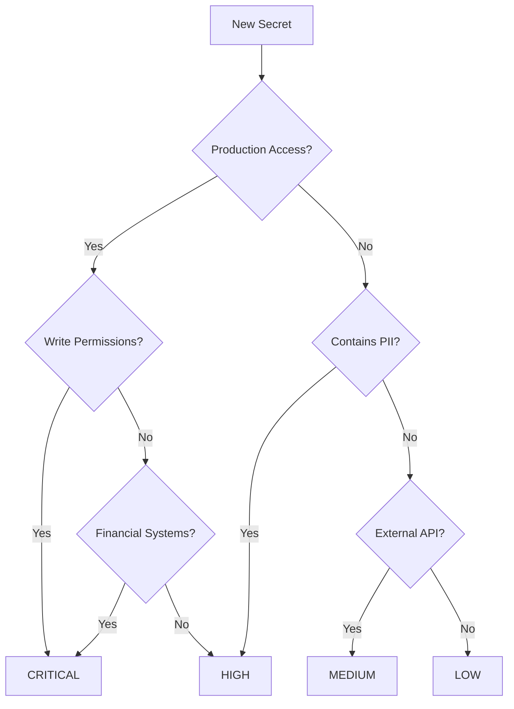

# Secrets Rotation Policy and Management

## Executive Summary

This document establishes the comprehensive secrets management and rotation procedures for self-hosted GitHub Actions runners. It defines classification levels, rotation frequencies, storage requirements, and automated procedures to maintain security while ensuring operational continuity.

## Table of Contents

- [Secret Classification](#secret-classification)
- [Storage Architecture](#storage-architecture)
- [Rotation Schedules](#rotation-schedules)
- [Automated Rotation Procedures](#automated-rotation-procedures)
- [Secret Injection and Usage](#secret-injection-and-usage)
- [Emergency Procedures](#emergency-procedures)
- [Compliance and Audit](#compliance-and-audit)
- [Implementation Guide](#implementation-guide)

## Secret Classification

### Classification Matrix

| Level | Description | Examples | Rotation | Storage | MFA |
|-------|-------------|----------|----------|---------|-----|
| **CRITICAL** | Compromise causes severe damage | Production DB passwords, Cloud provider root keys, Payment API keys | 30 days | Hardware HSM | Required |
| **HIGH** | Significant security impact | GitHub PATs, API keys with write access, SSL certificates | 90 days | Software HSM | Required |
| **MEDIUM** | Moderate security concern | Read-only API keys, Webhook secrets, Non-prod credentials | 180 days | Encrypted vault | Optional |
| **LOW** | Minimal security impact | Public API keys with rate limits, Development tokens | 365 days | Encrypted vault | Not required |

### Classification Decision Tree



## Storage Architecture

### Primary Storage: HashiCorp Vault

```yaml
vault_configuration:
  backend:
    type: "consul"
    ha_enabled: true
    cluster_addr: "https://vault-cluster.internal:8201"

  seal:
    type: "awskms"
    region: "us-east-1"
    kms_key_id: "arn:aws:kms:us-east-1:123456789012:key/vault-unseal"

  storage:
    encryption:
      algorithm: "AES-256-GCM"
      key_rotation: "automatic"

    access_control:
      authentication:
        - method: "github"
          config:
            organization: "your-org"
        - method: "ldap"
          config:
            url: "ldaps://ldap.company.com"

  audit:
    file:
      path: "/vault/logs/audit.log"
      log_raw: false
      hmac_accessor: true
```

### GitHub Secrets Store Integration

```yaml
github_secrets:
  hierarchy:
    organization:
      path: "/org-secrets"
      access: "org-wide runners"
      examples:
        - SONAR_TOKEN
        - ARTIFACTORY_PASSWORD
        - SLACK_WEBHOOK

    repository:
      path: "/repo-secrets"
      access: "repo-specific runners"
      examples:
        - DEPLOY_KEY
        - DATABASE_URL
        - API_TOKEN

    environment:
      path: "/env-secrets"
      access: "environment-protected"
      examples:
        - PROD_DATABASE_URL
        - STAGING_API_KEY
        - DEV_CREDENTIALS
```

### Secret Path Structure

```
/secrets/
├── /critical/
│   ├── /production/
│   │   ├── database-master-password
│   │   ├── aws-root-key
│   │   └── payment-api-secret
│   └── /infrastructure/
│       ├── vault-unseal-key
│       └── backup-encryption-key
├── /high/
│   ├── /github/
│   │   ├── org-admin-pat
│   │   └── deployment-pat
│   └── /certificates/
│       ├── wildcard-ssl-cert
│       └── code-signing-cert
├── /medium/
│   ├── /webhooks/
│   │   └── github-webhook-secret
│   └── /monitoring/
│       └── datadog-api-key
└── /low/
    ├── /development/
    │   └── test-api-key
    └── /public/
        └── maps-api-key
```

## Rotation Schedules

### Standard Rotation Calendar

```yaml
rotation_schedule:
  critical:
    frequency: 30_days
    advance_notice: 7_days
    grace_period: 24_hours
    blackout_windows:
      - "December 24-26"  # Holidays
      - "Major deployment windows"

  high:
    frequency: 90_days
    advance_notice: 14_days
    grace_period: 3_days
    automation: required

  medium:
    frequency: 180_days
    advance_notice: 30_days
    grace_period: 7_days
    automation: recommended

  low:
    frequency: 365_days
    advance_notice: 30_days
    grace_period: 14_days
    automation: optional
```

### Rotation Calendar Automation

```python
# rotation_scheduler.py
from datetime import datetime, timedelta
import hashicorp_vault
import github

class SecretRotationScheduler:
    def __init__(self):
        self.vault = hashicorp_vault.Client()
        self.github = github.Client()

    def get_rotation_schedule(self):
        """Generate rotation calendar for next 90 days"""
        secrets = self.vault.list_all_secrets()
        schedule = []

        for secret in secrets:
            rotation_date = self.calculate_rotation_date(secret)
            if rotation_date <= datetime.now() + timedelta(days=90):
                schedule.append({
                    'secret_name': secret.name,
                    'classification': secret.classification,
                    'current_rotation': secret.last_rotated,
                    'next_rotation': rotation_date,
                    'notification_date': rotation_date - timedelta(days=secret.advance_notice),
                    'grace_period_end': rotation_date + timedelta(days=secret.grace_period)
                })

        return sorted(schedule, key=lambda x: x['next_rotation'])

    def calculate_rotation_date(self, secret):
        """Calculate next rotation date based on classification"""
        rotation_intervals = {
            'CRITICAL': 30,
            'HIGH': 90,
            'MEDIUM': 180,
            'LOW': 365
        }

        interval = rotation_intervals[secret.classification]
        return secret.last_rotated + timedelta(days=interval)
```

## Automated Rotation Procedures

### Universal Rotation Workflow

```yaml
name: Secret Rotation Workflow
on:
  schedule:
    - cron: '0 3 * * *'  # Daily at 3 AM UTC
  workflow_dispatch:
    inputs:
      secret_name:
        description: 'Specific secret to rotate'
        required: false

jobs:
  identify-secrets:
    runs-on: self-hosted
    outputs:
      secrets-to-rotate: ${{ steps.identify.outputs.secrets }}
    steps:
      - name: Query expiring secrets
        id: identify
        run: |
          SECRETS=$(vault kv list -format=json secret/ | \
            jq '[.[] | select(.rotation_due <= now + 7*24*60*60)]')
          echo "secrets=$SECRETS" >> $GITHUB_OUTPUT

  rotate-secret:
    needs: identify-secrets
    strategy:
      matrix:
        secret: ${{ fromJson(needs.identify-secrets.outputs.secrets-to-rotate) }}
    runs-on: self-hosted
    steps:
      - name: Generate new secret
        id: generate
        run: |
          case "${{ matrix.secret.type }}" in
            "password")
              NEW_SECRET=$(openssl rand -base64 32)
              ;;
            "api_key")
              NEW_SECRET=$(uuidgen | tr -d '-')
              ;;
            "certificate")
              NEW_SECRET=$(generate_certificate.sh)
              ;;
            *)
              echo "Unknown secret type"
              exit 1
              ;;
          esac
          echo "::add-mask::$NEW_SECRET"
          echo "new_secret=$NEW_SECRET" >> $GITHUB_OUTPUT

      - name: Update in Vault
        run: |
          vault kv put secret/${{ matrix.secret.path }} \
            value="${{ steps.generate.outputs.new_secret }}" \
            rotated_at="$(date -u +%Y-%m-%dT%H:%M:%SZ)" \
            rotated_by="automation" \
            previous_version="${{ matrix.secret.version }}"

      - name: Update in GitHub Secrets
        if: matrix.secret.sync_to_github
        run: |
          gh secret set ${{ matrix.secret.name }} \
            --body "${{ steps.generate.outputs.new_secret }}" \
            --org "${{ github.repository_owner }}"

      - name: Verify new secret
        run: |
          # Test the new secret works
          ./scripts/verify_secret.sh \
            --name "${{ matrix.secret.name }}" \
            --type "${{ matrix.secret.type }}"

      - name: Schedule old secret deletion
        run: |
          echo "${{ matrix.secret.name }}" >> /tmp/deletion_queue
          at now + ${{ matrix.secret.grace_period }} <<< \
            "vault kv delete secret/${{ matrix.secret.path }}/previous"

      - name: Send notifications
        run: |
          ./scripts/notify_rotation.sh \
            --secret "${{ matrix.secret.name }}" \
            --status "completed" \
            --teams "${{ matrix.secret.owners }}"
```

### Database Password Rotation

```python
# rotate_database_password.py
import psycopg2
import vault
import time
from datetime import datetime

class DatabasePasswordRotator:
    def __init__(self, db_config):
        self.db_config = db_config
        self.vault_client = vault.Client()

    def rotate_password(self, username):
        """Rotate database user password"""
        # Step 1: Generate new password
        new_password = self.generate_secure_password()

        # Step 2: Create new user with new password
        temp_username = f"{username}_rotating_{int(time.time())}"
        self.create_user_with_grants(temp_username, new_password, username)

        # Step 3: Test new credentials
        if not self.test_connection(temp_username, new_password):
            raise Exception("New credentials failed validation")

        # Step 4: Update applications to use new credentials
        self.update_vault_secret(username, new_password)
        self.trigger_application_reload()

        # Step 5: Wait for grace period
        time.sleep(300)  # 5 minutes

        # Step 6: Rename users (atomic switch)
        self.atomic_user_switch(username, temp_username)

        # Step 7: Remove old user after verification
        self.schedule_old_user_removal(f"{username}_old")

        return {
            'username': username,
            'rotated_at': datetime.utcnow().isoformat(),
            'next_rotation': self.calculate_next_rotation()
        }

    def generate_secure_password(self, length=32):
        """Generate cryptographically secure password"""
        import secrets
        import string

        alphabet = string.ascii_letters + string.digits + "!@#$%^&*"
        password = ''.join(secrets.choice(alphabet) for _ in range(length))

        # Ensure password meets complexity requirements
        assert any(c.isupper() for c in password)
        assert any(c.islower() for c in password)
        assert any(c.isdigit() for c in password)
        assert any(c in "!@#$%^&*" for c in password)

        return password
```

### API Key Rotation

```bash
#!/bin/bash
# rotate_api_key.sh

rotate_api_key() {
    local SERVICE=$1
    local KEY_NAME=$2

    echo "Starting API key rotation for $SERVICE::$KEY_NAME"

    # Step 1: Create new API key via service API
    case $SERVICE in
        "github")
            NEW_KEY=$(gh api --method POST /user/personal-access-tokens \
                --field name="${KEY_NAME}-rotated" \
                --field expiration="90days" \
                | jq -r '.token')
            ;;
        "aws")
            NEW_KEY=$(aws iam create-access-key --user-name "$KEY_NAME" \
                | jq -r '.AccessKey.SecretAccessKey')
            ;;
        "datadog")
            NEW_KEY=$(curl -X POST "https://api.datadoghq.com/api/v1/api_key" \
                -H "DD-API-KEY: $CURRENT_KEY" \
                | jq -r '.api_key.key')
            ;;
        *)
            echo "Unknown service: $SERVICE"
            exit 1
            ;;
    esac

    # Step 2: Test new key
    if ! test_api_key "$SERVICE" "$NEW_KEY"; then
        echo "New API key validation failed"
        rollback_key_creation "$SERVICE" "$NEW_KEY"
        exit 1
    fi

    # Step 3: Update in vault
    vault kv put "secret/api-keys/$SERVICE/$KEY_NAME" \
        key="$NEW_KEY" \
        rotated_at="$(date -u +%Y-%m-%dT%H:%M:%SZ)" \
        previous_key="$CURRENT_KEY"

    # Step 4: Update GitHub secrets
    gh secret set "${SERVICE}_${KEY_NAME}_API_KEY" \
        --org "$(git config --get remote.origin.url | cut -d: -f2 | cut -d/ -f1)" \
        --body "$NEW_KEY"

    # Step 5: Trigger deployments to use new key
    trigger_rolling_deployment "$SERVICE"

    # Step 6: Deactivate old key after grace period
    echo "vault kv delete secret/api-keys/$SERVICE/$KEY_NAME/previous" | \
        at now + 24 hours

    echo "API key rotation completed for $SERVICE::$KEY_NAME"
}
```

## Secret Injection and Usage

### Secure Injection Pattern

```yaml
name: Secure Secret Usage
on:
  push:
    branches: [main]

jobs:
  deploy:
    runs-on: self-hosted
    permissions:
      contents: read
      id-token: write  # For OIDC

    steps:
      - name: Checkout code
        uses: actions/checkout@v3

      - name: Authenticate to Vault
        id: vault-auth
        run: |
          # Use OIDC token for passwordless auth
          VAULT_TOKEN=$(vault login -method=oidc -token-only)
          echo "::add-mask::$VAULT_TOKEN"
          echo "VAULT_TOKEN=$VAULT_TOKEN" >> $GITHUB_ENV

      - name: Retrieve secrets from Vault
        id: secrets
        run: |
          # Retrieve and mask secrets
          DB_PASS=$(vault kv get -field=password secret/database/prod)
          API_KEY=$(vault kv get -field=key secret/api/production)

          echo "::add-mask::$DB_PASS"
          echo "::add-mask::$API_KEY"

          # Use GitHub's secret masking
          echo "db_password=$DB_PASS" >> $GITHUB_OUTPUT
          echo "api_key=$API_KEY" >> $GITHUB_OUTPUT

      - name: Use secrets securely
        env:
          DATABASE_PASSWORD: ${{ steps.secrets.outputs.db_password }}
          API_KEY: ${{ steps.secrets.outputs.api_key }}
        run: |
          # Secrets are now in environment variables
          # They will be masked in logs automatically

          # Create temporary config file (deleted after use)
          cat > /tmp/app.conf <<EOF
          database.password = ${DATABASE_PASSWORD}
          api.key = ${API_KEY}
          EOF

          # Use config file
          ./deploy.sh --config /tmp/app.conf

          # Clean up immediately
          shred -vfz /tmp/app.conf

      - name: Audit secret access
        if: always()
        run: |
          # Log secret access for audit
          vault audit list -detailed
```

### WSL/Windows Secret Sharing

```yaml
wsl_windows_secret_bridge:
  windows_to_wsl:
    method: "credential_manager"
    steps:
      - Store in Windows Credential Manager
      - Access via WSL using /mnt/c/Windows/System32/cmdkey
      - Convert to Linux format

  wsl_to_windows:
    method: "shared_volume"
    steps:
      - Encrypt secret in WSL
      - Write to shared volume
      - Decrypt in Windows using same key

  bidirectional:
    method: "vault_agent"
    configuration: |
      # Vault agent config
      auto_auth {
        method "cert" {
          config {
            client_cert = "/mnt/c/certs/client.crt"
            client_key = "/mnt/c/certs/client.key"
          }
        }
      }

      template {
        source = "/vault/templates/secrets.tpl"
        destination = "/mnt/c/secrets/shared.env"
      }
```

## Emergency Procedures

### Secret Compromise Response

```yaml
compromise_response_playbook:
  detection:
    sources:
      - GitHub secret scanning alerts
      - Vault audit logs
      - SIEM correlation
      - Manual report

  immediate_response:  # < 15 minutes
    1_isolate:
      - Revoke compromised secret
      - Block source IP/account
      - Disable affected services

    2_assess:
      - Identify exposure window
      - List affected systems
      - Check for active exploitation

  containment:  # < 2 hours
    3_rotate:
      - Generate new secrets
      - Update all systems
      - Verify functionality

    4_investigate:
      - Review access logs
      - Identify compromise vector
      - Document timeline

  recovery:  # < 24 hours
    5_remediate:
      - Patch vulnerabilities
      - Update security controls
      - Enhance monitoring

    6_validate:
      - Security scan
      - Penetration test
      - Process review
```

### Emergency Secret Generation

```python
#!/usr/bin/env python3
# emergency_secret_generator.py

import os
import json
import boto3
import hashlib
from datetime import datetime, timedelta
from cryptography.fernet import Fernet

class EmergencySecretManager:
    def __init__(self):
        self.kms_client = boto3.client('kms')
        self.break_glass_used = False

    def generate_emergency_secret(self, purpose, approvers):
        """Generate emergency secret with dual approval"""

        # Verify dual approval
        if len(approvers) < 2:
            raise ValueError("Emergency secrets require dual approval")

        if not self.verify_approvers(approvers):
            raise ValueError("Approver verification failed")

        # Generate secret
        secret = {
            'value': self.generate_secure_value(),
            'purpose': purpose,
            'created_at': datetime.utcnow().isoformat(),
            'expires_at': (datetime.utcnow() + timedelta(hours=24)).isoformat(),
            'approvers': approvers,
            'emergency': True
        }

        # Encrypt with KMS
        encrypted = self.kms_client.encrypt(
            KeyId='alias/emergency-secrets',
            Plaintext=json.dumps(secret)
        )

        # Store with automatic expiration
        secret_id = self.store_emergency_secret(encrypted['CiphertextBlob'])

        # Log break-glass usage
        self.log_emergency_access(secret_id, purpose, approvers)

        # Schedule automatic revocation
        self.schedule_revocation(secret_id, hours=24)

        return secret_id

    def generate_secure_value(self, length=32):
        """Generate cryptographically secure secret"""
        return os.urandom(length).hex()

    def verify_approvers(self, approvers):
        """Verify approvers are authorized for emergency access"""
        authorized_approvers = self.get_authorized_approvers()
        return all(approver in authorized_approvers for approver in approvers)

    def log_emergency_access(self, secret_id, purpose, approvers):
        """Create immutable audit log of emergency access"""
        log_entry = {
            'event': 'EMERGENCY_SECRET_CREATED',
            'secret_id': secret_id,
            'purpose': purpose,
            'approvers': approvers,
            'timestamp': datetime.utcnow().isoformat(),
            'hash': None
        }

        # Add hash for tamper detection
        log_entry['hash'] = hashlib.sha256(
            json.dumps(log_entry, sort_keys=True).encode()
        ).hexdigest()

        # Send to multiple destinations for redundancy
        self.send_to_siem(log_entry)
        self.send_to_audit_log(log_entry)
        self.send_alert_to_security_team(log_entry)
```

### Break-Glass Procedure

```bash
#!/bin/bash
# break_glass.sh - Emergency access procedure

break_glass_access() {
    echo "=== EMERGENCY BREAK-GLASS PROCEDURE ==="
    echo "This action will be logged and audited"
    echo ""

    # Require two-person authorization
    read -p "Authorizer 1 Username: " AUTH1_USER
    read -sp "Authorizer 1 Password: " AUTH1_PASS
    echo
    read -sp "Authorizer 1 MFA Code: " AUTH1_MFA
    echo

    read -p "Authorizer 2 Username: " AUTH2_USER
    read -sp "Authorizer 2 Password: " AUTH2_PASS
    echo
    read -sp "Authorizer 2 MFA Code: " AUTH2_MFA
    echo

    # Validate authorizers
    if ! validate_emergency_approvers; then
        echo "Authorization failed. This attempt has been logged."
        send_security_alert "Failed break-glass attempt"
        exit 1
    fi

    # Record reason for emergency access
    read -p "Reason for emergency access: " REASON

    # Generate time-limited super-admin token
    EMERGENCY_TOKEN=$(vault token create \
        -policy=emergency-super-admin \
        -ttl=1h \
        -renewable=false \
        -metadata="reason=$REASON" \
        -metadata="approver1=$AUTH1_USER" \
        -metadata="approver2=$AUTH2_USER" \
        -format=json | jq -r '.auth.client_token')

    # Log everything
    log_emergency_access "$REASON" "$AUTH1_USER" "$AUTH2_USER"

    # Display token with warnings
    echo ""
    echo "╔════════════════════════════════════════╗"
    echo "║        EMERGENCY TOKEN GENERATED        ║"
    echo "╠════════════════════════════════════════╣"
    echo "║ Valid for: 1 hour (non-renewable)      ║"
    echo "║ All actions will be logged              ║"
    echo "║ Security team has been notified        ║"
    echo "╚════════════════════════════════════════╝"
    echo ""
    echo "Token: $EMERGENCY_TOKEN"
    echo ""
    echo "This token will be automatically revoked in 1 hour"
}
```

## Compliance and Audit

### Audit Requirements

```yaml
audit_requirements:
  logging:
    what_to_log:
      - Secret creation
      - Secret access
      - Secret modification
      - Secret rotation
      - Secret deletion
      - Failed access attempts
      - Emergency access

    log_format:
      timestamp: ISO8601
      actor:
        identity: user_or_service
        source_ip: IP_address
        authentication_method: method_used
      action:
        operation: CRUD_operation
        resource: secret_path
        result: success_or_failure
      metadata:
        classification: secret_level
        reason: business_justification
        correlation_id: unique_id

  retention:
    hot_storage: 90_days
    warm_storage: 1_year
    cold_storage: 7_years

  compliance_reports:
    sox:
      frequency: quarterly
      includes:
        - Financial system secrets
        - Segregation of duties
        - Change management

    pci_dss:
      frequency: annual
      includes:
        - Cardholder data encryption
        - Key management procedures
        - Access controls

    gdpr:
      frequency: on_demand
      includes:
        - Personal data encryption
        - Data retention compliance
        - Right to erasure
```

### Compliance Dashboard

```yaml
name: Generate Compliance Report
on:
  schedule:
    - cron: '0 0 1 * *'  # Monthly

jobs:
  compliance-report:
    runs-on: self-hosted
    steps:
      - name: Collect metrics
        run: |
          # Rotation compliance
          ROTATED_ON_TIME=$(vault audit list -format=json | \
            jq '[.[] | select(.rotated_on_time == true)] | length')

          TOTAL_SECRETS=$(vault kv list -format=json secret/ | jq length)

          COMPLIANCE_RATE=$((ROTATED_ON_TIME * 100 / TOTAL_SECRETS))

          # Access patterns
          UNAUTHORIZED_ATTEMPTS=$(grep "permission denied" /var/log/vault/audit.log | wc -l)

          # Secret hygiene
          EXPIRED_SECRETS=$(vault kv list -format=json secret/ | \
            jq '[.[] | select(.expiry < now)] | length')

      - name: Generate report
        run: |
          cat > compliance_report.md <<EOF
          # Secret Management Compliance Report
          Date: $(date -u +%Y-%m-%d)

          ## Rotation Compliance
          - Compliance Rate: ${COMPLIANCE_RATE}%
          - On-time Rotations: ${ROTATED_ON_TIME}/${TOTAL_SECRETS}
          - Expired Secrets: ${EXPIRED_SECRETS}

          ## Security Metrics
          - Unauthorized Access Attempts: ${UNAUTHORIZED_ATTEMPTS}
          - Emergency Access Used: ${EMERGENCY_ACCESS_COUNT}
          - Average Time to Rotation: ${AVG_ROTATION_TIME}

          ## Recommendations
          $(generate_recommendations)
          EOF

      - name: Send to stakeholders
        run: |
          send_email \
            --to security-team@company.com \
            --subject "Monthly Secret Compliance Report" \
            --body compliance_report.md
```

## Implementation Guide

### Phase 1: Assessment (Week 1-2)

```yaml
assessment_tasks:
  inventory:
    - Identify all existing secrets
    - Classify by sensitivity
    - Map dependencies
    - Document current rotation

  risk_assessment:
    - Identify high-risk secrets
    - Evaluate exposure
    - Priority ranking
    - Resource planning

  tools_selection:
    - Evaluate secret stores
    - Test automation tools
    - Integration assessment
    - Cost analysis
```

### Phase 2: Implementation (Week 3-6)

```yaml
implementation_tasks:
  infrastructure:
    - Deploy Vault cluster
    - Configure GitHub integration
    - Setup monitoring
    - Enable audit logging

  migration:
    - Migrate secrets by priority
    - Update applications
    - Test functionality
    - Document procedures

  automation:
    - Deploy rotation scripts
    - Configure schedules
    - Test workflows
    - Alert setup
```

### Phase 3: Validation (Week 7-8)

```yaml
validation_tasks:
  testing:
    - Rotation dry runs
    - Failover testing
    - Recovery procedures
    - Performance validation

  training:
    - Team training sessions
    - Documentation review
    - Runbook creation
    - Emergency drills

  certification:
    - Security audit
    - Compliance check
    - Sign-off process
    - Go-live approval
```

### Success Metrics

```yaml
success_metrics:
  security:
    - Zero secret exposure incidents
    - 100% rotation compliance
    - < 5 minute detection time
    - < 1 hour remediation time

  operational:
    - 99.9% availability
    - < 1% failed rotations
    - Automated coverage > 95%
    - Manual intervention < 5%

  compliance:
    - Audit findings: zero critical
    - SOC2 attestation achieved
    - GDPR compliance maintained
    - Industry standards met
```

## Appendix

### Secret Generation Scripts

```python
# generate_secrets.py
import secrets
import string
import base64
from cryptography.hazmat.primitives import serialization
from cryptography.hazmat.primitives.asymmetric import rsa
from cryptography.hazmat.backends import default_backend

class SecretGenerator:
    @staticmethod
    def generate_password(length=32, special_chars=True):
        """Generate secure password"""
        chars = string.ascii_letters + string.digits
        if special_chars:
            chars += "!@#$%^&*()_+-="

        password = ''.join(secrets.choice(chars) for _ in range(length))
        return password

    @staticmethod
    def generate_api_key(prefix="sk"):
        """Generate API key with prefix"""
        key = secrets.token_urlsafe(32)
        return f"{prefix}_{key}"

    @staticmethod
    def generate_jwt_secret():
        """Generate JWT signing secret"""
        return base64.b64encode(secrets.token_bytes(64)).decode('utf-8')

    @staticmethod
    def generate_ssh_keypair():
        """Generate SSH keypair"""
        private_key = rsa.generate_private_key(
            public_exponent=65537,
            key_size=4096,
            backend=default_backend()
        )

        private_pem = private_key.private_bytes(
            encoding=serialization.Encoding.PEM,
            format=serialization.PrivateFormat.PKCS8,
            encryption_algorithm=serialization.NoEncryption()
        )

        public_key = private_key.public_key()
        public_pem = public_key.public_bytes(
            encoding=serialization.Encoding.OpenSSH,
            format=serialization.PublicFormat.OpenSSH
        )

        return private_pem, public_pem
```

### Monitoring Queries

```sql
-- Secret rotation compliance
SELECT
    secret_name,
    classification,
    last_rotated,
    DATEDIFF(day, last_rotated, GETDATE()) as days_since_rotation,
    CASE
        WHEN classification = 'CRITICAL' AND DATEDIFF(day, last_rotated, GETDATE()) > 30 THEN 'OVERDUE'
        WHEN classification = 'HIGH' AND DATEDIFF(day, last_rotated, GETDATE()) > 90 THEN 'OVERDUE'
        WHEN classification = 'MEDIUM' AND DATEDIFF(day, last_rotated, GETDATE()) > 180 THEN 'OVERDUE'
        WHEN classification = 'LOW' AND DATEDIFF(day, last_rotated, GETDATE()) > 365 THEN 'OVERDUE'
        ELSE 'COMPLIANT'
    END as status
FROM secret_registry
WHERE active = 1
ORDER BY days_since_rotation DESC;

-- Failed rotation attempts
SELECT
    timestamp,
    secret_name,
    error_message,
    retry_count
FROM rotation_logs
WHERE status = 'FAILED'
    AND timestamp > DATEADD(day, -7, GETDATE())
ORDER BY timestamp DESC;

-- Unusual access patterns
SELECT
    actor,
    secret_name,
    COUNT(*) as access_count,
    STRING_AGG(timestamp, ', ') as access_times
FROM secret_access_logs
WHERE timestamp > DATEADD(hour, -24, GETDATE())
GROUP BY actor, secret_name
HAVING COUNT(*) > 10
ORDER BY access_count DESC;
```

---

*Document Version: 1.0*
*Classification: Confidential*
*Last Updated: 2024*
*Next Review: Quarterly*
*Owner: Security Operations Team*
*Compliance: SOC2, PCI-DSS, GDPR, HIPAA*