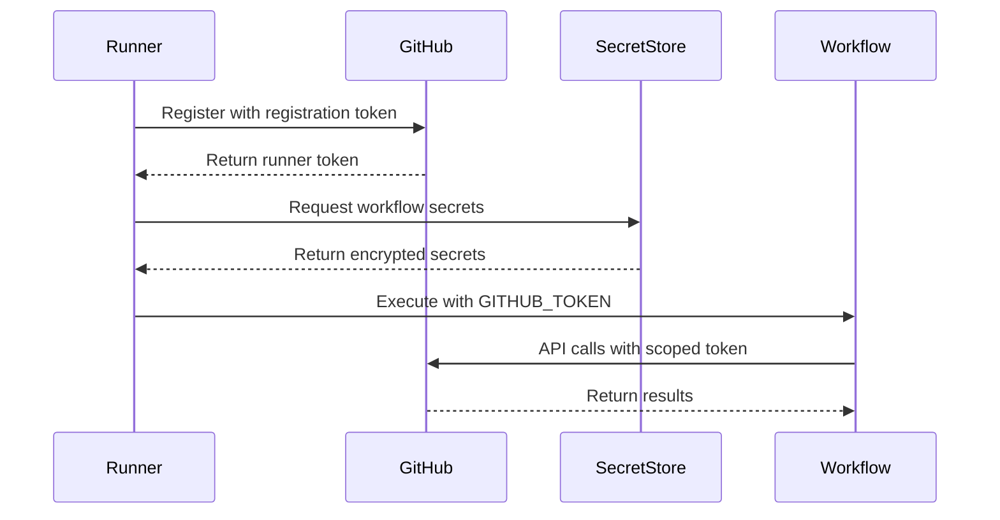

# Security Model for Self-Hosted GitHub Actions Runners

## Executive Summary

This document defines the comprehensive security architecture for self-hosted GitHub Actions runners deployed on Windows with WSL 2.0. The model implements zero-trust principles with defense-in-depth strategies to protect against credential leaks, runner compromise, and malicious code execution.

## Table of Contents

- [Security Architecture Overview](#security-architecture-overview)
- [Zero-Trust Implementation](#zero-trust-implementation)
- [Authentication and Authorization](#authentication-and-authorization)
- [Network Security](#network-security)
- [Runner Isolation](#runner-isolation)
- [Secrets Management](#secrets-management)
- [Audit and Compliance](#audit-and-compliance)
- [Incident Response](#incident-response)

## Security Architecture Overview

### Core Security Principles

1. **Principle of Least Privilege**: All tokens, permissions, and access rights follow minimal necessary access
2. **Defense in Depth**: Multiple security layers prevent single point of failure
3. **Fail Secure**: System defaults to deny access on any security validation failure
4. **Zero Trust**: No implicit trust; continuous verification required
5. **Separation of Duties**: Critical operations require multiple approvals

### Security Zones

```
┌─────────────────────────────────────────────────────────┐
│                    Internet Zone                        │
│                  (GitHub.com/Enterprise)                │
└────────────────────┬───────────────────────────────────┘
                     │ TLS 1.3
         ┌───────────▼────────────┐
         │   DMZ/Edge Zone        │
         │  - WAF                 │
         │  - DDoS Protection     │
         │  - Rate Limiting       │
         └───────────┬────────────┘
                     │
         ┌───────────▼────────────┐
         │   Runner Zone          │
         │  - Isolated VLANs      │
         │  - Network Segmentation│
         │  - Host Firewalls     │
         └───────────┬────────────┘
                     │
         ┌───────────▼────────────┐
         │   Internal Services    │
         │  - Secret Store        │
         │  - Monitoring         │
         │  - Audit Logs        │
         └────────────────────────┘
```

## Zero-Trust Implementation

### Trust Boundaries

1. **No Implicit Trust**
   - Every request authenticated and authorized
   - Continuous verification during execution
   - Session timeout: 15 minutes for administrative operations
   - Token refresh required for long-running jobs

2. **Micro-Segmentation**
   ```yaml
   network_segments:
     runner_pool_a:
       vlan: 100
       subnet: 10.0.100.0/24
       access: "repository:org/repo-a"
     runner_pool_b:
       vlan: 200
       subnet: 10.0.200.0/24
       access: "repository:org/repo-b"
   ```

3. **Identity Verification**
   - Multi-factor authentication for runner registration
   - Certificate-based runner authentication
   - JWT tokens with short expiration (1 hour max)

### Access Control Model

```yaml
rbac_model:
  roles:
    runner_admin:
      permissions:
        - runner:register
        - runner:remove
        - runner:update
        - logs:read
      mfa_required: true

    workflow_developer:
      permissions:
        - workflow:create
        - workflow:update
        - secrets:read
        - artifacts:read

    security_auditor:
      permissions:
        - logs:read
        - audit:read
        - config:read
      read_only: true
```

## Authentication and Authorization

### Token Hierarchy and Scoping

1. **GITHUB_TOKEN (Automatic)**
   ```yaml
   default_permissions: {}  # No permissions by default

   # Explicit permission escalation per job
   jobs:
     build:
       permissions:
         contents: read      # Read repository content
         packages: write     # Publish packages
         id-token: write    # OIDC token for cloud providers
   ```

2. **Personal Access Tokens (PAT)**
   - Used ONLY when GITHUB_TOKEN insufficient (e.g., branch protection bypass)
   - Minimum required scopes only
   - Separate PATs per use case
   - Never stored in code or logs

3. **Fine-Grained PATs (Preferred)**
   ```yaml
   fine_grained_pat:
     repository_access:
       - org/repo-1
       - org/repo-2
     permissions:
       contents: read
       pull_requests: write
       issues: write
     expiration: 90_days
   ```

### Permission Matrix

| Operation | GITHUB_TOKEN | PAT Required | Minimum Scopes |
|-----------|--------------|--------------|----------------|
| Read repository | ✓ | ✗ | `contents:read` |
| Create PR | ✓ | ✗ | `pull-requests:write` |
| Push to protected branch | ✗ | ✓ | `repo`, `workflow` |
| Update deployment | ✓ | ✗ | `deployments:write` |
| Access org secrets | ✓ | ✗ | `secrets:read` |
| Modify runner | ✗ | ✓ | `admin:org` |
| Cross-repo access | ✗ | ✓ | `repo` (target repos) |

### Authentication Flow



## Network Security

### Network Access Control

1. **Ingress Rules**
   ```yaml
   ingress:
     - protocol: tcp
       port: 443
       source: github.com/meta
       description: "GitHub webhook delivery"
     - protocol: tcp
       port: 22
       source: admin_network
       description: "SSH management access"
   ```

2. **Egress Rules**
   ```yaml
   egress:
     - protocol: tcp
       port: 443
       destination: api.github.com
       description: "GitHub API access"
     - protocol: tcp
       port: 443
       destination: github.com
       description: "Git operations"
     - protocol: tcp
       port: 443
       destination: packages.github.com
       description: "Package registry"
   ```

### TLS Configuration

```yaml
tls_configuration:
  minimum_version: "TLS 1.2"
  preferred_version: "TLS 1.3"
  cipher_suites:
    - TLS_AES_256_GCM_SHA384
    - TLS_AES_128_GCM_SHA256
    - TLS_CHACHA20_POLY1305_SHA256
  certificate_validation: required
  ocsp_stapling: enabled
  hsts_header: "max-age=31536000; includeSubDomains; preload"
```

## Runner Isolation

### Container Isolation (WSL 2.0)

```yaml
wsl_security:
  memory_limit: 8GB
  cpu_limit: 4
  swap: disabled
  networking:
    mode: NAT
    firewall: enabled
  filesystem:
    root_access: disabled
    mount_propagation: private
```

### Process Isolation

1. **User Context**
   - Dedicated service account per runner
   - No administrative privileges
   - Restricted sudo access in WSL

2. **Resource Limits**
   ```yaml
   resource_limits:
     max_processes: 1000
     max_open_files: 4096
     max_cpu_time: 3600  # 1 hour
     max_memory: 8GB
   ```

### Workspace Isolation

```bash
# Runner workspace structure
/runners/
├── runner-1/
│   ├── _work/        # Isolated workspace
│   ├── _temp/        # Temporary files (cleared after each job)
│   └── _tools/       # Approved tools only
└── runner-2/
    └── ...

# Permissions
chmod 700 /runners/runner-*
chown runner-user:runner-group /runners/runner-*
```

## Secrets Management

### Secret Storage Architecture

```yaml
secret_storage:
  provider: "Azure Key Vault"  # or HashiCorp Vault
  encryption:
    algorithm: AES-256-GCM
    key_rotation: 90_days
  access_control:
    authentication: "Managed Identity"
    authorization: "RBAC"
  audit:
    enabled: true
    retention: 365_days
```

### Secret Injection

1. **Runtime Injection Only**
   ```yaml
   - name: Deploy Application
     env:
       API_KEY: ${{ secrets.API_KEY }}  # Injected at runtime
     run: |
       # Secret masked in logs automatically
       echo "::add-mask::$API_KEY"
       deploy.sh
   ```

2. **Secret Masking**
   - Automatic masking in logs
   - Pattern-based detection (API keys, tokens)
   - Custom mask patterns

### Secret Types and Classification

| Classification | Examples | Rotation | Storage |
|---------------|----------|----------|---------|
| Critical | PATs, Cloud credentials | 30 days | Hardware HSM |
| High | API keys, DB passwords | 90 days | Software HSM |
| Medium | Webhook secrets | 180 days | Encrypted store |
| Low | Non-sensitive config | 365 days | Encrypted store |

## Audit and Compliance

### Audit Logging Requirements

```yaml
audit_configuration:
  log_level: INFO
  retention:
    hot: 30_days
    warm: 90_days
    cold: 365_days

  events_to_log:
    - runner_registration
    - runner_removal
    - job_start
    - job_complete
    - secret_access
    - permission_change
    - authentication_failure
    - api_rate_limit

  log_format:
    timestamp: ISO8601
    actor: user_or_system_id
    action: verb_noun
    resource: affected_resource
    result: success_or_failure
    metadata: additional_context
```

### Compliance Controls

1. **SOC2 Type 2 Requirements**
   - Continuous monitoring
   - Change management process
   - Access reviews (quarterly)
   - Vulnerability scanning (weekly)

2. **GDPR Compliance**
   - Data minimization
   - Right to erasure implementation
   - Data retention policies
   - Privacy by design

### Security Metrics

```yaml
security_kpis:
  - metric: failed_authentication_rate
    threshold: "< 5%"
    alert: immediate

  - metric: secret_rotation_compliance
    threshold: "100%"
    alert: 24_hours_before_expiry

  - metric: vulnerability_remediation_time
    critical: "< 24 hours"
    high: "< 7 days"
    medium: "< 30 days"
```

## Incident Response

### Incident Classification

| Severity | Description | Response Time | Escalation |
|----------|-------------|---------------|------------|
| Critical | Active exploitation, data breach | 15 minutes | CISO, Legal |
| High | Credential compromise, service down | 1 hour | Security Team |
| Medium | Failed security control | 4 hours | DevOps Lead |
| Low | Policy violation | 24 hours | Team Lead |

### Response Procedures

1. **Immediate Actions**
   ```yaml
   critical_incident_response:
     1_detect:
       - Automated alerting
       - Manual report
     2_contain:
       - Isolate affected runners
       - Revoke compromised credentials
       - Block malicious IPs
     3_investigate:
       - Collect logs and artifacts
       - Timeline reconstruction
       - Root cause analysis
     4_remediate:
       - Patch vulnerabilities
       - Rotate all secrets
       - Update security controls
     5_recover:
       - Restore services
       - Verify integrity
       - Monitor for recurrence
   ```

2. **Communication Plan**
   - Internal: Incident Response Team → Management → Affected Teams
   - External: Legal Review → Customer Notification → Public Disclosure

### Security Validation Checklist

```yaml
pre_production_checklist:
  network_security:
    - [ ] Firewall rules configured
    - [ ] Network segmentation active
    - [ ] TLS 1.3 enforced
    - [ ] DDoS protection enabled

  authentication:
    - [ ] MFA enforced for admins
    - [ ] Token rotation automated
    - [ ] Default permissions: none
    - [ ] PAT usage monitored

  secrets_management:
    - [ ] All secrets in secure store
    - [ ] Rotation policy active
    - [ ] Masking validated
    - [ ] No hardcoded secrets

  monitoring:
    - [ ] Audit logging enabled
    - [ ] SIEM integration tested
    - [ ] Alerting rules active
    - [ ] Metrics dashboard live

  compliance:
    - [ ] SOC2 controls validated
    - [ ] GDPR requirements met
    - [ ] Security scan passed
    - [ ] Documentation complete
```

## Security Contacts

| Role | Contact | Escalation |
|------|---------|------------|
| Security Lead | security-lead@org.com | Primary |
| CISO | ciso@org.com | Critical incidents |
| DevOps Security | devops-security@org.com | Technical issues |
| Incident Response | incident-response@org.com | 24/7 hotline |

---

*Document Version: 1.0*
*Classification: Confidential*
*Last Updated: 2024*
*Next Review: Quarterly*
*Compliance: SOC2, ISO27001, GDPR*