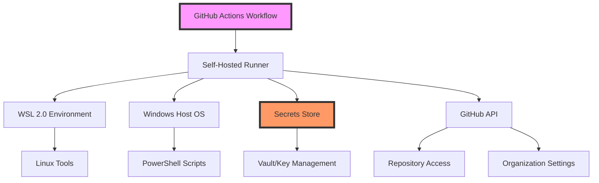
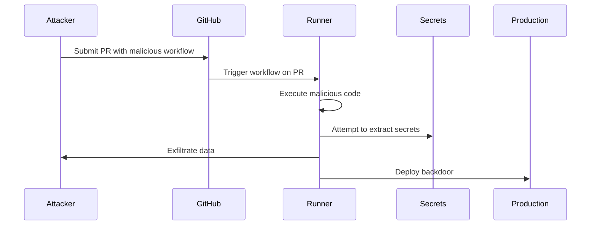
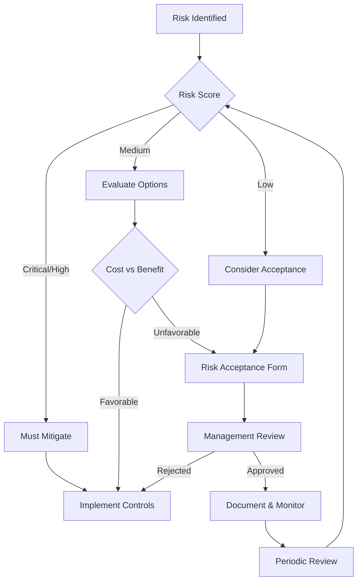

# Threat Model for Self-Hosted GitHub Actions Runners

## Executive Summary

This document provides a comprehensive threat analysis for self-hosted GitHub Actions runners deployed on Windows with WSL 2.0. Using STRIDE methodology and MITRE ATT&CK framework, we identify potential threats, assess risks, and define mitigation strategies to protect against credential leaks, runner compromise, and malicious code execution.

## Table of Contents

- [Asset Identification](#asset-identification)
- [Threat Actor Profiles](#threat-actor-profiles)
- [Attack Surface Analysis](#attack-surface-analysis)
- [STRIDE Analysis](#stride-analysis)
- [Attack Scenarios](#attack-scenarios)
- [Risk Assessment Matrix](#risk-assessment-matrix)
- [Mitigation Strategies](#mitigation-strategies)
- [Security Controls](#security-controls)
- [Residual Risk](#residual-risk)

## Asset Identification

### Critical Assets

| Asset | Value | Data Classification | Impact if Compromised |
|-------|-------|-------------------|----------------------|
| GitHub PATs | Critical | Confidential | Full repository access, code manipulation |
| Runner Registration Tokens | High | Confidential | Unauthorized runner registration |
| Production Secrets | Critical | Confidential | Production system compromise |
| Source Code | High | Proprietary | IP theft, backdoor insertion |
| Build Artifacts | Medium | Internal | Supply chain attacks |
| Runner Infrastructure | High | - | Service disruption, lateral movement |
| Audit Logs | High | Confidential | Compliance violation, evidence tampering |

### Asset Dependencies



## Threat Actor Profiles

### External Threat Actors

| Actor Type | Motivation | Capability | Likelihood | Target Assets |
|------------|------------|------------|------------|---------------|
| **Nation-State APT** | Espionage, disruption | Very High | Medium | Source code, secrets, infrastructure |
| **Cybercriminals** | Financial gain | High | High | Credentials, compute resources, data |
| **Hacktivists** | Ideology, publicity | Medium | Medium | Public repos, website defacement |
| **Script Kiddies** | Recognition, fun | Low | High | Exposed endpoints, known vulnerabilities |

### Internal Threat Actors

| Actor Type | Motivation | Capability | Likelihood | Target Assets |
|------------|------------|------------|------------|---------------|
| **Malicious Insider** | Revenge, profit | Very High | Low | All assets, especially secrets |
| **Compromised Account** | Varies | High | Medium | Accessible resources, lateral movement |
| **Careless Employee** | Unintentional | Medium | High | Accidental exposure, misconfiguration |
| **Third-Party Contractor** | Various | Medium | Medium | Limited scope based on access |

## Attack Surface Analysis

### Network Attack Surface

```yaml
network_exposure:
  external:
    - GitHub webhooks (HTTPS/443)
    - GitHub API connections (HTTPS/443)
    - Package registries (HTTPS/443)
    - AI/LLM service endpoints (HTTPS/443)

  internal:
    - Runner management ports
    - WSL bridge network
    - Vault/secret store connections
    - Monitoring endpoints

  protocols:
    - HTTPS (primary)
    - SSH (management)
    - WinRM (Windows management)
```

### Application Attack Surface

```yaml
application_surface:
  github_actions:
    - Workflow YAML injection
    - Malicious actions from marketplace
    - Secret extraction attempts
    - Resource exhaustion

  runner_software:
    - Runner binary vulnerabilities
    - Dependency vulnerabilities
    - Script injection
    - Privilege escalation

  integrations:
    - AI/LLM prompt injection
    - API key exposure
    - Webhook manipulation
    - Third-party service compromise
```

### Physical/Local Attack Surface

```yaml
local_surface:
  windows_host:
    - Local privilege escalation
    - Registry manipulation
    - Service hijacking
    - DLL injection

  wsl_environment:
    - Container escape
    - Kernel vulnerabilities
    - File system access
    - Network namespace bypass
```

## STRIDE Analysis

### Spoofing

| Threat | Description | Impact | Likelihood | Mitigation |
|--------|-------------|--------|------------|------------|
| T-S01: Fake GitHub webhook | Attacker sends malicious webhook | High | Medium | Webhook secret validation, IP allowlisting |
| T-S02: Runner impersonation | Fake runner registers with org | Critical | Low | Token validation, certificate pinning |
| T-S03: User impersonation | Stolen credentials used | High | Medium | MFA, behavioral analysis |
| T-S04: Service spoofing | MITM attack on API calls | High | Low | Certificate validation, TLS pinning |

### Tampering

| Threat | Description | Impact | Likelihood | Mitigation |
|--------|-------------|--------|------------|------------|
| T-T01: Workflow modification | Malicious PR modifies workflows | Critical | High | PR approval, signed commits |
| T-T02: Secret modification | Attacker changes secret values | Critical | Low | Audit logging, access controls |
| T-T03: Log tampering | Audit logs modified/deleted | High | Low | Immutable logs, remote logging |
| T-T04: Artifact poisoning | Build artifacts compromised | High | Medium | Signing, integrity checks |

### Repudiation

| Threat | Description | Impact | Likelihood | Mitigation |
|--------|-------------|--------|------------|------------|
| T-R01: Action denial | User denies triggering workflow | Medium | Medium | Comprehensive audit logging |
| T-R02: Change denial | Developer denies code changes | Medium | Low | Git commit signing, audit trail |
| T-R03: Access denial | Admin denies configuration change | Medium | Low | Change management, logging |

### Information Disclosure

| Threat | Description | Impact | Likelihood | Mitigation |
|--------|-------------|--------|------------|------------|
| T-I01: Secret exposure in logs | Credentials leaked in output | Critical | High | Secret masking, scanning |
| T-I02: Source code leak | Private code exposed | High | Medium | Access controls, DLP |
| T-I03: PII disclosure | Personal data exposed | High | Medium | Data classification, encryption |
| T-I04: Infrastructure details | Internal IPs/configs exposed | Medium | High | Output sanitization |

### Denial of Service

| Threat | Description | Impact | Likelihood | Mitigation |
|--------|-------------|--------|------------|------------|
| T-D01: Runner exhaustion | All runners consumed | High | High | Rate limiting, quotas |
| T-D02: Resource starvation | CPU/memory exhausted | High | Medium | Resource limits, monitoring |
| T-D03: API rate limiting | GitHub API quota exceeded | Medium | Medium | Caching, rate limit handling |
| T-D04: Storage filling | Disk space exhausted | Medium | Medium | Cleanup policies, quotas |

### Elevation of Privilege

| Threat | Description | Impact | Likelihood | Mitigation |
|--------|-------------|--------|------------|------------|
| T-E01: Container escape | Break out of WSL/container | Critical | Low | Security patches, isolation |
| T-E02: Token privilege escalation | Gain additional permissions | Critical | Medium | Least privilege, validation |
| T-E03: Local privilege escalation | User to admin/system | High | Medium | Patching, privilege separation |
| T-E04: Cross-repo access | Access unauthorized repos | High | Medium | Permission boundaries |

## Attack Scenarios

### Scenario 1: Malicious Pull Request Attack



**Mitigation:**
- Require PR approval for workflow changes
- Restrict workflow triggers for external contributors
- Use `pull_request_target` carefully
- Implement secret scanning

### Scenario 2: Supply Chain Attack via Compromised Action

```yaml
attack_chain:
  1_reconnaissance:
    - Identify popular GitHub Actions used
    - Find actions with weak security

  2_initial_compromise:
    - Compromise action maintainer account
    - OR submit malicious PR that gets merged

  3_payload_delivery:
    - Update action with backdoor
    - Maintain normal functionality

  4_execution:
    - Victims auto-update to compromised version
    - Backdoor executes in runner context

  5_persistence:
    - Establish C2 channel
    - Steal secrets and credentials

  6_lateral_movement:
    - Use stolen creds for repo access
    - Compromise additional systems
```

**Mitigation:**
- Pin actions to specific commits/SHAs
- Review action source code
- Use only verified actions
- Monitor for unusual behavior

### Scenario 3: Insider Threat - Rogue Developer

```yaml
threat_scenario:
  actor: Trusted developer with repo access

  attack_steps:
    1_preparation:
      - Study security controls
      - Identify valuable targets
      - Plan exfiltration method

    2_execution:
      - Create innocent-looking workflow
      - Slowly escalate permissions
      - Extract secrets over time

    3_exfiltration:
      - Send data to external service
      - Use steganography in artifacts
      - Leverage allowed integrations

    4_covering_tracks:
      - Delete incriminating workflows
      - Modify audit logs if possible
      - Blame on external compromise
```

**Mitigation:**
- Require peer review for all changes
- Implement anomaly detection
- Regular access reviews
- Separation of duties

### Scenario 4: Cryptomining Resource Hijack

```yaml
attack_pattern:
  initial_access:
    - Find misconfigured public repos
    - OR compromise developer account

  execution:
    - Create workflow with mining software
    - Use matrix strategy for scale
    - Trigger on multiple events

  persistence:
    - Hide mining in legitimate-looking jobs
    - Use scheduled workflows
    - Distribute across multiple repos

  impact:
    - Consume compute resources
    - Increase cloud costs
    - Degrade legitimate job performance
```

**Mitigation:**
- Monitor CPU/GPU usage
- Implement cost alerts
- Review scheduled workflows
- Scan for known mining signatures

## Risk Assessment Matrix

### Risk Scoring Methodology

```yaml
likelihood_scale:
  1_rare: "< 5% chance in 1 year"
  2_unlikely: "5-25% chance in 1 year"
  3_possible: "25-50% chance in 1 year"
  4_likely: "50-75% chance in 1 year"
  5_certain: "> 75% chance in 1 year"

impact_scale:
  1_negligible: "< $10K loss, no data breach"
  2_minor: "$10K-$100K loss, minor data exposure"
  3_moderate: "$100K-$1M loss, limited data breach"
  4_major: "$1M-$10M loss, significant breach"
  5_catastrophic: "> $10M loss, complete compromise"

risk_matrix:
  critical: likelihood * impact >= 20
  high: likelihood * impact >= 12
  medium: likelihood * impact >= 6
  low: likelihood * impact < 6
```

### Top Risks

| Risk ID | Threat | Likelihood | Impact | Risk Score | Priority |
|---------|--------|------------|--------|------------|----------|
| R001 | Secret exposure in logs | 4 | 5 | 20 | Critical |
| R002 | Malicious workflow injection | 4 | 4 | 16 | High |
| R003 | Supply chain attack | 3 | 5 | 15 | High |
| R004 | Runner resource exhaustion | 4 | 3 | 12 | High |
| R005 | Insider credential theft | 2 | 5 | 10 | Medium |
| R006 | API rate limit DoS | 3 | 3 | 9 | Medium |
| R007 | Container escape | 2 | 5 | 10 | Medium |
| R008 | Cryptomining | 3 | 2 | 6 | Medium |

## Mitigation Strategies

### Defense in Depth Architecture

```yaml
layer_1_perimeter:
  controls:
    - Web Application Firewall (WAF)
    - DDoS protection
    - Geographic IP filtering
    - Rate limiting

layer_2_network:
  controls:
    - Network segmentation
    - Zero-trust networking
    - Encrypted communications
    - Intrusion detection (IDS)

layer_3_host:
  controls:
    - Hardened OS configuration
    - Host-based firewall
    - Anti-malware/EDR
    - File integrity monitoring

layer_4_application:
  controls:
    - Input validation
    - Output encoding
    - Secret masking
    - Code signing

layer_5_data:
  controls:
    - Encryption at rest
    - Encryption in transit
    - Data loss prevention (DLP)
    - Access controls
```

### Specific Mitigations by Threat Category

#### Credential and Secret Protection

```yaml
secret_protection:
  preventive:
    - Use GitHub Secrets for sensitive data
    - Implement secret scanning
    - Enforce least privilege
    - Rotate credentials regularly

  detective:
    - Monitor for exposed secrets
    - Audit secret access
    - Alert on anomalous usage
    - Track permission changes

  corrective:
    - Automated secret rotation
    - Immediate revocation capability
    - Incident response playbook
    - Recovery procedures
```

#### Malicious Code Prevention

```yaml
code_protection:
  workflow_security:
    - Require approval for first-time contributors
    - Review workflow changes
    - Pin action versions
    - Restrict workflow permissions

  runtime_security:
    - Sandboxing/containerization
    - Resource limits
    - Network isolation
    - System call filtering

  supply_chain:
    - Dependency scanning
    - SBOM generation
    - Signature verification
    - Vendor assessment
```

#### Infrastructure Protection

```yaml
infrastructure_hardening:
  windows_host:
    - Apply security baselines (CIS/STIG)
    - Regular patching
    - Disable unnecessary services
    - Application whitelisting

  wsl_environment:
    - Kernel hardening
    - Secure defaults
    - Limited root access
    - AppArmor/SELinux

  network:
    - Microsegmentation
    - East-west firewall rules
    - VLAN isolation
    - Network monitoring
```

## Security Controls

### Technical Controls Implementation

```yaml
technical_controls:
  access_control:
    - implementation: RBAC with Azure AD
    - mfa_required: true
    - session_timeout: 15_minutes
    - privilege_escalation: requires_approval

  encryption:
    - data_at_rest: AES-256-GCM
    - data_in_transit: TLS 1.3
    - key_management: HSM-backed
    - certificate_management: Automated

  monitoring:
    - siem_integration: Splunk
    - log_aggregation: ELK Stack
    - metrics: Prometheus/Grafana
    - alerting: PagerDuty

  vulnerability_management:
    - scanning_frequency: weekly
    - patch_window: 30_days_critical
    - penetration_testing: quarterly
    - bug_bounty: yes
```

### Administrative Controls

```yaml
administrative_controls:
  policies:
    - Information Security Policy
    - Acceptable Use Policy
    - Incident Response Plan
    - Business Continuity Plan

  procedures:
    - Secure Development Lifecycle
    - Change Management Process
    - Access Review Process
    - Security Training Program

  compliance:
    - SOC2 Type 2
    - ISO 27001
    - GDPR
    - Industry-specific
```

### Physical Controls

```yaml
physical_controls:
  data_center:
    - 24/7 security personnel
    - Biometric access controls
    - CCTV surveillance
    - Environmental monitoring

  workstation:
    - Screen locks
    - Disk encryption
    - Cable locks
    - Clean desk policy
```

## Residual Risk

### Accepted Risks

| Risk ID | Description | Justification | Compensating Controls | Review Date |
|---------|-------------|---------------|----------------------|-------------|
| RR001 | Zero-day vulnerabilities | Cannot prevent unknown vulnerabilities | Rapid patching, monitoring, incident response | Quarterly |
| RR002 | Sophisticated nation-state attack | Cost of prevention exceeds risk | Cyber insurance, incident response, backups | Annual |
| RR003 | Limited GitHub API functionality | Platform limitation | Use alternative APIs where possible | Bi-annual |

### Risk Monitoring

```yaml
risk_monitoring:
  continuous:
    - Security metrics dashboard
    - Threat intelligence feeds
    - Vulnerability notifications
    - Compliance tracking

  periodic:
    - Quarterly risk assessment
    - Annual penetration testing
    - Bi-annual security audits
    - Monthly security reviews

  triggers:
    - New vulnerability disclosed
    - Security incident occurred
    - Major architecture change
    - Regulatory change
```

### Risk Acceptance Process



## Security Validation Checklist

### Pre-Production Security Gates

```yaml
security_gates:
  gate_1_design:
    - [ ] Threat model reviewed
    - [ ] Security architecture approved
    - [ ] Compliance requirements met
    - [ ] Privacy impact assessed

  gate_2_implementation:
    - [ ] Security controls implemented
    - [ ] Secrets management configured
    - [ ] Monitoring enabled
    - [ ] Logging configured

  gate_3_testing:
    - [ ] Vulnerability scan passed
    - [ ] Penetration test completed
    - [ ] Security controls validated
    - [ ] Incident response tested

  gate_4_deployment:
    - [ ] Production hardening complete
    - [ ] Security monitoring live
    - [ ] Incident response ready
    - [ ] Documentation complete
```

### Ongoing Security Validation

```yaml
continuous_validation:
  daily:
    - Monitor security alerts
    - Review failed authentications
    - Check secret access logs
    - Validate backup completion

  weekly:
    - Vulnerability scanning
    - Security metric review
    - Patch assessment
    - Access review

  monthly:
    - Security control testing
    - Compliance check
    - Risk reassessment
    - Training completion

  quarterly:
    - Penetration testing
    - Disaster recovery drill
    - Security audit
    - Threat model update
```

## Appendix: MITRE ATT&CK Mapping

### Relevant Techniques

| Tactic | Technique | ID | Relevance | Mitigation |
|--------|-----------|-----|-----------|------------|
| Initial Access | Supply Chain Compromise | T1195 | High | Action pinning, verification |
| Execution | Command and Script Interpreter | T1059 | High | Input validation, sandboxing |
| Persistence | Valid Accounts | T1078 | High | MFA, monitoring |
| Privilege Escalation | Valid Accounts | T1078 | High | Least privilege |
| Defense Evasion | Masquerading | T1036 | Medium | File integrity monitoring |
| Credential Access | Credentials from Password Stores | T1555 | High | Encryption, access control |
| Discovery | Account Discovery | T1087 | Medium | Audit logging |
| Lateral Movement | Remote Services | T1021 | Medium | Network segmentation |
| Collection | Data from Local System | T1005 | High | DLP, monitoring |
| Exfiltration | Exfiltration Over Web Service | T1567 | High | Network monitoring, DLP |
| Impact | Resource Hijacking | T1496 | Medium | Resource monitoring |

---

*Document Version: 1.0*
*Classification: Confidential*
*Last Updated: 2024*
*Next Review: Quarterly*
*Framework: STRIDE, MITRE ATT&CK v12*
*Owner: Security Architecture Team*