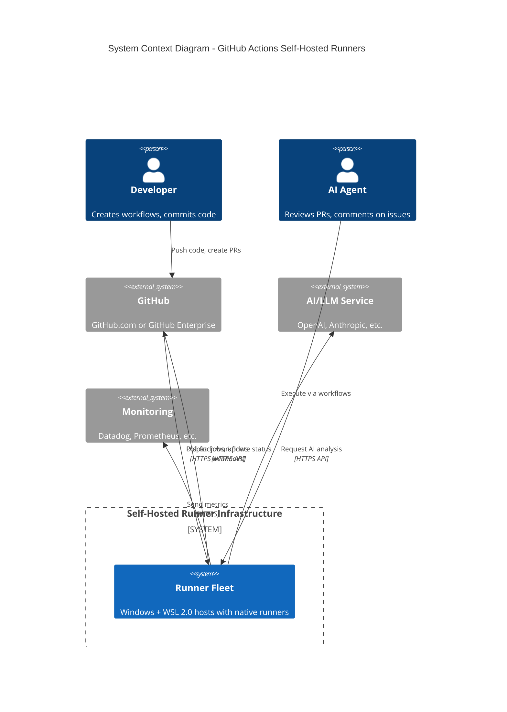
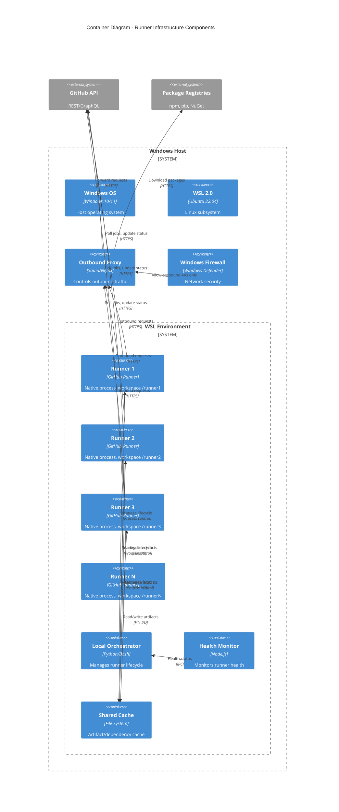
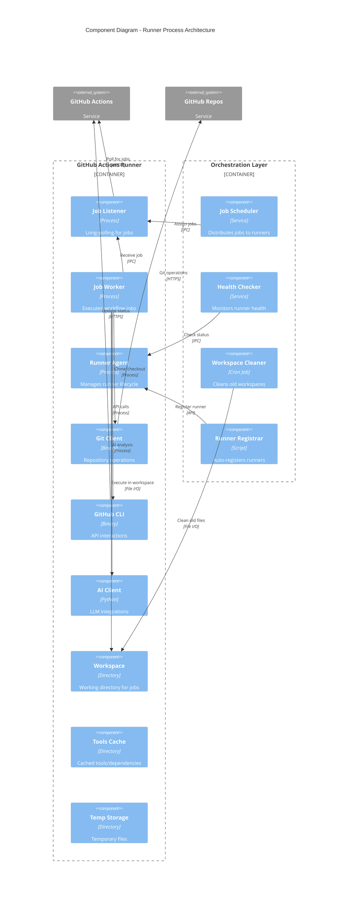
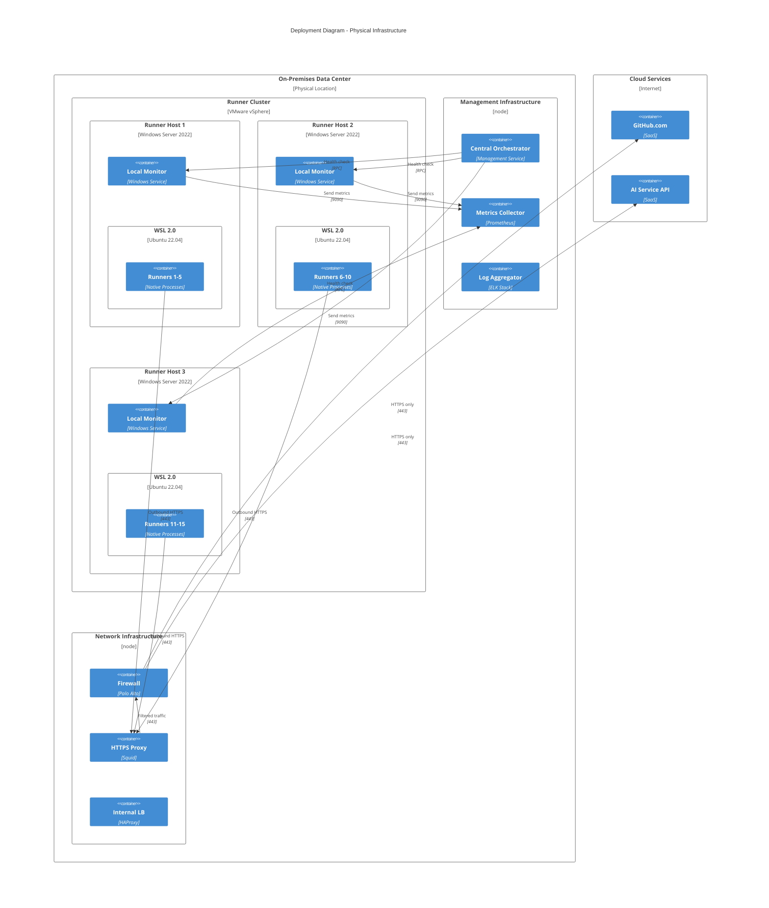

# GitHub Actions Self-Hosted Runner Infrastructure Architecture

## Executive Summary

This document defines the infrastructure architecture for self-hosted GitHub Actions runners deployed on Windows hosts with WSL 2.0, running native runner processes (no Docker containers). The design supports 3-5 initial runners per host, scalable to 10-20 runners, with a warm workspace strategy for optimal performance.

## Architecture Principles

1. **Native Process Execution**: Runners execute as native processes in WSL 2.0, not containerized
2. **Horizontal Scalability**: Scale by adding runner instances within hosts, then adding hosts
3. **Security First**: Outbound HTTPS only, no inbound ports, zero-trust model
4. **Performance Optimization**: Warm workspaces, local caching, SSD storage
5. **High Availability**: Multi-host deployment with automatic failover
6. **Cost Efficiency**: Right-sized resources with auto-scaling capabilities

## C4 Model Diagrams

### Level 1: System Context Diagram



### Level 2: Container Diagram



### Level 3: Component Diagram



### Level 4: Deployment Diagram



## Infrastructure Components

### Windows Host Configuration

#### Base Requirements
- **OS**: Windows Server 2022 or Windows 10/11 Pro
- **WSL**: Version 2.0 with Ubuntu 22.04 LTS
- **PowerShell**: Version 7.0+
- **Updates**: Automated Windows Updates with maintenance windows

#### WSL 2.0 Configuration
```powershell
# WSL 2.0 Resource Configuration
[wsl2]
memory=32GB              # 50% of host RAM
processors=16            # 50% of host CPU cores
swap=8GB                 # Swap file size
localhostForwarding=false # Security: disable localhost forwarding
kernelCommandLine="cgroup_enable=memory swapaccount=1"
```

### Runner Process Architecture

#### Native Runner Installation
Each runner is installed as a native process in WSL with:
- Dedicated service account
- Isolated workspace directory
- Independent configuration
- Separate GitHub token

#### Workspace Strategy
```bash
/home/runners/
├── runner1/
│   ├── actions-runner/     # Runner installation
│   ├── workspace/           # Active job workspace
│   ├── workspace-warm/      # Pre-warmed workspace
│   └── cache/              # Local cache
├── runner2/
│   ├── actions-runner/
│   ├── workspace/
│   ├── workspace-warm/
│   └── cache/
└── shared/
    ├── tools/              # Shared tools
    ├── cache/              # Shared cache
    └── artifacts/          # Shared artifacts
```

### Network Architecture

#### Security Model
- **Inbound**: All ports blocked (no incoming connections)
- **Outbound**: HTTPS (443) only via proxy
- **Internal**: Communication via Unix sockets and IPC

#### Proxy Configuration
```nginx
# Allowed Destinations (Whitelist)
github.com
api.github.com
*.githubusercontent.com
registry.npmjs.org
pypi.org
nuget.org
*.openai.com      # AI services
*.anthropic.com   # AI services
```

### Storage Architecture

#### Disk Layout
```yaml
System Disk (C:):
  - Size: 256 GB SSD
  - Windows OS and programs
  - WSL 2.0 system files

Data Disk (D:):
  - Size: 1 TB NVMe SSD
  - WSL 2.0 ext4 filesystem
  - Runner workspaces
  - Cache storage

Backup Disk (E:):
  - Size: 2 TB HDD
  - Artifacts archive
  - Log retention
  - Backup storage
```

#### Performance Optimization
- **SSD Storage**: All active workspaces on NVMe SSD
- **Cache Strategy**: Multi-tier caching (memory > local > shared)
- **Cleanup Policy**: Automated cleanup of workspaces older than 7 days
- **Compression**: Artifact compression before storage

## High Availability Design

### Redundancy Model
- **N+1 Redundancy**: Always maintain one extra host for failover
- **Runner Distribution**: Spread runners across multiple hosts
- **Geographic Distribution**: Consider multi-site deployment for DR

### Failover Strategy
1. **Health Monitoring**: Continuous health checks every 30 seconds
2. **Failure Detection**: 3 consecutive failed health checks trigger failover
3. **Runner Migration**: Automatically start replacement runners on healthy hosts
4. **Job Recovery**: Re-queue failed jobs for execution on new runners

### Backup and Recovery
- **Configuration Backup**: Daily backup of runner configurations
- **Workspace Snapshots**: Optional snapshots for critical workspaces
- **Recovery Time Objective (RTO)**: < 15 minutes
- **Recovery Point Objective (RPO)**: < 1 hour

## Monitoring and Observability

### Metrics Collection
```yaml
System Metrics:
  - CPU utilization per runner
  - Memory usage per runner
  - Disk I/O performance
  - Network throughput
  - WSL 2.0 resource usage

Application Metrics:
  - Jobs executed per hour
  - Job queue depth
  - Job execution time
  - Success/failure rates
  - API rate limit usage

Security Metrics:
  - Failed authentication attempts
  - Proxy blocked requests
  - Secret rotation compliance
  - Audit log volume
```

### Logging Strategy
- **Centralized Logging**: All logs shipped to central ELK stack
- **Log Retention**: 30 days hot, 90 days warm, 1 year cold storage
- **Log Levels**: Structured logging with appropriate verbosity
- **Correlation IDs**: Track jobs across multiple runners

### Alerting Rules
```yaml
Critical Alerts:
  - Runner host down > 5 minutes
  - All runners on host unhealthy
  - Disk space < 10%
  - Memory usage > 95%
  - GitHub API errors > 10/minute

Warning Alerts:
  - Runner unhealthy > 10 minutes
  - Job queue depth > 50
  - CPU usage > 80% for 15 minutes
  - Cache hit rate < 50%
  - Certificate expiry < 30 days
```

## Security Architecture

### Authentication and Authorization
- **Runner Tokens**: Unique fine-grained PAT per runner
- **Token Rotation**: Automated rotation every 30 days
- **Service Accounts**: Dedicated accounts with minimal privileges
- **MFA**: Required for administrative access

### Network Security
- **Zero Trust**: No implicit trust, verify everything
- **Egress Filtering**: Whitelist-only outbound connections
- **TLS Enforcement**: TLS 1.3 minimum for all connections
- **Certificate Pinning**: Pin GitHub and AI service certificates

### Data Protection
- **Encryption at Rest**: BitLocker for Windows, LUKS for WSL
- **Encryption in Transit**: TLS for all network communication
- **Secret Management**: GitHub Secrets, never in code or logs
- **Workspace Isolation**: Separate workspaces per runner

## Disaster Recovery Plan

### Failure Scenarios
1. **Single Runner Failure**: Automatic restart via orchestrator
2. **Host Failure**: Failover to standby host within 15 minutes
3. **Network Failure**: Queue jobs locally, retry when restored
4. **Storage Failure**: Restore from backup, rebuild cache
5. **Complete Site Failure**: Activate DR site (if configured)

### Recovery Procedures
```yaml
Runner Recovery:
  1. Detect failure via health check
  2. Attempt automatic restart (3 retries)
  3. If failed, mark runner offline
  4. Start replacement runner
  5. Re-register with GitHub
  6. Resume job processing

Host Recovery:
  1. Detect host failure
  2. Trigger failover to standby
  3. Start runners on new host
  4. Update DNS/load balancer
  5. Investigate root cause
  6. Restore failed host
```

## Capacity Planning

### Initial Deployment (Phase 1)
- **Hosts**: 2 active + 1 standby
- **Runners per Host**: 3-5
- **Total Runners**: 6-10 active
- **Concurrent Jobs**: 10-15

### Growth Projection (Phase 2)
- **Hosts**: 3-5 active + 1 standby
- **Runners per Host**: 10-15
- **Total Runners**: 30-75 active
- **Concurrent Jobs**: 50-100

### Scale Limits
- **Max Runners per Host**: 20 (WSL 2.0 process limit)
- **Max Memory per Runner**: 4 GB typical, 8 GB max
- **Max Storage per Runner**: 50 GB workspace
- **Max Network per Host**: 1 Gbps recommended

## Cost Analysis

### Infrastructure Costs (Monthly)
```yaml
Hardware/VM Costs:
  - 3x Windows Server VMs (16 vCPU, 64GB RAM): $1,500
  - Storage (3TB SSD + 6TB HDD): $300
  - Network bandwidth (1TB egress): $100
  Subtotal: $1,900/month

Software Licensing:
  - Windows Server licenses: $500
  - Monitoring tools: $200
  - Security tools: $150
  Subtotal: $850/month

Operational Costs:
  - Power and cooling: $200
  - Management overhead: $500
  Subtotal: $700/month

Total Monthly Cost: $3,450
Cost per Runner (10 runners): $345/month
```

### ROI Calculation
```yaml
Benefits:
  - Eliminated GitHub hosted runner minutes: $2,000/month
  - Reduced PR review time (AI automation): $5,000/month value
  - Improved deployment frequency: $3,000/month value

Total Monthly Benefit: $10,000
Monthly Cost: $3,450
Monthly Savings: $6,550
ROI: 190%
Payback Period: < 1 month
```

## Migration Strategy

### Phase 1: Pilot
1. Deploy 2 hosts with 3 runners each
2. Test with non-critical repositories
3. Validate performance and reliability
4. Gather metrics and feedback

### Phase 2: Production Rollout
1. Add production hosts and runners
2. Migrate critical repositories gradually
3. Implement full monitoring and alerting
4. Enable auto-scaling

### Phase 3: Optimization
1. Analyze usage patterns
2. Optimize resource allocation
3. Implement advanced caching
4. Add predictive scaling

## Appendix A: Configuration Examples

### Runner Registration Script
```bash
#!/bin/bash
# register-runner.sh

RUNNER_NAME="runner-$(hostname)-$(date +%s)"
GITHUB_URL="https://github.com/your-org"
RUNNER_TOKEN="$(curl -X POST -H "Authorization: token ${PAT}" \
  ${GITHUB_URL}/actions/runners/registration-token | jq -r .token)"

cd /home/runners/${RUNNER_NAME}
./config.sh --url ${GITHUB_URL} \
  --token ${RUNNER_TOKEN} \
  --name ${RUNNER_NAME} \
  --work workspace \
  --labels "self-hosted,WSL,Windows,x64" \
  --unattended \
  --replace

# Install as service
sudo ./svc.sh install
sudo ./svc.sh start
```

### Health Check Script
```python
#!/usr/bin/env python3
# health-check.py

import subprocess
import json
import requests
from datetime import datetime

def check_runner_health(runner_name):
    """Check if runner service is healthy"""
    try:
        result = subprocess.run(
            ['systemctl', 'is-active', f'actions.runner.{runner_name}'],
            capture_output=True,
            text=True
        )
        return result.returncode == 0
    except Exception as e:
        return False

def report_metrics(runner_name, status):
    """Report health metrics to monitoring system"""
    metrics = {
        'runner': runner_name,
        'status': 'healthy' if status else 'unhealthy',
        'timestamp': datetime.utcnow().isoformat()
    }
    # Send to monitoring system
    requests.post('http://metrics-collector:9090/metrics', json=metrics)

if __name__ == '__main__':
    runners = ['runner1', 'runner2', 'runner3']
    for runner in runners:
        health = check_runner_health(runner)
        report_metrics(runner, health)
```

## Appendix B: Troubleshooting Guide

### Common Issues

#### Runner Not Starting
```bash
# Check service status
systemctl status actions.runner.{runner-name}

# Check logs
journalctl -u actions.runner.{runner-name} -n 100

# Verify network connectivity
curl -I https://api.github.com

# Re-register if needed
./config.sh remove --token ${TOKEN}
./config.sh --url ${URL} --token ${NEW_TOKEN}
```

#### High Memory Usage
```bash
# Check WSL memory usage
wsl --status

# Limit memory in .wslconfig
[wsl2]
memory=32GB
swap=8GB

# Restart WSL
wsl --shutdown
wsl --distribution Ubuntu-22.04
```

#### Job Failures
```bash
# Check runner logs
tail -f /home/runners/runner1/_diag/Runner_*.log

# Verify tools availability
which git gh python3 node

# Check disk space
df -h /home/runners

# Clear cache if needed
rm -rf /home/runners/runner1/_work/_tool
```

## Document Control

- **Version**: 1.0
- **Author**: Cloud Architecture Team
- **Date**: 2024-10-17
- **Review Cycle**: Quarterly
- **Next Review**: 2025-01-17

---

*This document is part of the Wave 1 GitHub Actions Self-Hosted Runner Infrastructure project.*