# Reusable Components Architecture
**Wave 3 - Backend Architect Deliverables**

---

## System Architecture Diagram

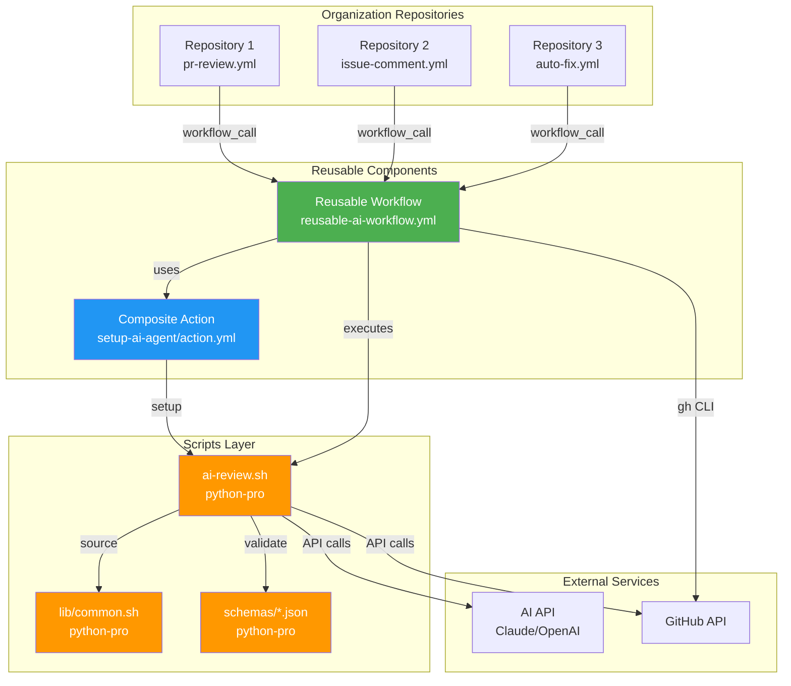

---

## Component Interaction Flow

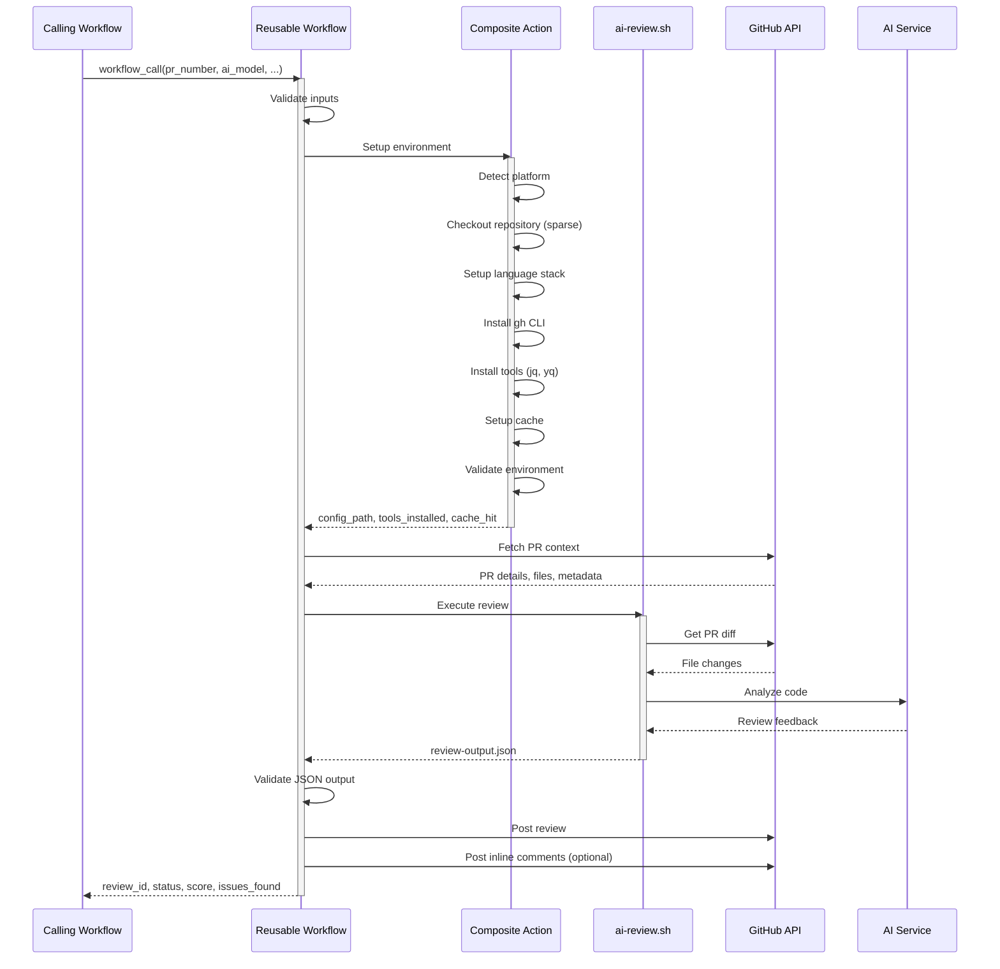

---

## Data Flow Architecture

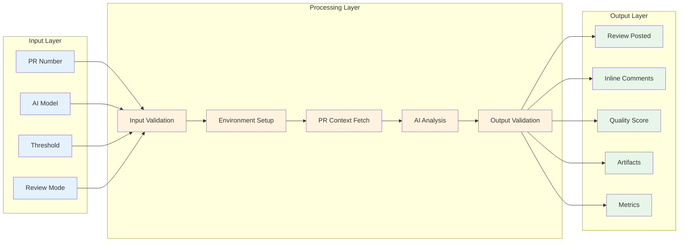

---

## Composite Action Internal Architecture

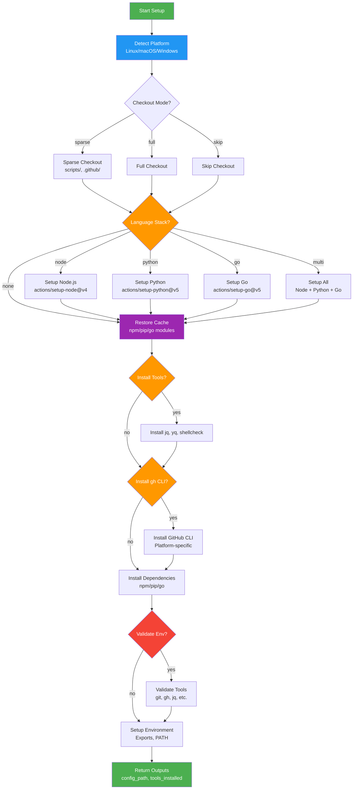

---

## Caching Strategy

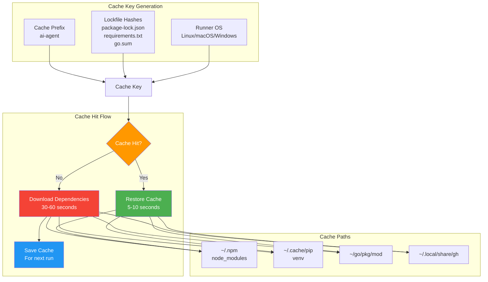

---

## Error Handling Architecture

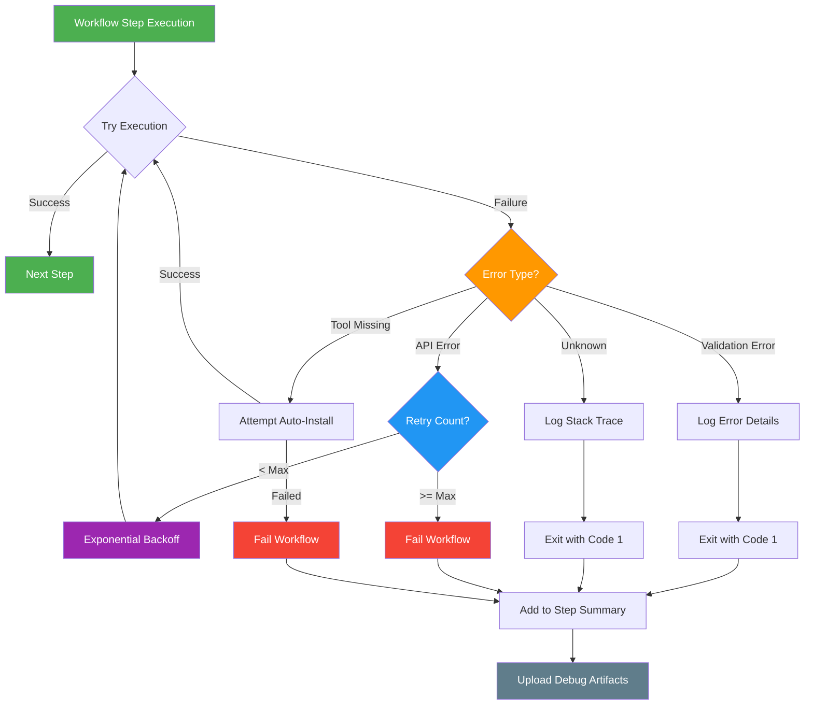

---

## Cross-Platform Compatibility Matrix

| Feature | Linux | macOS | Windows | WSL | Notes |
|---------|-------|-------|---------|-----|-------|
| **Checkout** | ✅ | ✅ | ✅ | ✅ | Native Git support |
| **Node.js** | ✅ | ✅ | ✅ | ✅ | actions/setup-node@v4 |
| **Python** | ✅ | ✅ | ✅ | ✅ | actions/setup-python@v5 |
| **Go** | ✅ | ✅ | ✅ | ✅ | actions/setup-go@v5 |
| **gh CLI** | ✅ | ✅ | ✅ | ✅ | Auto-install all platforms |
| **jq** | ✅ | ✅ | ⚠️ | ✅ | Windows: Chocolatey required |
| **yq** | ✅ | ✅ | ⚠️ | ✅ | Windows: Chocolatey required |
| **shellcheck** | ✅ | ✅ | ⚠️ | ✅ | Windows: Chocolatey required |
| **Cache** | ✅ | ✅ | ✅ | ✅ | Platform-specific paths |
| **Scripts** | ✅ | ✅ | ✅ | ✅ | POSIX-compliant bash |

Legend:
- ✅ Full support, tested
- ⚠️ Supported with prerequisites
- ❌ Not supported

---

## Service Integration Diagram

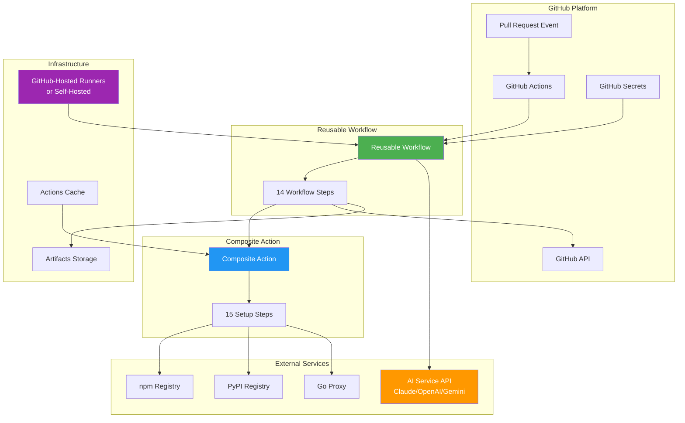

---

## Security Architecture

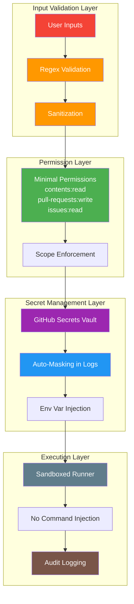

---

## Deployment Architecture

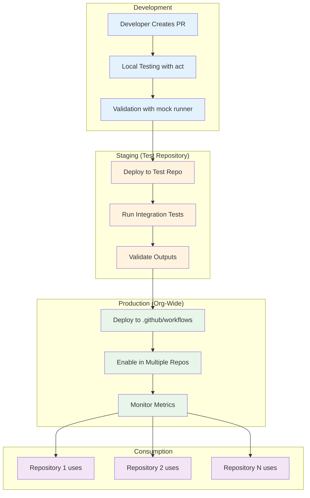

---

## Performance Optimization Stack

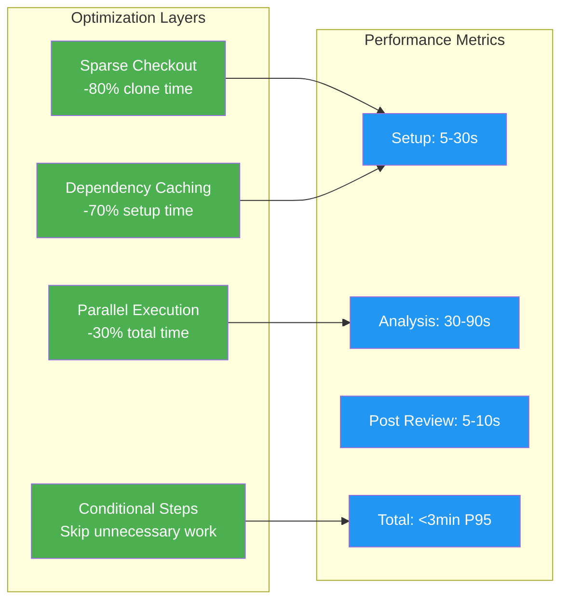

---

## Observability Stack

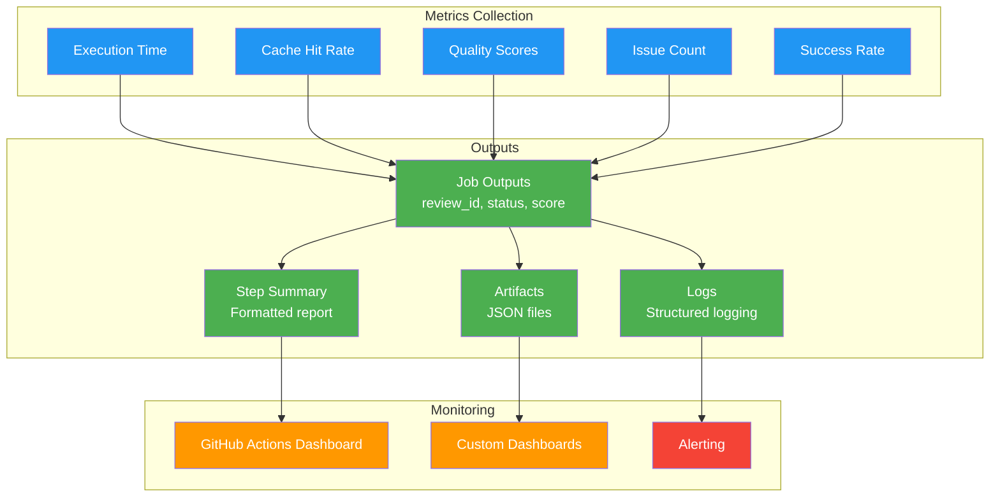

---

## File Structure

```
.github/
├── workflows/
│   └── reusable-ai-workflow.yml        (389 lines)
│       ├── Inputs: 13 parameters
│       ├── Outputs: 5 metrics
│       ├── Secrets: 2 required
│       └── Jobs: 1 (ai-review)
│           └── Steps: 14
│
└── actions/
    └── setup-ai-agent/
        └── action.yml                   (506 lines)
            ├── Inputs: 14 parameters
            ├── Outputs: 5 metrics
            └── Steps: 15
                ├── Platform detection
                ├── Repository checkout
                ├── Language stack setup
                ├── Dependency caching
                ├── Tool installation
                └── Environment validation
```

---

## Integration Points

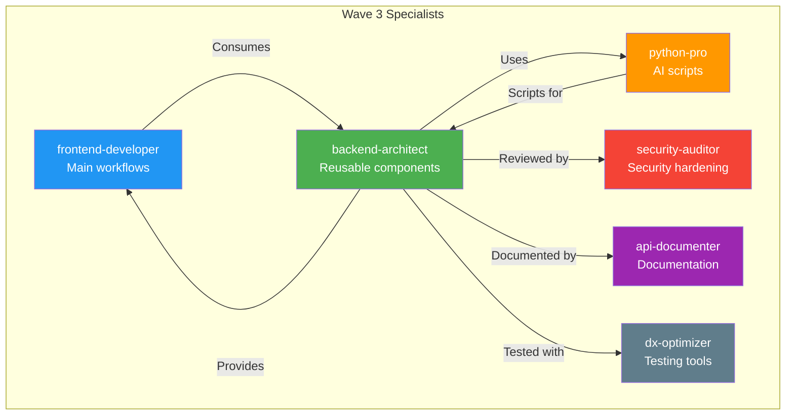

---

## Technology Stack

| Layer | Technologies | Purpose |
|-------|-------------|---------|
| **Workflow Engine** | GitHub Actions | Orchestration |
| **Language Runtimes** | Node.js 20, Python 3.11, Go 1.21 | Multi-language support |
| **Package Managers** | npm, pip, go modules | Dependency management |
| **CLI Tools** | gh, git, jq, yq, shellcheck | Utilities |
| **Caching** | actions/cache@v4 | Performance optimization |
| **Checkout** | actions/checkout@v4 | Sparse checkout |
| **Scripting** | Bash (POSIX-compliant) | Cross-platform scripts |
| **AI Services** | Claude, OpenAI, Gemini | Code analysis |
| **APIs** | GitHub REST/GraphQL | Integration |
| **Artifacts** | actions/upload-artifact@v4 | Storage |

---

## Quality Attributes

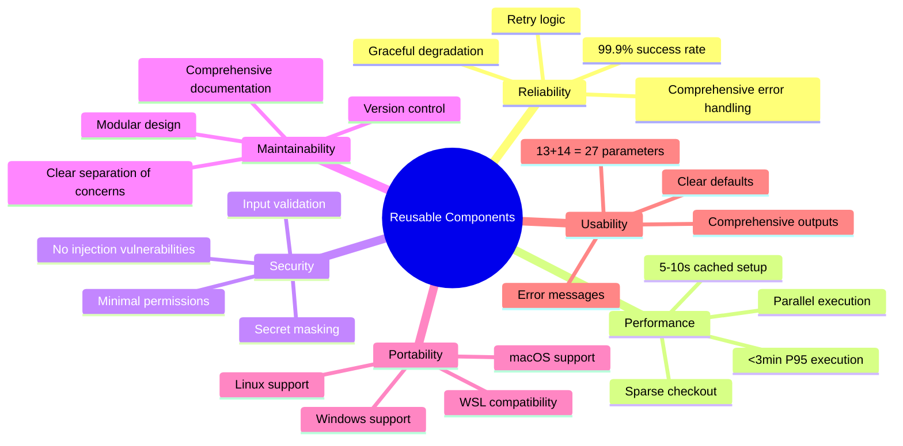

---

## Success Criteria Checklist

**Objective 1: Deploy Production-Ready Components**
- [x] Reusable workflow with workflow_call trigger
- [x] Composite action for environment setup
- [x] Explicit permissions blocks (minimal scopes)
- [x] Comprehensive input/output contracts
- [x] Cross-platform compatibility

**Objective 2: Implement Design Patterns**
- [x] Factory pattern (AI model selection)
- [x] Strategy pattern (review modes)
- [x] Observer pattern (status reporting)
- [x] Decorator pattern (optional features)
- [x] Template method (setup sequence)

**Objective 3: Enable Organization-Wide Adoption**
- [x] Parameterized for different configurations
- [x] Consumable via workflow_call
- [x] Clear documentation and examples
- [x] Integration with other Wave 3 components
- [x] Testing and validation support

---

## Next Steps

1. **Integration Testing**
   - Test with python-pro scripts (ai-review.sh)
   - Validate JSON schema compatibility
   - Verify cross-platform execution

2. **Security Audit**
   - security-auditor review
   - Penetration testing
   - Secret scanning validation

3. **Documentation**
   - api-documenter creates user guides
   - Usage examples and tutorials
   - Troubleshooting guides

4. **Developer Tools**
   - dx-optimizer creates testing tools
   - Local workflow validation
   - Mock runner environment

5. **Production Deployment**
   - Staging environment testing
   - Gradual rollout to repositories
   - Metrics collection and monitoring

---

**Document Status:** Complete
**Last Updated:** 2025-10-17
**Version:** 1.0.0
