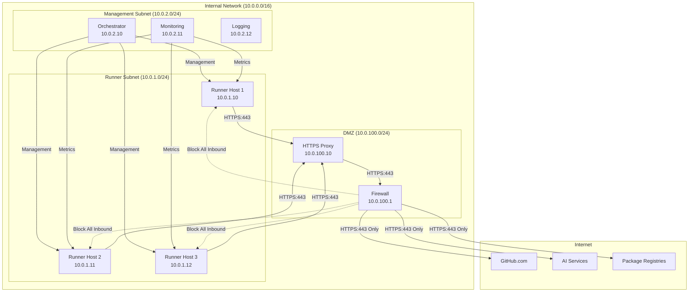
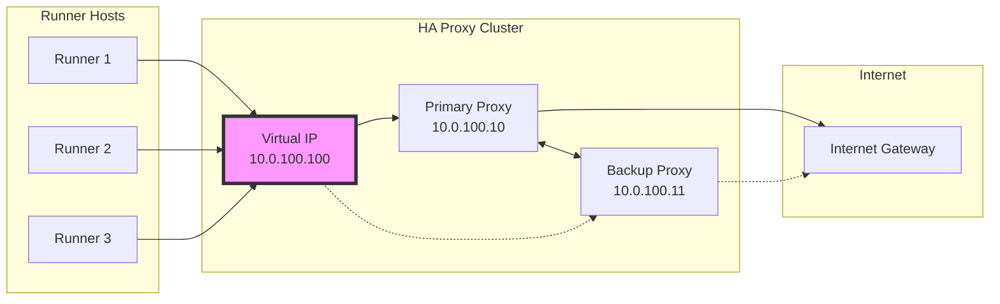
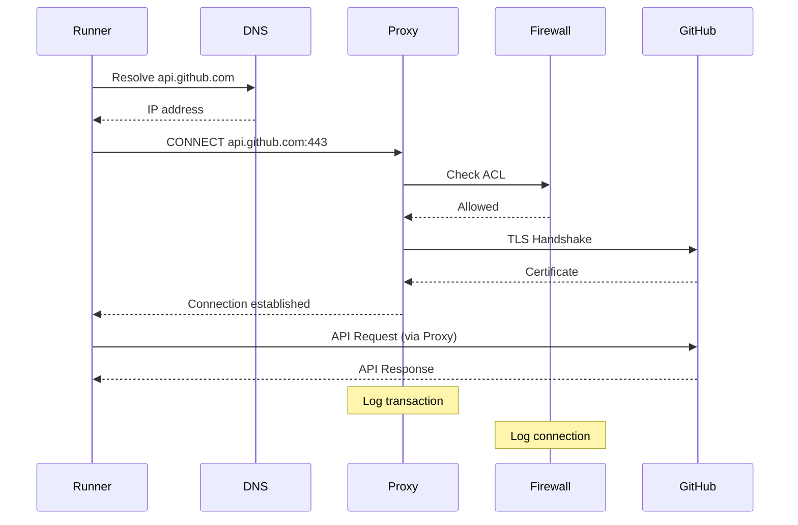
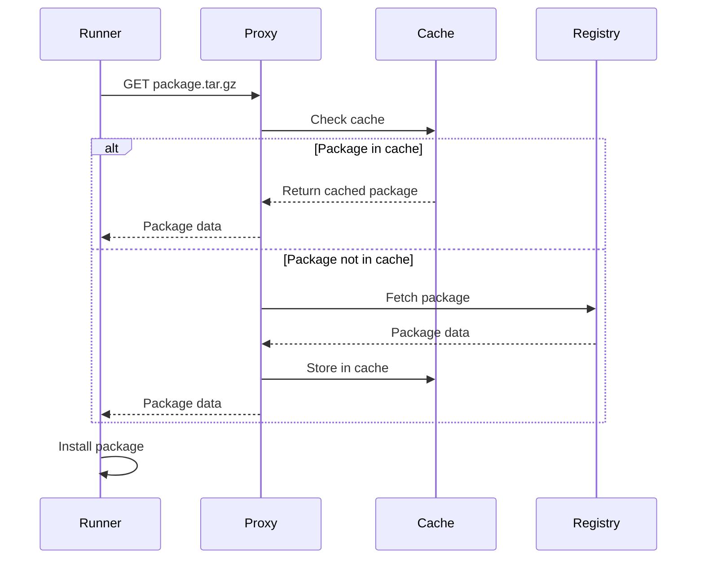

# GitHub Actions Runner Network Topology

## Executive Summary

This document defines the network architecture for self-hosted GitHub Actions runners with a strict security model: outbound HTTPS (port 443) only, no inbound connections. The design ensures secure communication while maintaining high performance and reliability for runner operations.

## Network Security Principles

1. **Zero Trust Architecture**: No implicit trust, verify everything
2. **Outbound Only**: No inbound ports open, all connections initiated from inside
3. **HTTPS Enforcement**: All traffic encrypted with TLS 1.3+
4. **Least Privilege**: Minimal network access required for operation
5. **Defense in Depth**: Multiple security layers
6. **Audit Everything**: Complete logging of all network activity

## Network Architecture Overview

### High-Level Network Diagram



## Detailed Network Topology

### Network Segmentation

```yaml
Network Segments:
  Runner Network:
    Subnet: 10.0.1.0/24
    VLAN: 100
    Gateway: 10.0.1.1
    DNS: 10.0.1.2, 10.0.1.3
    DHCP: Disabled (Static IPs only)
    Purpose: Isolated network for runner hosts

  Management Network:
    Subnet: 10.0.2.0/24
    VLAN: 200
    Gateway: 10.0.2.1
    DNS: 10.0.2.2, 10.0.2.3
    Purpose: Management and monitoring services

  DMZ Network:
    Subnet: 10.0.100.0/24
    VLAN: 999
    Gateway: 10.0.100.1
    Purpose: Proxy and firewall services

  Inter-VLAN Routing:
    - Runner -> DMZ: Allowed (HTTPS only)
    - Runner -> Management: Denied
    - Management -> Runner: Allowed (SSH, monitoring)
    - DMZ -> Runner: Denied
    - DMZ -> Internet: Allowed (HTTPS only)
```

### IP Address Allocation

```yaml
Static IP Assignments:
  Runner Hosts:
    runner-host-01: 10.0.1.10
    runner-host-02: 10.0.1.11
    runner-host-03: 10.0.1.12
    runner-host-04: 10.0.1.13  # Reserved
    runner-host-05: 10.0.1.14  # Reserved
    # ... up to .250 for growth

  Management Services:
    orchestrator: 10.0.2.10
    monitoring: 10.0.2.11
    logging: 10.0.2.12
    backup: 10.0.2.13
    ansible: 10.0.2.14

  DMZ Services:
    primary-proxy: 10.0.100.10
    backup-proxy: 10.0.100.11   # HA failover
    firewall: 10.0.100.1
    ids-ips: 10.0.100.20

Reserved Ranges:
  10.0.1.251-254: Network equipment
  10.0.2.251-254: Network equipment
  10.0.100.251-254: Network equipment
```

## Firewall Configuration

### Firewall Rules

```yaml
# Outbound Rules (Stateful)
Outbound_Rules:
  Rule_1:
    Name: "Allow GitHub API"
    Source: 10.0.1.0/24
    Destination: github.com, api.github.com
    Port: 443
    Protocol: TCP
    Action: ALLOW
    Log: Yes

  Rule_2:
    Name: "Allow GitHub Raw Content"
    Source: 10.0.1.0/24
    Destination: raw.githubusercontent.com, *.githubusercontent.com
    Port: 443
    Protocol: TCP
    Action: ALLOW
    Log: Yes

  Rule_3:
    Name: "Allow Package Registries"
    Source: 10.0.1.0/24
    Destination:
      - registry.npmjs.org
      - pypi.org
      - files.pythonhosted.org
      - nuget.org
      - registry.yarnpkg.com
      - repo.maven.apache.org
    Port: 443
    Protocol: TCP
    Action: ALLOW
    Log: Yes

  Rule_4:
    Name: "Allow AI Services"
    Source: 10.0.1.0/24
    Destination:
      - api.openai.com
      - api.anthropic.com
      - *.openai.azure.com
    Port: 443
    Protocol: TCP
    Action: ALLOW
    Log: Yes

  Rule_5:
    Name: "Allow DNS"
    Source: 10.0.1.0/24
    Destination: 10.0.1.2, 10.0.1.3
    Port: 53
    Protocol: UDP, TCP
    Action: ALLOW
    Log: No

  Rule_6:
    Name: "Allow NTP"
    Source: 10.0.1.0/24
    Destination: pool.ntp.org
    Port: 123
    Protocol: UDP
    Action: ALLOW
    Log: No

  Default_Outbound:
    Action: DENY
    Log: Yes

# Inbound Rules
Inbound_Rules:
  Rule_1:
    Name: "Management SSH"
    Source: 10.0.2.0/24
    Destination: 10.0.1.0/24
    Port: 22
    Protocol: TCP
    Action: ALLOW
    Log: Yes

  Rule_2:
    Name: "Monitoring Metrics"
    Source: 10.0.2.11
    Destination: 10.0.1.0/24
    Port: 9090
    Protocol: TCP
    Action: ALLOW
    Log: No

  Default_Inbound:
    Action: DENY
    Log: Yes

# Inter-VLAN Rules
Inter_VLAN_Rules:
  Rule_1:
    Name: "Runner to Proxy"
    Source: 10.0.1.0/24
    Destination: 10.0.100.10-11
    Port: 3128  # Proxy port
    Protocol: TCP
    Action: ALLOW

  Rule_2:
    Name: "Block Runner to Management"
    Source: 10.0.1.0/24
    Destination: 10.0.2.0/24
    Action: DENY

  Rule_3:
    Name: "Allow Management to Runner"
    Source: 10.0.2.0/24
    Destination: 10.0.1.0/24
    Port: 22, 9090
    Protocol: TCP
    Action: ALLOW
```

### Network ACLs

```yaml
# Additional Layer 3/4 ACLs
Runner_Subnet_ACL:
  Inbound:
    - Permit: tcp 10.0.2.0/24 any eq 22    # SSH from management
    - Permit: tcp 10.0.2.11/32 any eq 9090 # Monitoring
    - Deny: ip any any                      # Deny all else

  Outbound:
    - Permit: tcp any 10.0.100.10/32 eq 3128  # To proxy
    - Permit: udp any 10.0.1.2/32 eq 53       # DNS
    - Permit: udp any 10.0.1.3/32 eq 53       # DNS
    - Deny: ip any any                         # Deny all else
```

## Proxy Configuration

### HTTPS Proxy Setup

```nginx
# squid.conf - Squid Proxy Configuration
http_port 3128 ssl-bump cert=/etc/squid/cert.pem

# SSL Bump configuration
ssl_bump splice all

# Access Control Lists
acl runner_network src 10.0.1.0/24
acl SSL_ports port 443
acl CONNECT method CONNECT

# Destination whitelist
acl allowed_sites dstdomain .github.com
acl allowed_sites dstdomain .githubusercontent.com
acl allowed_sites dstdomain .npmjs.org
acl allowed_sites dstdomain .pypi.org
acl allowed_sites dstdomain .pythonhosted.org
acl allowed_sites dstdomain .nuget.org
acl allowed_sites dstdomain .yarnpkg.com
acl allowed_sites dstdomain .maven.apache.org
acl allowed_sites dstdomain .openai.com
acl allowed_sites dstdomain .anthropic.com
acl allowed_sites dstdomain .openai.azure.com

# Access rules
http_access allow runner_network allowed_sites SSL_ports
http_access allow runner_network allowed_sites CONNECT
http_access deny all

# Cache configuration
cache_dir ufs /var/cache/squid 10000 16 256
cache_mem 256 MB
maximum_object_size 100 MB
cache_replacement_policy lru

# Logging
access_log /var/log/squid/access.log squid
cache_log /var/log/squid/cache.log

# Performance tuning
dns_v4_first on
forwarded_for delete
via off
```

### Proxy High Availability



```yaml
# Keepalived configuration for proxy HA
global_defs {
    router_id PROXY_HA
}

vrrp_instance PROXY {
    state MASTER              # BACKUP on secondary
    interface eth0
    virtual_router_id 51
    priority 100              # 90 on backup
    advert_int 1

    authentication {
        auth_type PASS
        auth_pass SecurePass123
    }

    virtual_ipaddress {
        10.0.100.100/24
    }

    track_script {
        check_squid
    }
}

vrrp_script check_squid {
    script "/usr/local/bin/check_squid.sh"
    interval 2
    weight 2
}
```

## DNS Configuration

### Internal DNS Setup

```bind
; /etc/bind/named.conf.local
zone "runners.local" {
    type master;
    file "/etc/bind/db.runners.local";
};

zone "1.0.10.in-addr.arpa" {
    type master;
    file "/etc/bind/db.10.0.1";
};

; /etc/bind/db.runners.local
$TTL    604800
@       IN      SOA     ns1.runners.local. admin.runners.local. (
                        2024101701      ; Serial
                        604800          ; Refresh
                        86400           ; Retry
                        2419200         ; Expire
                        604800 )        ; Negative Cache TTL

@       IN      NS      ns1.runners.local.
@       IN      NS      ns2.runners.local.

ns1     IN      A       10.0.1.2
ns2     IN      A       10.0.1.3

; Runner hosts
runner-host-01  IN      A       10.0.1.10
runner-host-02  IN      A       10.0.1.11
runner-host-03  IN      A       10.0.1.12

; Services
proxy           IN      A       10.0.100.100    ; VIP
proxy-primary   IN      A       10.0.100.10
proxy-backup    IN      A       10.0.100.11

; CNAME records
github-api      IN      CNAME   api.github.com.
github-raw      IN      CNAME   raw.githubusercontent.com.
```

### DNS Security

```yaml
DNSSEC Configuration:
  - Enable DNSSEC validation
  - Sign internal zones
  - Validate external responses

DNS over HTTPS (DoH):
  Primary: https://1.1.1.1/dns-query
  Secondary: https://8.8.8.8/dns-query

Rate Limiting:
  - Max queries per second: 100
  - Burst size: 200
  - Block duration: 60 seconds
```

## Load Balancing

### Internal Load Balancing

```yaml
# HAProxy configuration for internal services
global
    log 127.0.0.1:514 local0
    chroot /var/lib/haproxy
    user haproxy
    group haproxy
    daemon
    ssl-default-bind-ciphers ECDHE+AESGCM:ECDHE+CHACHA20
    ssl-default-bind-options no-sslv3 no-tlsv10 no-tlsv11

defaults
    mode tcp
    log global
    option tcplog
    option dontlognull
    timeout connect 5s
    timeout client 30s
    timeout server 30s

frontend proxy_frontend
    bind 10.0.1.1:3128
    default_backend proxy_servers

backend proxy_servers
    balance roundrobin
    option tcp-check
    server proxy1 10.0.100.10:3128 check
    server proxy2 10.0.100.11:3128 check backup
```

## Network Monitoring

### Traffic Analysis

```yaml
Monitoring Points:
  Network Level:
    - Firewall logs
    - Proxy access logs
    - DNS query logs
    - NetFlow data
    - Packet captures (selective)

  Application Level:
    - GitHub API calls
    - Package downloads
    - AI service requests
    - Failed connections
    - TLS handshake failures

Key Metrics:
  - Bandwidth utilization per host
  - Connection count per destination
  - Request latency by service
  - DNS resolution time
  - Proxy cache hit rate
  - Failed connection attempts
```

### Network Security Monitoring

```yaml
Security Events to Monitor:
  - Unauthorized connection attempts
  - DNS tunneling attempts
  - Unusual data volumes
  - New destination requests
  - Certificate validation failures
  - Proxy bypass attempts

Alerting Rules:
  Critical:
    - Connection to non-whitelisted IP
    - Inbound connection attempt
    - DNS tunneling detected
    - Certificate mismatch

  Warning:
    - High bandwidth usage (>100Mbps)
    - Unusual connection pattern
    - Repeated failed connections
    - DNS resolution failures
```

## Traffic Flow Patterns

### Normal Operation Flow



### Package Installation Flow



## Network Performance Optimization

### Bandwidth Management

```yaml
QoS Configuration:
  Traffic Classes:
    High Priority (30%):
      - GitHub API calls
      - Job status updates
      - Git operations

    Medium Priority (50%):
      - Package downloads
      - Artifact uploads/downloads
      - AI service calls

    Low Priority (20%):
      - Log shipping
      - Metric collection
      - Cache synchronization

  Rate Limiting:
    Per-Host Limits:
      - Total bandwidth: 100 Mbps
      - Per-connection: 10 Mbps
      - Burst allowance: 150%

    Per-Service Limits:
      - GitHub API: 50 Mbps
      - Package registries: 30 Mbps
      - AI services: 20 Mbps
```

### Caching Strategy

```yaml
Multi-Level Cache:
  Level 1 - Local Host Cache:
    - Location: Runner host
    - Size: 10 GB per host
    - Content: Frequently used packages
    - TTL: 7 days

  Level 2 - Proxy Cache:
    - Location: Proxy servers
    - Size: 100 GB
    - Content: All cacheable content
    - TTL: 30 days

  Level 3 - CDN Cache (Optional):
    - Location: Internal CDN
    - Size: 1 TB
    - Content: Large artifacts
    - TTL: 90 days

Cache-able Content:
  - Package registry downloads
  - GitHub release artifacts
  - Docker base images
  - Static assets
  - Tool downloads
```

## Network Troubleshooting

### Common Issues and Solutions

```yaml
Issue: Connection Timeout to GitHub:
  Diagnosis:
    - Check proxy connectivity: curl -x proxy:3128 https://api.github.com
    - Verify DNS resolution: nslookup api.github.com
    - Check firewall logs: tail -f /var/log/firewall.log
  Solution:
    - Restart proxy service
    - Clear DNS cache
    - Verify whitelist entries

Issue: Slow Package Downloads:
  Diagnosis:
    - Check bandwidth usage: iftop -i eth0
    - Monitor proxy cache: squidclient -p 3128 mgr:info
    - Analyze connection count: ss -tan | grep :443
  Solution:
    - Increase cache size
    - Adjust QoS priorities
    - Add additional proxy servers

Issue: DNS Resolution Failures:
  Diagnosis:
    - Test DNS servers: dig @10.0.1.2 github.com
    - Check DNS logs: tail -f /var/log/named/query.log
    - Verify forwarders: cat /etc/bind/named.conf.options
  Solution:
    - Restart DNS service
    - Update forwarders
    - Clear negative cache

Issue: Certificate Validation Errors:
  Diagnosis:
    - Check certificate chain: openssl s_client -connect api.github.com:443
    - Verify system time: timedatectl status
    - Review proxy SSL config
  Solution:
    - Update CA certificates
    - Sync system time
    - Regenerate proxy certificates
```

### Network Diagnostic Tools

```bash
#!/bin/bash
# network-diagnostics.sh

echo "=== Network Connectivity Test ==="

# Test DNS
echo "Testing DNS resolution..."
for domain in api.github.com registry.npmjs.org pypi.org; do
    if host $domain > /dev/null 2>&1; then
        echo "✓ $domain resolves"
    else
        echo "✗ $domain failed to resolve"
    fi
done

# Test proxy connectivity
echo -e "\nTesting proxy connectivity..."
if curl -x http://proxy.runners.local:3128 -I https://api.github.com 2>/dev/null | grep "200 OK" > /dev/null; then
    echo "✓ Proxy connection successful"
else
    echo "✗ Proxy connection failed"
fi

# Test direct HTTPS
echo -e "\nTesting HTTPS connectivity..."
for url in https://api.github.com https://registry.npmjs.org https://pypi.org; do
    if curl -I $url 2>/dev/null | grep "200\|301\|302" > /dev/null; then
        echo "✓ $url accessible"
    else
        echo "✗ $url not accessible"
    fi
done

# Check firewall rules
echo -e "\nActive firewall rules:"
sudo iptables -L -n -v | grep -E "443|ACCEPT|DROP" | head -10

# Network statistics
echo -e "\nNetwork statistics:"
ss -s

# Bandwidth usage
echo -e "\nCurrent bandwidth usage:"
ifstat -t 1 1

echo -e "\n=== Diagnostic Complete ==="
```

## Network Security Hardening

### Advanced Security Measures

```yaml
TLS Configuration:
  Minimum Version: TLS 1.3
  Cipher Suites:
    - TLS_AES_256_GCM_SHA384
    - TLS_CHACHA20_POLY1305_SHA256
    - TLS_AES_128_GCM_SHA256
  Certificate Pinning:
    - Pin GitHub certificates
    - Pin AI service certificates
    - Verify certificate chains

Network Segmentation:
  Microsegmentation:
    - Isolate each runner process
    - Separate workspace networks
    - Individual firewall rules

  Zero Trust Implementation:
    - No lateral movement
    - Authenticate every connection
    - Encrypt all communications

Intrusion Detection:
  Network IDS:
    - Monitor for suspicious patterns
    - Detect port scanning
    - Identify data exfiltration attempts

  Honeypots:
    - Deploy decoy services
    - Monitor unauthorized access
    - Early warning system
```

## Compliance and Auditing

### Compliance Requirements

```yaml
Regulatory Compliance:
  GDPR:
    - Data localization
    - Encryption in transit
    - Audit trails

  SOC2 Type II:
    - Network monitoring
    - Access controls
    - Incident response

  ISO 27001:
    - Risk assessment
    - Security controls
    - Continuous improvement

Audit Logging:
  Required Logs:
    - All outbound connections
    - DNS queries
    - Proxy access
    - Firewall denials
    - Authentication attempts

  Log Retention:
    - Real-time: 7 days
    - Archive: 1 year
    - Compliance: 7 years

  Log Analysis:
    - Daily automated review
    - Weekly manual audit
    - Monthly compliance report
```

## Document Control

- **Version**: 1.0
- **Author**: Cloud Architecture Team
- **Date**: 2024-10-17
- **Review Cycle**: Quarterly
- **Next Review**: 2025-01-17

---

*This document is part of the Wave 1 GitHub Actions Self-Hosted Runner Infrastructure project.*