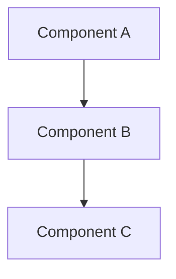

# Analysis Tools Reference

## Table of Contents

1. [Multi-Language Tools](#multi-language-tools)
2. [Python Tools](#python-tools)
3. [JavaScript/TypeScript Tools](#javascripttypescript-tools)
4. [Go Tools](#go-tools)
5. [Rust Tools](#rust-tools)
6. [Java Tools](#java-tools)
7. [Architecture Visualization](#architecture-visualization)
8. [Documentation Generators](#documentation-generators)

## Multi-Language Tools

### tree-sitter

**Purpose**: Fast, incremental parsing for syntax trees across languages

**URL**: https://tree-sitter.github.io/tree-sitter/

**Usage**:
```bash
npm install tree-sitter
# Use in Node.js to parse code programmatically
```

**Languages Supported**: Python, JavaScript, TypeScript, Go, Rust, Java, C, C++, and 40+ others

**Why Use**:
- Efficient incremental parsing
- Consistent AST across languages
- Good for building custom analysis tools

### ctags (Universal Tags)

**Purpose**: Source code indexing for multiple languages

**URL**: https://github.com/universal-ctags/ctags

**Usage**:
```bash
ctags -R .                           # Index current directory
ctags -R --languages=python src/     # Python only
ctags-vim                            # With Vim integration
```

**Output**: Tags file for editor integration, jump-to-definition, symbol completion

**Supported**: Python, JavaScript, Go, Rust, Java, C/C++, and 50+ languages

### tokei

**Purpose**: Fast code statistics and line counting

**URL**: https://github.com/XAMPPRocky/tokei

**Installation**:
```bash
cargo install tokei
# or
brew install tokei          # macOS
```

**Usage**:
```bash
tokei .                           # Current directory
tokei . --output json             # JSON format
tokei . --files                   # By-file breakdown
tokei src/ tests/                 # Multiple directories
```

**Output**: Lines of code, comments, blanks by language

**Speed**: 10-100x faster than cloc

### cloc

**Purpose**: Count lines of code (older, well-established)

**URL**: https://github.com/AlDanial/cloc

**Usage**:
```bash
cloc .                           # Basic count
cloc . --json                    # JSON output
cloc . --by-file-by-lang         # Detailed breakdown
```

**Compatible**: All major languages

**Trade-off**: Slower than tokei but more stable

### scc (Sloc Cloc and Code)

**Purpose**: Fast code counting alternative

**URL**: https://github.com/boyter/scc

**Usage**:
```bash
scc .                           # Default format
scc . --format json             # JSON output
scc . --wide                    # Wide terminal output
```

**Performance**: Similar to tokei

## Python Tools

### radon

**Purpose**: Code metrics for Python (complexity, maintainability)

**URL**: https://radon.readthedocs.io/

**Installation**: `pip install radon`

**Commands**:

```bash
# Cyclomatic complexity
radon cc .                       # Short report
radon cc . -a -nb               # Detailed with color
radon cc . --json               # JSON output

# Maintainability Index
radon mi .                       # By file
radon mi . -n B                  # Show files B or worse

# Metrics (LOC, LLOC, etc.)
radon metrics .                  # Detailed metrics
radon metrics . --json           # JSON format

# Check raw metrics
radon raw .                      # Physical/logical lines
```

**Output Interpretation**:
- CC 1-10: Simple, easy to test
- CC 11-20: Moderate
- CC 21+: Complex, needs refactoring
- MI 85-100: Excellent maintainability
- MI <65: Low maintainability

### pydeps

**Purpose**: Python dependency visualization

**URL**: https://github.com/thebjorn/pydeps

**Installation**: `pip install pydeps`

**Usage**:
```bash
pydeps mypackage --dot          # Generate Graphviz
pydeps mypackage --nodot        # Summary only
pydeps mypackage --show-cycles  # Find circular deps
pydeps mypackage --max-bacon 2  # Limit depth
```

**Output**: PNG/SVG dependency graphs

### pyreverse

**Purpose**: UML diagram generation from Python code

**URL**: https://pylint.pycqa.org/en/latest/pyreverse.html

**Installation**: `pip install pylint` (includes pyreverse)

**Usage**:
```bash
pyreverse -o png mypackage       # Generate UML diagrams
pyreverse -o dot mypackage       # Graphviz format
```

### vulture

**Purpose**: Find dead code in Python

**URL**: https://github.com/jendrikseipp/vulture

**Installation**: `pip install vulture`

**Usage**:
```bash
vulture .                          # Basic scan
vulture . --min-confidence 80      # Filter false positives
vulture . --exclude tests/         # Exclude directories
```

**Output**: Unused variables, functions, imports

### bandit

**Purpose**: Security issue scanner for Python

**URL**: https://bandit.readthedocs.io/

**Installation**: `pip install bandit`

**Usage**:
```bash
bandit -r .                      # Recursive scan
bandit -r . -f json              # JSON output
bandit -r . -ll                  # Report high/medium only
```

**Issues Detected**: Hardcoded passwords, SQL injection, insecure functions

## JavaScript/TypeScript Tools

### madge

**Purpose**: Dependency graph visualization and circular dependency detection

**URL**: https://github.com/pahen/madge

**Installation**: `npm install --save-dev madge`

**Usage**:
```bash
npx madge --circular src/                # List circular deps
npx madge --circular --json src/         # JSON output
npx madge --image graph.png src/         # PNG visualization
npx madge --dot src/ | dot -T png > deps.png  # Via Graphviz
```

**Formats**: JSON, DOT (Graphviz), text

### complexity-report

**Purpose**: Cyclomatic and cognitive complexity analysis

**URL**: https://github.com/escomplex/complexity-report

**Installation**: `npm install --save-dev complexity-report`

**Usage**:
```bash
npx cr src/**/*.js                       # Basic report
npx cr src/**/*.js --format json         # JSON output
npx cr src/**/*.js --output report.json  # Save to file
```

**Metrics**: Cyclomatic, cognitive complexity, maintainability

### dependency-cruiser

**Purpose**: Dependency validation and visualization

**URL**: https://github.com/sverweij/dependency-cruiser

**Installation**: `npm install --save-dev dependency-cruiser`

**Usage**:
```bash
npx depcruise src/ --output-type dot | dot -T png > deps.png
npx depcruise src/ --output-type json > deps.json
npx depcruise --validate .depcruiserrc.json src/  # Validate rules
```

**Features**: Circular dependency detection, forbidden patterns, visualization

### ts-morph

**Purpose**: TypeScript AST manipulation and code analysis

**URL**: https://ts-morph.com/

**Installation**: `npm install ts-morph`

**Usage**: Programmatic analysis and transformation of TypeScript code

**Best For**: Custom analysis tools for TypeScript

### jscpd

**Purpose**: Copy-paste detector for JavaScript/TypeScript

**URL**: https://github.com/kucherenko/jscpd

**Installation**: `npm install --save-dev jscpd`

**Usage**:
```bash
npx jscpd src/                        # Detect duplicates
npx jscpd src/ --format json          # JSON output
npx jscpd src/ --min-tokens 50        # Sensitivity
npx jscpd src/ --reporters cli json   # Multiple outputs
```

**Output**: Duplicate code blocks and their locations

## Go Tools

### gocyclo

**Purpose**: Cyclomatic complexity calculator for Go

**URL**: https://github.com/fzipp/gocyclo

**Installation**: `go install github.com/fzipp/gocyclo/cmd/gocyclo@latest`

**Usage**:
```bash
gocyclo -avg .              # Average complexity
gocyclo -avg ./cmd ./pkg    # Specific packages
gocyclo -over 10 .          # Functions > 10
gocyclo -top 5 .            # Top 5 complex
```

### go-callvis

**Purpose**: Call graph visualization

**URL**: https://github.com/ofabry/go-callvis

**Installation**: `go install github.com/ofabry/go-callvis@latest`

**Usage**:
```bash
go-callvis -format png .           # Visualize all functions
go-callvis -format png -focus main . # Focus on main
go-callvis -format png -exclude vendor/ . # Exclude vendor
```

**Output**: PNG visualization of call relationships

### godepgraph

**Purpose**: Create dependency graphs for Go packages

**URL**: https://github.com/kisielk/godepgraph

**Installation**: `go install github.com/kisielk/godepgraph@latest`

**Usage**:
```bash
godepgraph -s . | dot -Tpng > deps.png  # SVG graph
godepgraph . > deps.txt                  # Text format
```

### staticcheck

**Purpose**: Advanced Go linter and code analyzer

**URL**: https://staticcheck.io/

**Installation**: `go install honnef.co/go/tools/cmd/staticcheck@latest`

**Usage**:
```bash
staticcheck ./...          # Check all packages
staticcheck ./cmd ./pkg    # Specific packages
staticcheck -debug         # Verbose output
```

**Checks**: Bugs, inefficiencies, style issues, complexity

## Rust Tools

### cargo-modules

**Purpose**: Module structure visualization

**URL**: https://github.com/regexident/cargo-modules

**Installation**: `cargo install cargo-modules`

**Usage**:
```bash
cargo modules generate graph --lib          # Library module graph
cargo modules generate graph --bin          # Binary module graph
cargo modules generate graph --lib | dot -T png > modules.png
```

**Output**: Module hierarchy visualization

### cargo-geiger

**Purpose**: Unsafe code detection

**URL**: https://github.com/rust-secure-code/cargo-geiger

**Installation**: `cargo install cargo-geiger`

**Usage**:
```bash
cargo geiger                    # Count unsafe code
cargo geiger --output sarif     # SARIF format
cargo geiger --all-targets      # Include tests/examples
```

**Output**: Count and location of unsafe code blocks

### cargo-tree

**Purpose**: Dependency tree visualization

**URL**: Built-in cargo subcommand

**Usage**:
```bash
cargo tree                      # Full dependency tree
cargo tree --depth 1            # Top level only
cargo tree --duplicates         # Find duplicate versions
cargo tree --outdated           # Show outdated versions
```

## Java Tools

### JDepend

**Purpose**: Design quality metrics for Java

**URL**: https://github.com/clarkware/jdepend

**Installation**: Download from releases, or Maven plugin

**Usage**:
```bash
java -jar jdepend.jar src/         # Analyze directory
java -jar jdepend.jar -file report.txt src/  # File output
```

**Metrics**: Package coupling, stability, abstractness

### ArchUnit

**Purpose**: Architecture testing framework

**URL**: https://www.archunit.org/

**Installation**: Maven/Gradle dependency

**Usage**: Write tests for architectural rules

```java
@Test
public void architecture_rules_should_be_satisfied() {
    ArchRuleDefinition
        .classes()
        .that()
        .resideInAPackage("..service..")
        .should()
        .not()
        .dependOnClassesThat()
        .resideInAPackage("..web..")
        .check(importedClasses);
}
```

### Checkstyle

**Purpose**: Code style and quality checks

**URL**: https://checkstyle.org/

**Installation**: Maven/Gradle plugin

**Usage**:
```bash
checkstyle -c google_checks.xml -r src/
```

**Checks**: Code style, naming conventions, size issues

### PMD

**Purpose**: Source code analyzer for Java

**URL**: https://pmd.github.io/

**Installation**: Download or Maven plugin

**Usage**:
```bash
pmd -d src/ -R rulesets/java/basic.xml
pmd -d src/ -f json                         # JSON output
```

**Detects**: Design flaws, suboptimal code, bugs

## Architecture Visualization

### PlantUML

**Purpose**: UML diagrams from text definition

**URL**: https://plantuml.com/

**Usage**:
```
@startuml
rectangle "Service A"
rectangle "Service B"
"Service A" --> "Service B"
@enduml
```

**Formats**: PNG, SVG, PDF output

### Mermaid

**Purpose**: Diagrams and flowcharts in Markdown

**URL**: https://mermaid.js.org/

**Usage**:


**Integration**: Native GitHub support, no build needed

### Graphviz

**Purpose**: Graph visualization engine

**URL**: https://graphviz.org/

**Installation**:
```bash
brew install graphviz        # macOS
apt install graphviz         # Linux
```

**Usage**:
```bash
dot -Tpng graph.dot -o graph.png
```

**Input**: DOT format (produced by many tools)

### Structurizr

**Purpose**: C4 model architecture diagrams

**URL**: https://structurizr.com/

**Features**: Cloud-based, collaborative, versioning

**Model Levels**:
1. System Context
2. Container
3. Component
4. Code

### Archi

**Purpose**: ArchiMate modeling tool

**URL**: https://www.archimatetool.com/

**Use For**: Enterprise architecture modeling

## Documentation Generators

### Sphinx

**Purpose**: Python documentation generation

**URL**: https://www.sphinx-doc.org/

**Installation**: `pip install sphinx`

**Usage**:
```bash
sphinx-quickstart docs/     # Initialize
sphinx-build -b html docs/ docs/_build/
```

### JSDoc

**Purpose**: JavaScript documentation

**URL**: https://jsdoc.app/

**Usage**:
```javascript
/**
 * Adds two numbers.
 * @param {number} a - First number
 * @param {number} b - Second number
 * @returns {number} Sum of a and b
 */
function add(a, b) {
    return a + b;
}
```

### TypeDoc

**Purpose**: TypeScript documentation

**URL**: https://typedoc.org/

**Installation**: `npm install --save-dev typedoc`

**Usage**:
```bash
npx typedoc src/
```

### rustdoc

**Purpose**: Rust documentation (built-in)

**URL**: https://doc.rust-lang.org/rustdoc/

**Usage**:
```bash
cargo doc --open
```

### Javadoc

**Purpose**: Java documentation (built-in)

**URL**: https://www.oracle.com/technical-resources/articles/java/javadoc-tool.html

**Usage**:
```bash
javadoc -d docs/ src/*.java
```

### Doxygen

**Purpose**: Multi-language documentation

**URL**: https://www.doxygen.nl/

**Installation**: `brew install doxygen`

**Supports**: C, C++, C#, Python, Java, PHP, and more

## Configuration Examples

### .madgerc.json (JavaScript)

```json
{
  "extensions": [".js", ".ts"],
  "excludeRegExp": ["node_modules", "dist", "test"],
  "circular": true,
  "format": "json"
}
```

### .codemetrics (Python)

```ini
[radon]
complexity = 10
maintainability = 65

[excluded_paths]
tests,migrations,venv,build,dist
```

### .depcruiserrc.json (JavaScript)

```json
{
  "extends": "eslint-plugin-dependency-cruiser/configs/recommended",
  "excludeRegExp": ["node_modules", "dist"],
  "rules": {
    "no-circular": "error",
    "no-orphans": "warn"
  }
}
```

## Related Documentation

- `PATTERNS.md` - Language-specific usage patterns
- `GOTCHAS.md` - Tool limitations and workarounds
- `EXAMPLES.md` - Tool usage in real scenarios
