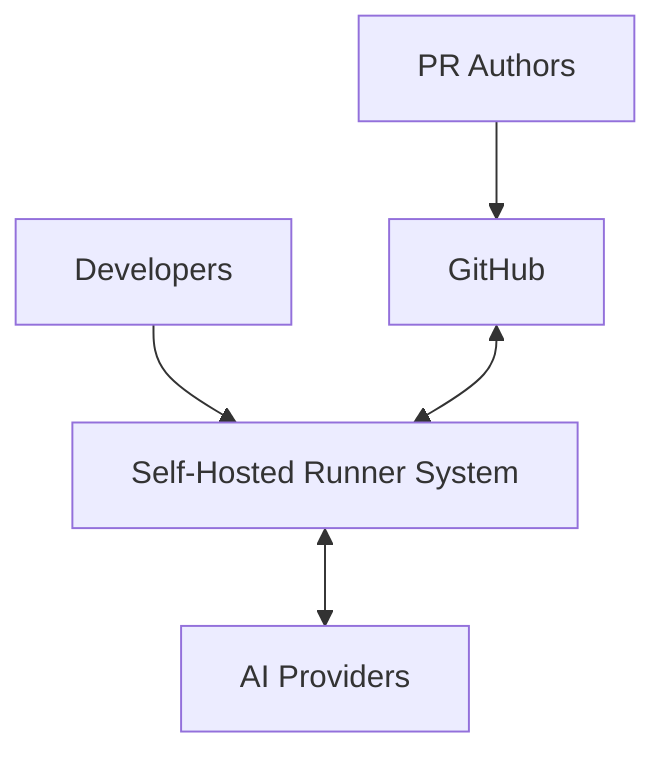
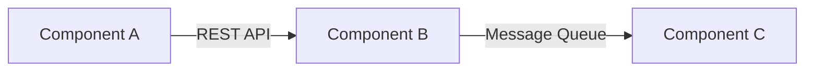
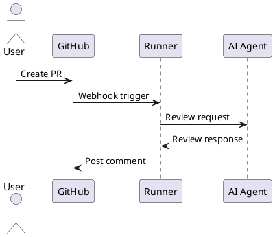

# Architecture Review Criteria
## Self-Hosted GitHub Actions Runner System

### Document Version
- **Version**: 1.0.0
- **Last Updated**: 2025-10-17
- **Purpose**: Define architectural review standards for Wave 1 (Architecture) and Wave 5 (Validation)
- **Scope**: Infrastructure, Workflows, Agent Operations, and Security domains

---

## 1. ARCHITECTURAL PRINCIPLES

### 1.1 SOLID Principles Application

#### Single Responsibility Principle (SRP)
- **Scripts**: Each bash script handles ONE specific concern (setup, execution, cleanup)
- **Workflows**: Each workflow file manages ONE logical process (PR review, issue comment, code push)
- **Agents**: Each AI agent specializes in ONE domain (architecture, security, performance)
- **Validation**: No component should have multiple reasons to change

#### Open/Closed Principle (OCP)
- **Extension Points**: New agent types added without modifying core runner infrastructure
- **Workflow Templates**: Base workflows extended via composite actions
- **Configuration**: Feature toggles via environment variables, not code changes
- **Validation**: New capabilities added through composition, not modification

#### Liskov Substitution Principle (LSP)
- **Runner Compatibility**: WSL runners functionally equivalent to native Windows runners
- **Agent Interfaces**: All review agents implement consistent input/output contracts
- **API Abstractions**: GitHub API wrappers interchangeable with mock implementations
- **Validation**: Substitutions don't break behavioral contracts

#### Interface Segregation Principle (ISP)
- **Minimal Interfaces**: Workflows expose only required inputs/outputs
- **Role-Based Access**: Permissions scoped to minimum necessary operations
- **API Contracts**: Separate interfaces for read vs write operations
- **Validation**: No client forced to depend on unused methods

#### Dependency Inversion Principle (DIP)
- **Abstract Dependencies**: Workflows depend on interfaces, not implementations
- **Configuration Injection**: Environment-specific settings injected at runtime
- **Service Abstractions**: AI providers behind common interface
- **Validation**: High-level modules independent of low-level details

### 1.2 Domain-Driven Design (DDD) Bounded Contexts

#### Infrastructure Context
- **Responsibility**: Runner provisioning, WSL management, resource allocation
- **Boundaries**: Clear separation from application logic
- **Interfaces**: Standardized runner registration and health APIs
- **Validation**: No business logic in infrastructure code

#### Workflows Context
- **Responsibility**: Orchestration, sequencing, conditional logic
- **Boundaries**: Isolated from implementation details
- **Interfaces**: Workflow dispatch events and artifacts
- **Validation**: Workflows remain declarative, not imperative

#### Agent Operations Context
- **Responsibility**: AI interactions, prompt engineering, response processing
- **Boundaries**: Encapsulated AI provider specifics
- **Interfaces**: Standardized request/response models
- **Validation**: Agent logic independent of delivery mechanism

#### Security Context
- **Responsibility**: Authentication, authorization, secret management, audit
- **Boundaries**: Centralized security controls
- **Interfaces**: Token validation, permission checks
- **Validation**: Security as cross-cutting concern, not scattered

### 1.3 Core Design Principles

#### Separation of Concerns
- Infrastructure ≠ Application ≠ Security
- Presentation (GitHub UI) ≠ Logic (Workflows) ≠ Data (Artifacts)
- Synchronous operations ≠ Asynchronous operations

#### Dependency Management
- **Direction**: Dependencies flow inward (Clean Architecture)
- **Cycles**: Zero circular dependencies between contexts
- **Versioning**: Explicit version pinning for external dependencies
- **Isolation**: Container/WSL boundaries for dependency conflicts

#### Cross-Platform Compatibility
- **Scripts**: POSIX-compliant bash (no bashisms)
- **Paths**: Platform-agnostic path handling
- **Line Endings**: Git autocrlf configuration
- **Tools**: Version-matched tools across Windows/WSL

---

## 2. REVIEW CHECKLIST

### 2.1 Wave 1 - Architecture Design Review

#### Component Coupling Analysis
- [ ] **Coupling Type Identified**: Data, Stamp, Control, External, Common, Content
- [ ] **Loose Coupling Verified**: Components interact through well-defined interfaces
- [ ] **No Inappropriate Intimacy**: Components don't access internal details of others
- [ ] **Event-Driven Where Appropriate**: Asynchronous operations use events, not polling
- [ ] **Dependency Direction Correct**: Dependencies point inward to stable abstractions

#### Interface Contracts
- [ ] **Workflow → Script Contract**:
  - Input parameters documented with types and constraints
  - Output format specified (JSON schema where applicable)
  - Error codes standardized and documented
  - Idempotency requirements defined
- [ ] **Script → AI API Contract**:
  - Request/response models versioned
  - Rate limiting handled gracefully
  - Timeout and retry policies defined
  - Token limits considered
- [ ] **Script → GitHub API Contract**:
  - GraphQL vs REST decision documented
  - Pagination strategy defined
  - Rate limit handling implemented
  - Error recovery procedures specified

#### Error Handling Patterns
- [ ] **Failure Modes Identified**: Document all failure scenarios
- [ ] **Recovery Strategies Defined**: Retry, fallback, circuit breaker patterns
- [ ] **Error Propagation Clear**: Errors bubble up appropriately
- [ ] **Observability Built-in**: Errors logged with context
- [ ] **Graceful Degradation**: System remains partially functional

#### Scalability Design
- [ ] **Horizontal Scaling**:
  - Runner pools can expand/contract
  - Workflow concurrency limits defined
  - Queue management for job distribution
- [ ] **Vertical Scaling**:
  - Resource requirements documented
  - Memory/CPU limits configured
  - WSL2 resource allocation tuned
- [ ] **Auto-scaling Triggers**:
  - Metrics for scale decisions identified
  - Scaling policies documented
  - Cost implications analyzed

#### Security Architecture
- [ ] **Least Privilege**:
  - Each component has minimal required permissions
  - GitHub tokens scoped appropriately
  - File system access restricted
- [ ] **Defense in Depth**:
  - Multiple security layers implemented
  - Network segmentation considered
  - Input validation at boundaries
- [ ] **Secret Management**:
  - No hardcoded secrets
  - Secret rotation capability
  - Audit trail for secret access

### 2.2 Wave 5 - Implementation Validation Review

#### Architecture Conformance
- [ ] Implementation matches design documents
- [ ] No architectural drift detected
- [ ] All ADRs followed or updated
- [ ] Technical debt documented

#### Performance Validation
- [ ] Latency targets met (< 30s workflow startup)
- [ ] Throughput goals achieved (X reviews/hour)
- [ ] Resource utilization within bounds
- [ ] No performance anti-patterns detected

#### Security Validation
- [ ] Security scanning passed (no critical vulnerabilities)
- [ ] Penetration testing completed
- [ ] Compliance requirements met
- [ ] Incident response plan tested

#### Operational Readiness
- [ ] Monitoring dashboards operational
- [ ] Alerting rules configured
- [ ] Runbooks documented
- [ ] Disaster recovery tested

---

## 3. QUALITY ATTRIBUTES

### 3.1 Reliability
**Target**: 99.5% runner availability, 95% workflow success rate

#### Metrics
- **Runner Availability**: Uptime percentage per runner
- **Workflow Success Rate**: Successful runs / total runs
- **Mean Time Between Failures (MTBF)**: Average operational time
- **Mean Time To Recovery (MTTR)**: Average recovery duration

#### Requirements
- Health checks every 60 seconds
- Automatic runner restart on failure
- Workflow retry logic for transient failures
- Circuit breakers for external dependencies

### 3.2 Performance
**Target**: < 30s workflow startup, < 5min total PR review time

#### Metrics
- **Workflow Startup Latency**: Time from trigger to first step
- **End-to-End Latency**: Total time for complete operation
- **Throughput**: Reviews processed per hour
- **Resource Utilization**: CPU, memory, network, disk

#### Requirements
- Sparse checkout for large repositories
- Parallel execution where possible
- Caching strategies implemented
- Resource pooling for expensive operations

### 3.3 Security
**Target**: Zero security breaches, 100% secret encryption

#### Metrics
- **Vulnerability Count**: By severity (Critical, High, Medium, Low)
- **Secret Exposure Events**: Accidental secret commits/logs
- **Permission Violations**: Unauthorized access attempts
- **Compliance Score**: Percentage of controls passed

#### Requirements
- All secrets encrypted at rest and in transit
- Principle of least privilege enforced
- Security scanning in CI/CD pipeline
- Regular security audits and updates

### 3.4 Maintainability
**Target**: < 2 hours for new developer onboarding, < 1 day for feature addition

#### Metrics
- **Code Duplication**: < 5% duplicate code
- **Cyclomatic Complexity**: < 10 per function
- **Documentation Coverage**: 100% for public interfaces
- **Test Coverage**: > 80% for critical paths

#### Requirements
- DRY principle enforced
- Reusable workflow templates
- Comprehensive documentation
- Automated testing suite

### 3.5 Portability
**Target**: 100% script compatibility across Windows/WSL/Linux

#### Metrics
- **Platform Test Pass Rate**: Tests passing on all platforms
- **Platform-Specific Code**: < 5% of codebase
- **Migration Effort**: Hours to move between platforms
- **Dependency Conflicts**: Number of platform-specific dependencies

#### Requirements
- POSIX-compliant shell scripts
- Platform abstraction layers
- Containerized dependencies where possible
- Cross-platform testing in CI

---

## 4. ARCHITECTURE DECISION RECORD (ADR) TEMPLATE

### 4.1 Decisions Requiring ADRs

#### Infrastructure Decisions
- Runner deployment model (native vs Docker vs WSL)
- Resource allocation strategy
- Scaling approach (manual vs automatic)
- Monitoring and observability stack

#### Workflow Decisions
- Workflow orchestration patterns
- Job distribution strategy
- Artifact storage approach
- Caching strategies

#### Integration Decisions
- AI provider selection and fallback
- GitHub API approach (REST vs GraphQL)
- Authentication methods
- Rate limiting strategies

#### Security Decisions
- Secret management solution
- Network security model
- Compliance framework adoption
- Incident response procedures

### 4.2 ADR Structure

```markdown
# ADR-XXX: [Title]

## Status
[Proposed | Accepted | Deprecated | Superseded by ADR-YYY]

## Context
What is the issue that we're seeing that is motivating this decision?
Include any relevant constraints, requirements, or assumptions.

## Decision Drivers
- Driver 1: [Explanation]
- Driver 2: [Explanation]
- Driver 3: [Explanation]

## Considered Options
1. **Option A**: [Description]
   - Pros: [List advantages]
   - Cons: [List disadvantages]

2. **Option B**: [Description]
   - Pros: [List advantages]
   - Cons: [List disadvantages]

3. **Option C**: [Description]
   - Pros: [List advantages]
   - Cons: [List disadvantages]

## Decision
We will go with Option X because [reasoning].

## Consequences

### Positive
- [Positive consequence 1]
- [Positive consequence 2]

### Negative
- [Negative consequence 1]
- [Negative consequence 2]

### Neutral
- [Neutral consequence 1]
- [Neutral consequence 2]

## Implementation Notes
[Any specific implementation guidance]

## References
- [Link to relevant documentation]
- [Link to related ADRs]
```

### 4.3 ADR Storage
- **Location**: `adr/*.md`
- **Naming**: `ADR-XXX-descriptive-title.md`
- **Index**: `adr/README.md` with chronological list
- **Review**: ADRs reviewed in architecture meetings
- **Lifecycle**: Superseded ADRs retained for history

---

## 5. C4 DIAGRAM REQUIREMENTS

### 5.1 Context Diagram (Level 1)
**Purpose**: Show system in context of users and external systems

#### Required Elements
- GitHub (external system)
- AI Provider APIs (external system)
- Developers (users)
- PR Authors (users)
- Self-Hosted Runner System (system boundary)

#### Format


### 5.2 Container Diagram (Level 2)
**Purpose**: Show major containers/applications within system

#### Required Elements
- GitHub Actions Runner (container)
- WSL2 Environment (container)
- Workflow Engine (container)
- Agent Scripts (container)
- Secret Store (container)
- Monitoring Stack (container)

#### Level of Detail
- Show data flow between containers
- Indicate synchronous vs asynchronous communication
- Mark security boundaries
- Specify protocols (HTTPS, SSH, etc.)

### 5.3 Component Diagram (Level 3)
**Purpose**: Show components within each container

#### Focus Areas
- **Runner Components**: Registration, Job Queue, Executor
- **Workflow Components**: Parser, Scheduler, State Machine
- **Agent Components**: Prompt Builder, API Client, Response Parser

#### Level of Detail
- Internal component interactions
- Data structures passed between components
- Component responsibilities
- Interface definitions

### 5.4 Deployment Diagram (Level 4)
**Purpose**: Show physical/virtual deployment topology

#### Required Elements
- Windows Host Machine
- WSL2 Virtual Machine
- Container Runtime (if used)
- Network boundaries
- Storage locations
- External service endpoints

#### Level of Detail
- Resource specifications (CPU, RAM, Disk)
- Network configuration
- Firewall rules
- Load balancing (if applicable)

### 5.5 Diagram Tools and Format

#### Primary Format: Mermaid


#### Alternative: PlantUML


#### Textual Descriptions
For each diagram, provide:
1. **Purpose Statement**: Why this view matters
2. **Key Design Decisions**: What the diagram reveals
3. **Trade-offs**: What alternatives were considered
4. **Evolution Path**: How this might change over time

---

## 6. REVIEW PROCESS

### 6.1 Wave 1 - Architecture Review
1. Review against all principles and checklists
2. Identify gaps and risks
3. Create ADRs for key decisions
4. Generate C4 diagrams
5. Sign-off from stakeholders

### 6.2 Wave 5 - Validation Review
1. Verify implementation matches architecture
2. Validate quality attributes are met
3. Confirm security requirements satisfied
4. Check operational readiness
5. Final architecture sign-off

### 6.3 Continuous Review
- Weekly architecture sync during development
- ADR reviews for significant changes
- Quarterly architecture health checks
- Annual architecture evolution planning

---

## 7. APPENDICES

### A. Reference Architecture Patterns
- Circuit Breaker Pattern
- Retry with Exponential Backoff
- Bulkhead Pattern
- Ambassador Pattern
- Sidecar Pattern

### B. Security Checklist
- OWASP Top 10 considerations
- CIS Benchmarks for Windows/Linux
- GitHub Security Best Practices
- Secret Scanning Rules

### C. Performance Benchmarks
- Baseline performance metrics
- Load testing scenarios
- Stress testing thresholds
- Performance regression criteria

### D. Compliance Mappings
- SOC 2 Type II controls
- GDPR requirements
- Industry-specific regulations
- Internal security policies

---

## Document Control
- **Review Frequency**: Monthly during active development, quarterly in maintenance
- **Approval Required From**: Chief Architect, Security Lead, Infrastructure Lead
- **Distribution**: Development Team, DevOps Team, Security Team, Management
- **Related Documents**:
  - System Design Document
  - Security Architecture Document
  - Operational Runbook
  - ADR Collection